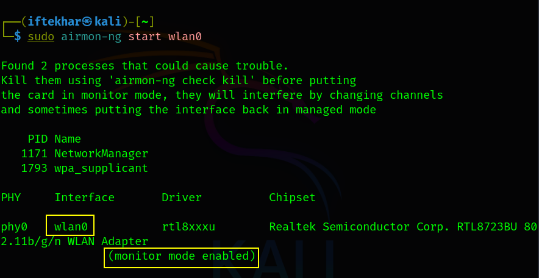
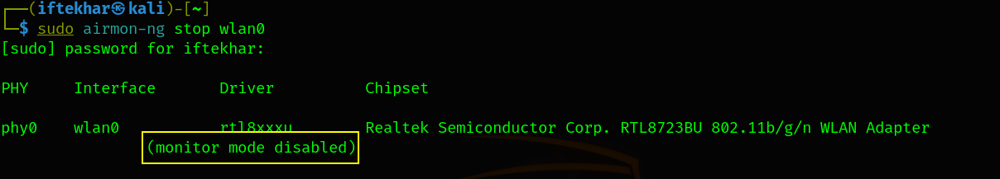
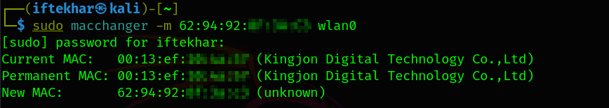
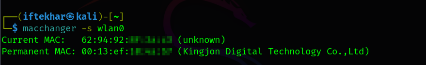
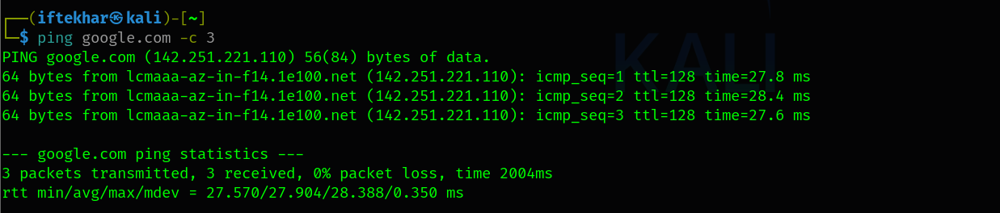

# Bypassing MAC and Open Authentication in Wireless Networks

As wireless networks have become ubiquitous, securing them against unauthorized access remains a critical concern for network administrators. Two common security mechanisms, **MAC address authentication** and **open authentication**, are often employed to restrict access to wireless networks. However, these methods are far from infallible and can be bypassed using readily available tools and techniques. In this blog, I aim to provide a detailed and practical guide to understanding and demonstrating the vulnerabilities of MAC and open authentication for anyone seeking to deepen their understanding of network vulnerabilities.

## Understanding MAC and Open Authentication

### MAC Address Authentication

MAC (Media Access Control) address authentication involves a network access point (AP) maintaining a whitelist of approved MAC addresses. Only devices with MAC addresses on this list are allowed to connect. While this approach may seem secure, MAC addresses are easily spoofable, as they are transmitted in plaintext and can be altered using software tools.

### Open Authentication

Open authentication, as defined in the 802.11 standard, allows any device to authenticate with an access point without requiring credentials. While it may be paired with other security measures (e.g., MAC filtering), open authentication itself provides no encryption or verification, making it inherently vulnerable to exploitation.

Both methods are often used in legacy systems or misconfigured networks, and their weaknesses can be exploited by attackers to gain unauthorized access. Below, we outline the process to bypass these mechanisms, focusing on MAC address spoofing to bypass MAC filtering and leveraging open authentication's lack of robust verification.

## Prerequisites

Before proceeding, ensure you have the following:

- **A Linux-based system** (e.g., Kali Linux, Ubuntu) with administrative privileges.
- **Wireless adapter** capable of monitor mode (e.g., one supporting the Atheros or Ralink chipset).
- **Installed tools:**
  - `aircrack-ng` suite (for capturing network data and managing interfaces).
  - `macchanger` (for spoofing MAC addresses).
  - `NetworkManager` (for managing network connections).
- Legal authorization to test the target network.
- Basic familiarity with Linux terminal commands.

## Bypassing MAC and Open Authentication

The process outlined below demonstrates how to bypass MAC address authentication by spoofing a whitelisted MAC address and exploiting open authentication's lack of verification.

### 1. Gather Information About the Target Network

To bypass MAC address authentication, you need the MAC address of an authorized client already connected to the network. Use tools like `airodump-ng` from the `aircrack-ng` suite to capture this information.

1. **Start monitor mode** on your wireless adapter (e.g., `wlan0`):

    <div style="text-align: center;">
      
    </div>

    This command places the wireless adapter in monitor mode, creating a virtual interface (e.g., `wlan0`) for capturing wireless packets.

2. **Scan for nearby networks** and identify the target network's BSSID (AP MAC address) and a connected client's MAC address:

    <div style="text-align: center;">
      
    </div>

    Look for the target network's SSID, BSSID, and channel. In the lower section of the output, note the MAC addresses of connected clients. Select one to spoof.

    In our example, `62:94:92:xx:xx:xx` is the client MAC address we'll be spoofing.

    - **BSSID** = MAC address of the Wi-Fi router/access point. It identifies the network itself. In our example, it's `E8:65:D4:xx:xx:xx`.

    - **Station/Client MAC Address** = MAC address of a device connected to that router. It identifies a specific device using the Wi-Fi. In our example, it's `62:94:92:xx:xx:xx`.

    For Beginners: Use the `--bssid` and `--channel` options with `airodump-ng` to focus on the target network and reduce noise:

    ```
    sudo airodump-ng --bssid E8:65:D4:xx:xx:xx --channel 6 wlan0
    ```

## 2. Stop the Monitoring Interface

Once you've identified the client MAC address, stop the monitoring interface to prepare for MAC spoofing:

<div style="text-align: center;">
  
</div>

This command returns the adapter to managed mode (e.g., `wlan0`).

**Note:** Ensure no other processes are using the wireless adapter before proceeding.

## 3. Disable Network Manager

The Network Manager service may interfere with manual interface configuration. Temporarily disable it:

<div style="text-align: center;">
  
</div>

This prevents conflicts when changing the MAC address or managing the wireless interface.

If you encounter issues with Network Manager restarting automatically, consider masking it temporarily:

```
sudo systemctl mask NetworkManager
```

Unmask it later with `sudo systemctl unmask NetworkManager`.

## 4. Take Down the Wireless Interface

Bring down the wireless interface to allow MAC address changes:

<div style="text-align: center;">
  
</div>

This command ensures the interface is inactive, preventing errors during MAC address spoofing.

## 5. Spoof the MAC Address

Use `macchanger` to change the MAC address of your wireless adapter to the whitelisted client's MAC address:

<div style="text-align: center;">
  
</div>

For Beginners: Verify the MAC address change with:

<div style="text-align: center;">
  
</div>

## 6. Bring the Interface Back Up

Reactivate the wireless interface:

<div style="text-align: center;">
  
</div>

This command brings the interface online with the spoofed MAC address.

## 7. Restore Network Manager

Re-enable Network Manager to manage network connections:

<div style="text-align: center;">
  
</div>

This restores normal network functionality, allowing you to attempt connection to the target network.

## 8. Connect to the Network

With the spoofed MAC address, attempt to connect to the target network. Since the network uses open authentication, no credentials are required. Use the network manager GUI or a command-line tool like `nmcli`:

<div style="text-align: center;">
  
</div>

Confirm connectivity with:

<div style="text-align: center;">
  
</div>

If pings are successful, the MAC address spoofing has bypassed the network's authentication.

## Mitigation Strategies

To protect networks from MAC spoofing and open authentication vulnerabilities, consider the following:

- **Use Strong Encryption:** Replace open authentication with WPA3 or WPA2 with strong passwords to prevent unauthorized access.
- **Implement 802.1X Authentication:** Use enterprise-grade authentication (e.g., EAP-TLS) to require client certificates, making MAC spoofing insufficient for access.
- **Monitor Network Activity:** Deploy intrusion detection systems (IDS) to detect unusual activity, such as multiple devices using the same MAC address.
- **Disable Unused Open Networks:** Ensure open networks are disabled or restricted to guest access with captive portals.
- **Regular Security Audits:** Conduct penetration tests to identify and address vulnerabilities proactively.
