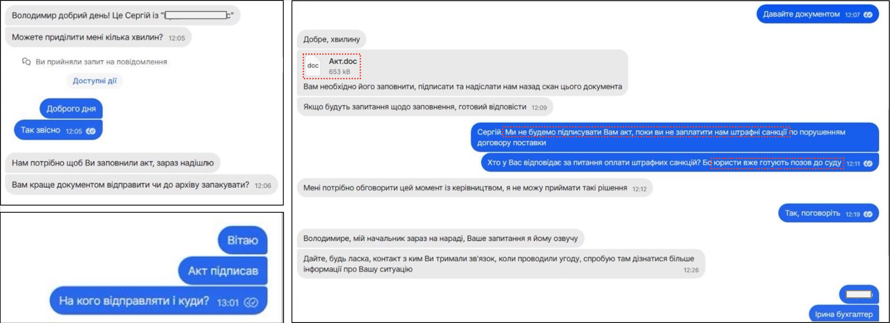
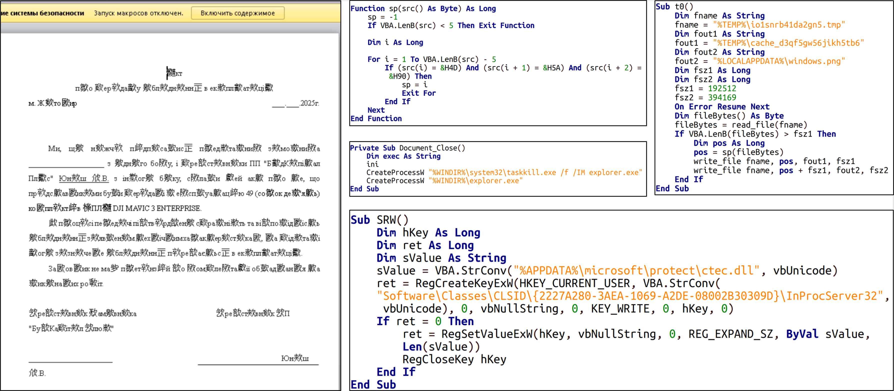
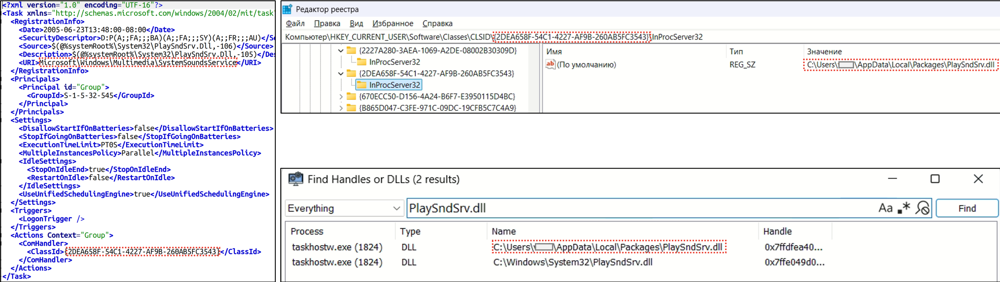

# APT28 Targets Government Agencies with BEARDSHELL COVENANT Malware through Signal (2025)

Recently, the Computer Emergency Response Team of Ukraine (CERT-UA) issued a warning about a sophisticated attack campaign orchestrated by the Russia-linked APT28 (also known as UAC-0001) hacking group. This group is using the Signal messaging app and phishing emails to deliver two new malware families, BEARDSHELL and COVENANT, targeting Ukrainian organizations.

  

## APT28 Overview

APT28 is a well-known hacking group believed to be linked to Russia. They've been active for years, targeting governments, militaries, and organizations worldwide, often with political motives. Their attacks are advanced and persistent, earning them the label "Advanced Persistent Threat" (APT). In this campaign, they're focusing on Ukrainian government entities, exploiting trust in communication platforms like Signal and vulnerabilities in email systems.

## Attack Origins

In **March-April 2024**, CERT-UA responded to a cyber incident in a central executive body's information and communication system (ICS). They discovered a compromised Windows server running two malicious tools:
- **BEARDSHELL**: A backdoor malware.
- **SLIMAGENT**: A tool for taking encrypted screenshots.

At the time, the initial infection method was unclear. CERT-UA shared the malicious files with trusted security vendors and researchers for further analysis.

In **May 2025**, ESET, a Slovak cybersecurity company, provided critical intelligence about unauthorized access to an email account in the "gov.ua" domain. This, combined with CERT-UA's collaboration with the Center for Cyber Security of Information and Telecommunications Systems (military unit A0334), led to a deeper investigation. The team uncovered the **COVENANT** malware framework, confirmed BEARDSHELL's role, and identified the initial attack vector, a malicious Word document delivered via Signal.

## Malware Deployment Process

One of the most alarming aspects of this campaign is the use of the Signal messaging app, which is known for its privacy and security. Here's how the attack unfolds:

1. **Delivery via Signal**: Attackers send a Microsoft Word document named "Акт.doc" (which translates to "Act.doc" in English) through Signal. The document appears legitimate, and the attacker's messages show familiarity with the target's operations, suggesting prior reconnaissance.

    

      
      
Signal Chat Showing Attacker Coordination

      
Source: https://cert.gov.ua/article/6284080

    

    The `Act.doc` malicious file is delivered through Signal via a socially engineered attack:
    
    - The sender initiates by offering the file, disguised as a legitimate document.
    - The recipient forwards it to the target (e.g., Serhii), with verification steps to ensure delivery.
    - The recipient later proposes and the sender agrees to send it to additional addressees, expanding the attack.
    - The target opens the file and enables macros, triggering the COVENANT-to-BEARDSHELL infection chain.
  
2. **Macro Activation**: Opening "Act.doc" prompts the user to enable macros. If enabled, the macro (partially shown) executes malicious code.

    

      
      
Deobfuscated Macro Code in Akt Doc File

      
Source: https://cert.gov.ua/article/6284080

    

3. **Payload Drop**: The macro creates two files:
   - **ctec.dll** in `%APPDATA%\microsoft\protect\`.
   - **windows.png** in `%LOCALAPPDATA%`. Despite its name, this is not an image but contains encrypted shellcode.

4. **Persistence via COM-Hijacking**: The macro modifies the Windows Registry by creating the key `HKCU\Software\Classes\CLSID\{2227A280-3AEA-1069-A2DE-08002B30309D}\InProcServer32`. This ensures "ctec.dll" loads when Windows File Explorer (`explorer.exe`) restarts, which the macro forces by terminating and relaunching the process.

5. **COVENANT Deployment**: The "ctec.dll" decrypts and executes shellcode from "windows.png," launching the **COVENANT** framework component (`ksmqsyck.dx4.exe`) in memory. COVENANT uses the Koofr service API (`app.koofr[.]net`) as a command-and-control (C2) channel.

6. **BEARDSHELL Installation**: COVENANT downloads two additional files:
   - **PlaySndSrv.dll** in `%LOCALAPPDATA%\Packages\`.
   - **sample-03.wav** in `%USERPROFILE%\Music\Samples\`.
   "PlaySndSrv.dll" reads shellcode from "sample-03.wav" and launches **BEARDSHELL** (`BeardShell.dll`). Persistence is ensured via another registry key (`HKEY_CURRENT_USER\Software\Classes\CLSID\{2DEA658F-54C1-4227-AF9B-260AB5FC3543}\InProcServer32`) and a scheduled task (`Microsoft\Windows\Multimedia\SystemSoundsService`).

    

      
      
Registry Method for BEARDSHELL Persistence

      
Source: https://cert.gov.ua/article/6284080
      
    

### Malware Distribution via Social Engineering

  
  
Fig. 01 Signal Chat Showing Attacker Coordination

The `Act.doc` malicious file is delivered through Signal via a socially engineered attack:

- The sender initiates by offering the file, disguised as a legitimate document.
- The recipient forwards it to the target (e.g., Serhii), with verification steps to ensure delivery.
- The recipient later proposes and the sender agrees to send it to additional addressees, expanding the attack.
- The target opens the file and enables macros, triggering the COVENANT-to-BEARDSHELL infection chain.

### BEARDSHELL Profile

BEARDSHELL is a C++-based backdoor with the following capabilities:
- Downloads and decrypts PowerShell scripts using the **chacha20-poly1305** algorithm.
- Executes the scripts and uploads results to a hacker-controlled server via the **Icedrive API** (`api.icedrive[.]net`).
- Creates a unique directory for each infected computer, named using a hash (`hash64_fnv1a`) of the computer name and hardware profile GUID.

In 2024, BEARDSHELL was also detected as `tcpiphlpsvc.dll`, showing its reuse across attacks.

### COVENANT Profile

COVENANT is a memory-resident malware framework, making it stealthy and hard to detect. It serves as an intermediate stage, fetching additional payloads like "PlaySndSrv.dll" and "sample-03.wav" to install BEARDSHELL. Its use of the Koofr API for C2 communication blends malicious traffic with legitimate service activity.

### SLIMAGENT Profile

SLIMAGENT, also written in C++, captures screenshots of the victim's screen using Windows APIs (`EnumDisplayMonitors`, `CreateCompatibleDC`, `CreateCompatibleBitmap`, `BitBlt`, `GdipSaveImageToStream`). It encrypts the images with **AES+RSA** and saves them locally in `%TEMP%\Desktop_%d-%m-%Y_%H-%M-%S.svc`. In 2024, it was detected as `eapphost.dll`.

## Phishing Campaign

APT28 also targets outdated **Roundcube** webmail servers with phishing emails disguised as news articles from NV (nv.ua). These emails exploit multiple vulnerabilities:

1. **Phishing Email**: Contains an exploit for a cross-site scripting (XSS) vulnerability in Roundcube (**CVE-2020-35730**).

2. **JavaScript Execution**: The exploit runs two JavaScript files:
   - **e.js**: Steals email address books, session cookies, and sets a mailbox rule to forward emails to a hacker-controlled address.
   - **q.js**: Exploits an SQL injection flaw (**CVE-2021-44026**) to extract data from the Roundcube database.

3. **Additional Exploit**: A third file, **c.js**, exploits another Roundcube flaw (**CVE-2020-12641**) to execute arbitrary commands on the mail server.

4. **Scale**: Over 40 Ukrainian organizations were targeted with these emails.

## Threat Impact

- **Trusted Platforms**: Signal's reputation for security lowers suspicion.
- **Social Engineering**: Attackers use tailored messages and fake news articles to trick users.
- **Exploiting Vulnerabilities**: Unpatched Roundcube servers are easy targets.
- **Stealthy Malware**: Memory-resident COVENANT and legitimate service APIs (Icedrive, Koofr) evade detection.
- **Impact**: Stolen data (emails, contacts, cookies) and remote control of systems threaten national security.

## Defense Strategies

1. **Be Wary of Attachments**:
   - Avoid opening Word documents from unknown sources, especially those requesting macro activation.
   - Verify Signal senders, even if messages seem legitimate.

2. **Update Software**:
   - Patch webmail systems like Roundcube to fix vulnerabilities (e.g., CVE-2020-35730, CVE-2021-44026, CVE-2020-12641).
   - Keep Windows and antivirus software up to date.

3. **Monitor Network Traffic**:
   - Block or monitor connections to `api.icedrive[.]net` and `app.koofr[.]net`.

4. **Enhance Security Practices**:
   - Enable two-factor authentication (2FA) on email accounts.
   - Train staff to spot phishing emails and social engineering.
   - Disable macros in Microsoft Office by default.

5. **Backup Data**:
   - Regularly back up critical files offline or in secure cloud storage.

## Malware Footprints

- **Files and Hashes**:
  - `Act.doc`: `c49d4acad68955692c32d5fa924eb5bb3f95a192d2c70ff6b0b2ce63c6afe985`
  - `ctec.dll`: `be588c14f7ed3252e36c7db623c09cde8e01fa850c5431d9d621ac942695804d`
  - `windows.png`: `0a0fefb509a85c069539003c03c4f9c292d415fb27d18aef750446b63533b432`
  - `ksmqsyck.dx4.exe` (COVENANT): `84e9eb9615f16316adac6c261fe427905bf1a3d36161e2e4f7658cd177a2c460`
  - `PlaySndSrv.dll`: `296b294a5fed830c2ff1fac9cb361a2d665b70f2f37188b593b5d1401cd6ca28`
  - `sample-03.wav`: `225b7abe861375141f6cfebde4981f615cb2aa4d913faf85172666fa4b4b320b`
  - `BeardShell.dll` (BEARDSHELL): `d1deeaf0f1807720b11d0f235e3c134a1384054e4c3700eabab26b3a39d2c19a`
  - `tcpiphlpsvc.dll` (2024 BEARDSHELL): `2eabe990f91bfc480c09db02a4de43116b40da2d6eaad00a034adf4214dac4d1`
  - `eapphost.dll` (2024 SLIMAGENT): `9faeb1c8a4b9827f025a63c086d87c409a369825428634b2b01314460a332c6c`

- **File Paths**:
  - `%APPDATA%\microsoft\protect\ctec.dll`
  - `%LOCALAPPDATA%\windows.png`
  - `%LOCALAPPDATA%\Packages\PlaySndSrv.dll`
  - `%USERPROFILE%\Music\Samples\sample-03.wav`
  - `%TEMP%\cache_d3qf5gw56jikh5tb6`
  - `C:\Windows\System32\tcpiphlpsvc.dll` (2024)
  - `C:\Windows\System32\wbem\eapphost.dll` (2024)

- **Registry Keys**:
  - `HKEY_CURRENT_USER\Software\Classes\CLSID\{2227A280-3AEA-1069-A2DE-08002B30309D}\InProcServer32`
  - `HKEY_CURRENT_USER\Software\Classes\CLSID\{2DEA658F-54C1-4227-AF9B-260AB5FC3543}\InProcServer32`

- **Scheduled Task**: `Microsoft\Windows\Multimedia\SystemSoundsService`

- **Network**:
  - `api.icedrive[.]net`
  - `app.koofr[.]net`

## Author

### Iftekhar Mahmud

- Email: iftekmahmud@protonmail.com
- Blog: [https://iftekmahmud.github.io/blog/](https://iftekmahmud.github.io/blog/)
- LinkedIn: [https://www.linkedin.com/in/iftekmahmud/](https://www.linkedin.com/in/iftekmahmud/)
