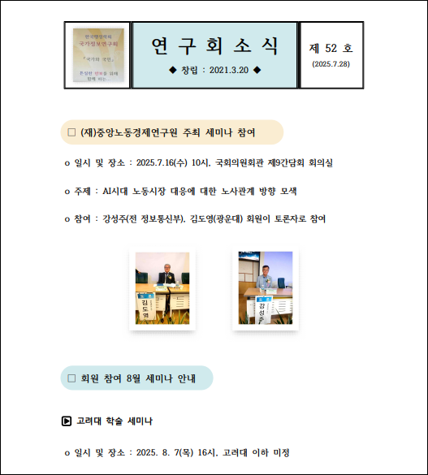
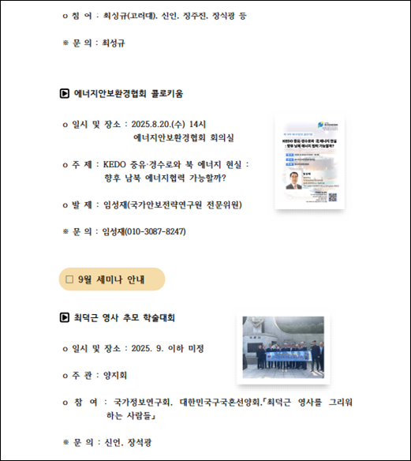

# North Korean APT37 Targets South Korean Officials With RokRAT Malware in Operation HanKook Phantom

## Overview

As a security researcher with years of experience tracking state-sponsored threats, I've closely examined various reports on Operation HanKook Phantom. This campaign exemplifies the evolving tactics of North Korean advanced persistent threats (APTs), particularly APT37, in their relentless pursuit of intelligence on South Korean affairs. Named "HanKook Phantom" to evoke Korea ("HanKook" in Korean) and the ghostly evasion techniques employed, the operation underscores the group's sophistication in blending social engineering with technical stealth. While the provided report offers a solid foundation, additional sources confirm this as part of broader APT37 activities in 2023–2025, including overlaps with campaigns targeting defectors and military alliances.

## Historical and Geopolitical Context

North Korea's cyber operations, often state-directed, aim to gather intelligence amid escalating tensions on the Korean Peninsula. APT37's activities date back to at least 2012, with a focus on South Korea but expanding to Japan, Vietnam, Russia, and beyond. The timing of HanKook Phantom, aligned with inter-Korean diplomatic strains, such as North Korea's rejection of reconciliation under South Korean leadership, suggests opportunistic exploitation of current events. Decoys reference real issues like North Korean troop deployments to Russia and policy critiques, making them highly credible to targets.

External research, including reports from Mandiant and Microsoft Threat Intelligence, corroborates APT37's use of similar lures in 2024 campaigns, such as phishing defectors with HWP documents. No major breaches from this specific operation have been publicly disclosed as of September 2025, but it fits a pattern of low-and-slow espionage rather than disruptive attacks.

## Threat Actor Profile

### APT37 (Reaper, ScarCruft, InkySquid)

APT37 is a prolific North Korean espionage group, linked to the Reconnaissance General Bureau (RGB), Pyongyang's primary intelligence arm.

- **Operational Focus**: Cyber espionage targeting government, defense, and academia, with spear-phishing as the entry vector.
- **Evolution**: Started with simple malware drops; now employs fileless techniques, cloud C2, and custom RATs like ROKRAT (a modular backdoor for command execution and exfiltration).
- **Geographic Reach**: Primarily South Korea (e.g., intelligence societies, universities like Kwangwoon and Korea University), but extends to Japan, Vietnam, Russia, Nepal, China, India, Romania, Kuwait, and Middle Eastern entities.
- **Attribution Indicators**: Use of Korean-language decoys, XOR encryption with simple keys (e.g., ASCII `'5'` or `'7'`), and C2 via legitimate cloud providers to blend traffic.

Recent analyses (e.g., from CrowdStrike's 2025 Global Threat Report) note APT37's increased use of LNK files post-2023, possibly in response to improved PDF sandboxing. They adapt quickly, renaming payloads (e.g., `aio*.dat` to `tony*.dat`) to evade signatures.

## Campaign Details: Two-Phased Spear-Phishing Attacks

The operation comprises two campaigns, both delivered via email archives containing a legitimate PDF decoy and a malicious LNK file (`"국가정보연구회 소식지(52호).pdf.lnk"`). Victims, likely from targeted sectors, receive these as "updates" or "statements," exploiting trust in official sources.

### Campaign 1: National Intelligence Research Society Newsletter Decoy

#### Decoy Analysis

The lure is Issue 52 of the "National Intelligence Research Society Newsletter" (국가정보연구회 소식지 52호), a real monthly publication from a South Korean group discussing intelligence, labor relations, security, energy, and North-South Korea ties. Dated around March 2021 but reused, it covers seminars, events, AI developments, and financial reminders tailored to engage academics and officials.

  

  

#### Targets

- National Intelligence Research Association
- Kwangwoon University and Korea University
- Institute for National Security Strategy
- Central Labor Economic Research Institute
- Energy Security and Environment Association
- Republic of Korea National Salvation Spirit Promotion Association
- Yangjihoe (memorial conference hosts)
- Korea Integration Strategy groups

#### Infection Chain

#### 1. User downloads ZIP with decoy PDF and LNK.

   - LNK is a Windows "shortcut" file. It's normally used to point to another file (like on your desktop). But in this case, it's been weaponized.
   - Instead of just pointing to a file, its properties have been edited to run a command (like PowerShell) when you double-click it. It's a Trojan horse that looks like a document.

#### 2. Executes LNK, triggering embedded PowerShell to extract payloads from LNK binary offsets (e.g., `0x0000102C` for fake PDF, `0x0007EDC1` for `aio1.dat`).

  

   - A command is hidden inside the LNK file's properties. When you click the LNK, it doesn't open a document; it opens a PowerShell window and tells it to run this specific, hidden command.
   - The PowerShell command's job is to find the hidden malicious payloads inside the LNK file, copy them out, and save them as separate files on your computer's hard drive (in the `%TEMP%` folder).
   - All computer files are made of binary data (1s and 0s). You can think of the LNK file as a long, long string of numbers.
   - The binary offset is an "address" or "position" of a specific piece of data within that long string. It's like the exact centimeter mark on a ruler.
   - `0x0000102C` is a hexadecimal number (that's what the `0x` means) that tells PowerShell to "Start reading the data at position 1,004th byte in the file."
   - The next offset, `0x0007EDC1`, tells it to start reading another payload at the 519,617th byte.
   - Hackers use offsets because it's a stealthy way to hide multiple files inside a single file without changing its file type. Antivirus might scan a .LNK file but not think to look for a PDF or a DAT file hidden deep inside its binary data.

#### 3. Drops files to `%TEMP%`: `aio0.dat` (decoy PDF), `aio03.bat`, `aio2.dat` (PowerShell script), `aio1.dat` (loader), and `aio1+3.b+la+t` (final payload).

   - `%TEMP%` is your computer's junk drawer or staging area. It's a system environment variable that points to a temporary folder (usually `C:\Users\[YourName]\AppData\Local\Temp`).
   - Attackers use it because:
      - Programs (and malware) are allowed to create files here without needing special admin permissions.
      - This folder is constantly filled with temporary files from legitimate programs, so the malicious files can blend in and look normal to a casual observer.
      - Users rarely look here, and some security tools might not scan it as aggressively as other folders.
   - The PowerShell command from the LNK file extracts and saves several pieces of the malware puzzle to this `%TEMP%` junk drawer:
      - `aio0.dat` is the decoy PDF or the distraction. This is the legitimate-looking document (e.g., a news article, an invoice) that gets opened automatically. Its sole purpose is to make you think everything worked normally, so you don't get suspicious while the malware runs in the background.
      - `aio03.bat` is the batch file. This is a simple batch script — a basic list of commands for Windows. Its job is very straightforward: run the PowerShell script (`aio2.dat`). It's the first thing that gets executed after the files are dropped, kicking off the entire malicious process.
     - `aio2.dat` is the PowerShell script, which is a text file containing PowerShell code. It doesn't run on its own; it's executed by the batch file (`aio03.bat`). Its job is complex:
         - It reads the encrypted loader (`aio1.dat`).
         - It decrypts it (unscrambles it) using a simple key (like `XOR 0x35`).
         - It performs advanced tricks to inject the decrypted code directly into the computer's memory, avoiding the hard drive where antivirus could detect it. This is called **fileless execution**.
      - `aio1.dat` is the loader. This file is encrypted (scrambled). Its job is to be loaded into the computer's memory by another program (the PowerShell script, `aio2.dat`). Once in memory, it will be decrypted and executed. It's called a "loader" because it loads the final stage of the malware.
      - `aio1+3.b+la+t` is the final payload. It's the actual malware (RokRAT). The weird name `aio1+3.b+la+t` is a trick to avoid detection. It's likely saved to the disk with this bizarre name but is actually a DLL file (a library of malicious code). The loader (`aio1.dat`, after being decrypted in memory) is designed to find this file and inject it into a running process, effectively bringing the malware to life.
 
#### 4. `aio03.bat` runs PowerShell from `aio2.dat`, which decodes UTF-8 content and executes via `Invoke-Command`.
   
   - The batch file (`aio03.bat`) contains a simple command that starts PowerShell and tells it to take the contents of the `aio2.dat` file and execute it as if it were a PowerShell script.
   - UTF-8 is a common standard for encoding text. The attackers wrote their malicious PowerShell script and then encoded it in UTF-8 to make it look like gibberish to the naked eye and to bypass simple security filters that might be scanning for known, plain-text malicious commands.
   - Before PowerShell can execute the commands, it must first translate this secret code (UTF-8) back into readable text. This decoding step is built right into PowerShell's functionality.
   - The `Invoke-Command` is a specific, powerful `cmdlet` in PowerShell. Its job is to run commands or scripts. In this case, it's being used to execute the newly decoded script directly from memory, without ever needing to save the decoded, plain-text version to the computer's hard drive.
   - **Fileless Execution** is a major evasion technique. The malicious instructions are never saved as a clear-text `.ps1` file that an antivirus could easily find and quarantine. They exist only in their encoded form on disk (`aio2.dat`) and then, for a brief moment, as decrypted commands in the computer's memory (RAM), which is much harder to monitor.

#### 5. Final stage: `aio2.dat` reads `aio1.dat` (XOR-encrypted with key `0x35`/`'5'`), decrypts in memory, allocates executable buffer via `GlobalAlloc`/`VirtualProtect`, injects DLL reflectively, and runs ROKRAT.

   - The loader file (`aio1.dat`) isn't stored as a usable program; it's scrambled using a simple encryption algorithm called `XOR` with a key of `0x35`. The PowerShell script reads this scrambled data from the disk.
   - The script performs a mathematical operation on every byte of the scrambled data using the key `0x35`. This reverses the scrambling process, turning the gibberish back into a working program, all within the computer's memory (RAM). This avoids saving a decrypted, detectable file to the disk.
   - `GlobalAlloc` is a Windows API function that asks the operating system for a block of memory (a "buffer") to store data.
   - `VirtualProtect` is another, more powerful Windows API function. By default, memory is allocated for storing data, not for running code. This function changes the protection on that memory block, marking it as executable. This is a classic technique used by malware to create a place to run its code.
   - The decrypted code in `aio1.dat` is a **DLL** (a library of code). Normally, Windows has a built-in process to load DLLs, which is monitored by security software.
      - **Reflective DLL Injection** is a hacking technique that bypasses this. The malware itself manually loads the DLL into memory, rather than asking Windows to do it. This is like bypassing the factory's building inspector. It's stealthy and leaves very few traces.
   - The final payload, hidden all along in the disguised file `aio1+3.b+la+t`, is now fully active in memory. The attacker can now steal data, log keystrokes, use your webcam, or use your computer to attack others.

  

#### XOR Encryption/Decryption

You have two light switches. The rule for XOR is: The light is ON only if one switch is ON, but not both.

- Switch A OFF, Switch B OFF → Light OFF
- Switch A ON, Switch B OFF → Light ON
- Switch A OFF, Switch B ON → Light ON
- Switch A ON, Switch B ON → Light OFF

Your data is a sequence of light switches (ON=1, OFF=0). The key (in this case, `0x35` or `'5'`) is another sequence of switches.

You take your data and "flip" each of its bits (switches) based on the key's bits. If the key's bit is ON (1), you flip the data's bit. If the key's bit is OFF (0), you leave it alone.

The characteristic of XOR is that it's reversible. If you XOR the encrypted data with the same key again, you get the original data back!

There is no practical difference between `0x35` and `'5'`. It's just two ways of writing the exact same number `53` in our everyday decimal system..

   - `0x35`: This is the number written in hexadecimal (base-16) format. The `0x` prefix tells programmers "this is a hex number".

   - `'5'`: This is the number written as an ASCII character. The computer stores everything as numbers. The number for the character `'5'` is... `0x35`.

| Format | Value | What it represents |
|----------|------------|-------------- |
| Hexadecimal | `0x35` | The number 53 |
| ASCII Character | `'5'` | The number 53 |
| Decimal | `53` | The number 53 |
| Binary | `0011 0101` | The number 53 |

So, the key is the byte value `0x35` or the character `'5'`. They are interchangeable in the code.

#### How the Decryption Works in This Attack

Let's walk through exactly what the PowerShell script (`aio2.dat`) does:

- **Read the Encrypted Loader:** It reads the contents of the `aio1.dat` file from the disk. This file doesn't look like a valid program; it's just scrambled, random-looking binary data (gibberish).
- **Apply the XOR Cipher:** It goes through this scrambled data one byte at a time and performs an XOR operation between that byte and the key (`0x35` or `53`).
- **The Result:** This mathematical process reverses the scrambling. The gibberish transforms back into the original, valid program code.

Let's say one encrypted byte in `aio1.dat` is `0110 0000` (which is the number 96).

| Step | Data (Binary) | Decimal |
|----------|------------|-------------- |
| 1. Encrypted Byte | `0110 0000` | 96 |
| 2. XOR Key (0x35) | `0011 0101` | 53 |
| 3. Result (Original Data) | `0101 0101` | 85 |

The PowerShell script does this for every single byte in the file. After this process, the entire `aio1.dat` block in memory is no longer encrypted; it's now the actual, executable loader code, ready to be used.

The code to implement an XOR cipher is very short and simple. It doesn't slow down the infection process.

The goal isn't military-grade encryption. It just needs to be enough to bypass antivirus signatures. If the malicious loader code were stored plainly on the disk, an antivirus would easily recognize its signature and block it. 

By scrambling it with even a simple XOR, the file's signature changes completely and looks like random data, allowing it to be written to disk (`%TEMP%`) undetected. The decryption only happens in memory, where it's harder to detect.

### Campaign 2: North Korean Official Statement Decoy

#### Decoy Analysis

A statement from Kim Yo-jong (Workers' Party of Korea Vice Director), dated July 28 (year unspecified, but contextually recent), reported by KCNA. It rejects South Korean reconciliation under President Lee Jae-myung's administration, criticizing inter-Korean talks as hypocritical and affirming confrontation over unity.

  

  

#### Targets

- South Korean Government (Lee Jae-myung administration)
- Ministry of Unification
- Workers’ Party of Korea Central Committee
- Korean Central News Agency (KCNA)
- U.S.-South Korea Military Alliance
- Asia-Pacific Economic Cooperation (APEC)

#### Infection Chain (Similar to Campaign 1, with renamed files for evasion):

#### 1. LNK drops "file.doc" decoy and artifacts to `%TEMP%`: `tony31.dat` (encrypted EXE), `tony32.dat` (base64 PowerShell), `tony33.bat` (obfuscated loader).

  - `tony33.bat` (obfuscated loader) is a simple script file that contains a list of commands for Windows to run automatically.
  - "Loader" means its job is to load or start the next stage. "Obfuscated" means its true purpose is hidden.
  - In this case, `tony33.bat` likely contains commands that are themselves written in a tricky, hard-to-read way to avoid detection. Its sole purpose is to decode and execute the commands hidden inside `tony32.dat`.
  - `tony32.dat` (base64 PowerShell) file contains PowerShell commands, which are the instructions for the attack. But these instructions are written in Base64, which is a method of encoding text to make it look like a block of random letters and numbers (e.g., `ZWNobyAiSGVsbG8gV29ybGQhIg==` instead of `echo "Hello World!"`).
  - This obfuscation hides the true intent of the commands from both humans and security software. It's like writing instructions in a secret code that only PowerShell can decode and understand.
  - `tony31.dat` (encrypted EXE) file contains a real, malicious program (an EXE file). However, it has been encrypted using a simple code (a `XOR` cipher with the key `0x37` or '7'). This makes it look like random, gibberish data instead of a dangerous program, allowing it to evade antivirus software that would recognize the dangerous program if it were in its normal form.
  - It is the final payload, often a "dropper" or "loader" that will fetch the even more powerful main malware from the internet.

#### 2. `tony33.bat` decodes `tony32.dat` twice (bytes to UTF-8, then Base64), executes in memory.

  

  - `tony33.bat` is the starter script. Its entire job is to begin the process of unlocking the hidden code.
  - `tony32.dat` is the double-locked container holding the real PowerShell commands.
  - The data inside `tony32.dat` has been encrypted not once, but two separate times. It must be decrypted in the correct order to get the original script back.
  - At its core, all computer data is just numbers (bytes). The first layer of scrambling in `tony32.dat` isn't a code, but a **misinterpretation**.
  - The PowerShell script was saved not as text, but as a sequence of raw numbers representing that text.
  - Imagine a simple malicious PowerShell command: `Write-Host "Hello, Malware!"`
  - To hide it, they first encode it to Base64: `VwByAGkAdABlAC0ASABvAHMAdAAgACIASABlAGwAbABvACwAIABNAGEAbAB3AGEAcgBlACEAIgA=`.
  - This is the first layer of obfuscation.
  - Instead of saving that Base64 text as a text file, the hackers saved it as raw data. This is the key.
  - When you save the characters `V, w, B,...` into a file as text, you are saving the codes for those letters (e.g., `V` is 86, `w` is 119, etc.).
  - The `tony32.dat` file does NOT contain the letters `V, w, B`. It contains the numbers themselves: `86, 119, 66, ...`
  - This is what the `tony32.dat` file would look like if you viewed it in a hex editor (a program that shows the raw bytes): `56 77 42 79 41 47 6B ...`
      
  | Character | ASCII/UTF-8 Value | Hexadecimal |
  |----------|------------|-------------- |
  | V | 86 | 56 |
  | w | 119 | 77 |
  | B | 66 | 42 |
  | y | 121 | 79 |

  - PowerShell reads the first number, 56.
  - It looks in the UTF-8 "dictionary".
  - UTF-8 is the standard "dictionary" for converting between numbers and text characters (like 'A' = 65).
  - It finds that the number `56` (hex) corresponds to the character `V`.
  - It reads the next number, `77` (hex), which corresponds to `w`.
  - Then `42` (hex) -> `B`.
  - It does this for every single number in the file. When it's done, it has successfully transformed the sequence of numbers...
  - `56 77 42 79 41 47 6B ...` back into a sequence of characters `V, w, B, y, A, G, k ...`
  - ... which forms the original Base64 string: `VwByAGkAdABlAC0ASABvAHMAdAAgACIASABlAGwAbABvACwAIABNAGEAbAB3AGEAcgBlACEAIgA=`.
  - This is a **misinterpretation** because the original data in `tony32.dat` was never intended to be text. It was just a bag of numbers. The command in `tony33.bat` forces the computer to misinterpret those numbers as text.

  | Step | What Happens |
  |----------|------------|
  | 1. Creation | Hackers encode a PS script to Base64 text. |
  | 2. Obfuscation | They save that text as raw numbers, not text. |
  | 3. Storage | These raw numbers are stored in `tony32.dat`. |
  | 4. Decode (Bytes to UTF-8) | `tony33.bat` tells the PC to read the numbers and convert them to text using the UTF-8 dictionary. |
  | 5. Decode (Base64) | The reassembled text (the Base64 string) is decoded back to the original PowerShell. |

  - This two-step process makes the code extremely well-hidden from both humans and security software that might be scanning for known-bad text patterns.
  - The file `malware.ps1` contains: "`VwByAGkAdABlAC0ASABvAHM....`" (the Base64 code).
  - An AV scanner can easily read this file as text. It might have a signature that recognizes this specific string of characters as being part of a known malicious script. **BAM! File detected and deleted.**
  - The file `tony32.dat` contains the bytes: `86, 119, 66, 121, ...` (the codes for "`V, w, B, y, ...`").
  - The AV scanner now has a problem. Is this a text file? A binary config file? Part of an image?
  - The AV scanner's text-based signatures will not match the raw byte data. The simple signature looking for the text string "`VwByAGkAdABlAC0ASABvAHM....`" is useless because the file doesn't contain that text; it contains the numbers that represent that text.
  - The file `tony32.dat` looks like innocent, random data. It slips through the scan. **EVASION SUCCESSFUL.**
  - The malicious `tony33.bat` script then does the decoding in memory, which is much harder for AV to monitor than a simple file on disk.
  - Imagine a security analyst looking at the `tony32.dat` file.
  - If it were a text file, they could open it in Notepad and immediately see the Base64 code. They could then decode it in 5 seconds to see the PowerShell commands. The attack is revealed instantly.
  - Because it's saved as raw bytes, they open it in Notepad and might see something like "`VwByAGkAdx§?5X?D?§?%a?`" or other garbled text if the bytes fall outside the standard text range. This gives no obvious clue that it's Base64.
  - They would need to open it in a hex editor, recognize the byte pattern, and manually figure out that these bytes need to be interpreted as text. This takes time, expertise, and slows their investigation down.
  - Notepad is converting the bytes to text. The problem is that it has to **guess** which "dictionary", called a character encoding (such as UTF-8, ISO-8859-5, Windows-1252, etc.), to use for the conversion. If it guesses wrong, you get garbled text.
  - A hex editor doesn't guess; it just shows you the raw numbers. It's now the analyst's job to be a detective and figure out the correct encoding to get the actual Base64 "`VwByAGkAdABlAC0ASABvAHM....`".

  
  
Base-64 String Encoded in tony32.dat

  - Now that the data has been converted from bytes to text, the second step is to decode this Base64 gibberish. This process translates the block of text back into the original, readable PowerShell commands.
  - **Fileless execution** is the critical evasion technique. The decoded, plain-text PowerShell commands are never saved to the hard drive.
  - Instead, the `tony33.bat` script passes them directly to the PowerShell engine, which reads and runs them entirely from the computer's RAM (memory).
  - This "fileless" technique leaves no trace for antivirus software to scan and detect. The malicious script only exists in a hidden, temporary state.

  

#### 3. `tony32.dat` loads `tony31.dat` (XOR with `0x37`/'7'), decrypts, injects via Windows APIs (`GlobalAlloc`, `VirtualProtect`, `CreateThread`).

  - The `tony31.dat` file is not a valid program; it's encrypted using the XOR cipher with the key `0x37`. The PowerShell script reads this scrambled data from the disk. 
  - The hexadecimal value `0x37` is the number 55, which is the ASCII code for the character `'7'`.
  - The script performs an XOR operation on every byte of the encrypted data using the key `0x37`. This reverses the scrambling process, turning the gibberish back into a working Windows executable (EXE) or a DLL, all within the computer's memory (RAM).
  - This avoids saving a decrypted, detectable file to the disk.
  - Functions of `GlobalAlloc` and `VirtualProtect` are already explained in Campaign 1.
  - Now that the decrypted malware is sitting in an executable block of memory, the hacker needs to start it running. `CreateThread` tells Windows to start a new thread of execution that begins at the location of that hidden code.
  - `CreateThread` allows the malware to run its code directly, without going through the normal Windows process of loading a DLL or EXE from disk, which is heavily monitored by security software.
  - It uses Windows' own, legitimate functions against itself. This makes it hard to block without breaking normal software.
  - The malware is now running directly from memory, completely independent of any file on the disk.

  

#### 4. Decoded `tony31.dat` acts as dropper: Downloads "abs.tmp" from C2 (daily.alltop.asia/blog/article/d2.php), validates/deobfuscates, executes via PowerShell with `-EncodedCommand`, then deletes traces.

  - A Dropper is a piece of malware whose main purpose is not to cause damage itself, but to **"drop"** or **download and install** other, more powerful malware onto the victim's computer.
  - C2 (Command & Control) is a server controlled by the hackers. It's the central brain of the operation. Its jobs are:
    - **Give Orders:** Tell the malware what to do next.
    - **Receive Stolen Data:** Act as a drop-off point for any information the malware steals.
    - **Deliver Tools:** Send additional malicious programs to the infected computer.
  - The dropper likely performs a quick check to make sure the file it downloaded (`abs.tmp`) is actually from the attacker and wasn't corrupted during download or sent by security researchers trying to hijack the attack. It might check a digital signature or a checksum.
  - The downloaded file (`abs.tmp`) is almost certainly scrambled (obfuscated) to avoid detection by network security systems. The dropper must unscramble (deobfuscate) it to turn it from gibberish back into a working program or script.
  - `EncodedCommand` is a parameter in PowerShell that allows you to pass a command that has been encoded into a block of text (usually Base64). It's designed for complex commands, but hackers abuse it because:
    - **It's Obfuscated:** The commands are unreadable at a glance.
    - **It's Fileless:** The script can be decoded and run entirely in memory, without ever saving a readable script to the disk for antivirus to find.
  - After the final payload is successfully downloaded and executed, the dropper will often delete itself (`tony31.dat`) and the downloaded file (`abs.tmp`) to cover its tracks and make forensic investigation harder.

  

  - This process is designed for maximum stealth and persistence.
  - The initial infection (the dropper) is separate from the main malware. The attackers can change the final payload on their server at any time without changing the initial infection method.
  - The core malicious component is downloaded after the initial infection, so it may bypass security tools that only scanned the original email attachment.
  - Using PowerShell with `-EncodedCommand` means the most damaging steps leave the least evidence.
  - Deleting traces makes it very difficult for an average user or even an IT person to figure out what happened.

##### Exfiltration Mechanics: Scans `%TEMP%` for files (e.g., in subdirs like `{502C2E2E-...}`), reads contents, packages as `multipart/form-data HTTP POST` mimicking Chrome PDF upload to C2 (`up2.php`). Includes victim `hostname/timestamp`; deletes files post-upload. Follow-up GET to `d2.php` downloads payloads; `del2.php` cleans server-side.

  - The malware doesn't know exactly where the valuable data is. So, it rummages through the computer's temporary files (`%TEMP%`), looking for specific folders that often contain goldmines of information.
  - These folders, with names like `{502C2E2E-...}`, are often created by browsers (like Chrome, Edge) to store your login sessions, cookies, and other sensitive data. The malware is hunting for these specific folders to steal their contents.
  - `multipart/form-data HTTP POST` is a technical way of saying "disguise the stolen data as a common web form upload."
  - When you upload a picture to social media or a PDF to a website, your browser packages it up using a format called `multipart/form-data`.
  - The malware mimics this exact process. It packages the stolen files to look identical to a normal file upload from a web browser. This helps the stolen data blend in with normal internet traffic, making it harder for network security systems to spot.
  - The malware also lies about its identity. When it sends the data, it sets its "user-agent" string to claim it is Google Chrome. This makes the traffic look even more legitimate.
  - The stolen data is sent to the attacker's server (the Command & Control center). The specific page `up2.php` is a script on that server designed to receive and handle the uploaded (stolen) files.
  - The malware labels the stolen package. Before sending, it adds a note saying: "This data came from computer `ABC-Company-Laptop23` and was stolen at `2023-11-07 14:30:05`". This helps the attackers keep their stolen data organized from thousands of victims.
  - After successfully smuggling the data out, the malware deletes the original documents. This destroys the evidence on the victim's computer, making it harder to determine what was stolen.
  - After exfiltrating data, the malware might call back to a different script (`d2.php`) on the C2 server. This script's job is to provide new commands or additional malware tools for the spy to use next.
  - After the stolen data is received, another script (`del2.php`) on the attacker's server might automatically delete the uploaded files to keep the C2 server clean and minimize evidence that could be found if the server is ever discovered.

  

  - `up2.php`'s job is to receive incoming packages (the stolen data uploaded by victims), **immediately process them** (extract the data), and store that valuable information in a secure, permanent **database** on the same server. Once processed, it leaves the original "package" (the uploaded file) in a temporary folder.
  - After the attacker (or an automated tool) has checked the temporary folder and confirmed the data was processed correctly, `del2.php` is run to delete the original uploaded files from the temporary folder.
  - The valuable stolen data (your passwords, cookies, etc.) is safely in the database. The temporary upload files are shredded to:
    - **Free up disk space** on the server for new uploads.
    - **Destroy forensic evidence.** If the server is discovered by law enforcement, having thousands of clearly stolen files on it is very damning evidence. If the server only has empty scripts and an encrypted database, it's much harder to prove what it was used for.
  - In short, the raw uploaded files are deleted, but the valuable extracted information within them is saved permanently elsewhere on the server before the deletion happens.

| Campaign | Decoy Type | Key Payloads | Encryption/Key | C2 Domain |
|----------|------------|--------------|----------------|-----------|
| 1 | Newsletter PDF | aio1.dat, aio2.dat, aio03.bat | XOR 0x35 ('5') | Cloud services (Dropbox, pCloud, Yandex) |
| 2 | Official Statement DOC | tony31.dat, tony32.dat, tony33.bat | XOR 0x37 ('7'), Base64 | daily.alltop.asia |

### Malware Analysis: RokRAT and Supporting Components
RokRAT is the core implant, a modular RAT for espionage. Extracted EXE (from `aio1.dat` or `tony31.dat`) fingerprints the host (architecture, username, BIOS, anti-VM checks like VMware Tools detection) and performs privilege/environment validation (e.g., creating/deleting `.dat` in system dir).

- **RokRAT** is the main, persistent malware that gets installed on the victim's computer. It's the goal of the entire infection chain.
- **RAT (Remote Access Trojan)** is a type of malware that gives the attacker full remote control over the infected computer.
- **Modular** means ROKRAT isn't one big program. It's a core program that can download and run new modules (plugins) from the attacker's server.
- This makes it incredibly flexible. One day it can be a keylogger, the next day a password stealer, all based on what the attacker needs.
- The malware's primary purpose is spying (**espionage**), not destruction (like ransomware). It's designed to steal information silently.
- Before the malware does anything, it quietly gathers a full dossier on the compromised computer to report back to its commander. It collects:
  - **Architecture:** Is this a 32-bit or 64-bit system?
  - **Username:** What is the Windows user account name?
  - **BIOS Information:** Gets details from the computer's core firmware. This can help attackers create a unique fingerprint to track the machine.
  - **Anti-VM Checks:** This is a critical stealth step. It looks for signs that it's running inside a virtual machine (VM) (like VMware or VirtualBox). Security analysts often use VMs to study malware safely. If ROKRAT detects it's in a VM, it will shut down immediately to avoid being analyzed. A common check is looking for processes like `vmwaretray.exe` (VMware Tools).
  - The malware also tests its security clearance and the environment.
  - It checks if it's running with **administrator privileges.** If it is, it can do much more damage (like modifying core system files).
  - It performs a simple but clever test to see what it's allowed to do, such as creating/deleting a `.dat` file in the system directory (e.g., `C:\Windows\System32\`).
  - Why? A normal user account doesn't have permission to create or delete files in this protected folder. If this operation succeeds, the malware knows it's running with high privileges. This is a more reliable check than just asking the system.

  

- The anti-VM check is a major defense for malware. It ensures it only runs on real victim machines, protecting its secrets from security researchers.
- The fingerprinting tells the attacker who they've hacked (e.g., "Is this a regular user or a high-value target like a system administrator?").
- Knowing the privileges helps the attacker decide what to do next. Without admin rights, they might first try to escalate their privileges before deploying more advanced spying tools.
- By being modular, the main implant can be small and quiet. It only downloads the tools it needs for the specific target, reducing its footprint and avoiding detection.

ROKRAT isn't a mindless virus; it's a sophisticated, cautious, and highly adaptive espionage tool designed to gather intelligence and maintain long-term, hidden access to valuable targets.

## Key Functions

#### **Screenshot Capture (sub_40E40B)**: Processes images in memory for exfiltration.

  - The names like `sub_40E40B` are just labels given by a reverse-engineering tool. We care about what they do.
  - This function takes **screenshots** of the victim's desktop. But it doesn't save them as image files (like `.png`) on the disk.
  - Instead, it processes the image data directly in the computer's memory (RAM) and prepares it to be sent to the attacker.
  - By avoiding the disk, it leaves no image file for the user to accidentally find or for an antivirus to scan.
  
#### **Anti-Analysis (sub_40EA2C)**: Tests admin privileges; fails in sandboxes.
 
  - This is the malware's paranoia check. It runs several tests to see if it's in a dangerous environment.
  - It checks if it's running with administrator rights. If yes, it can do much more damage.
  - It looks for signs that it's running in a "sandbox" (an isolated, virtual environment used by security researchers to analyze malware). If it detects a sandbox, it will shut down or refuse to run to avoid being studied.  
  
#### **Commands**: Single-char IDs (e.g., `1-4`: Shellcode execution/log to `r.txt`; `5-9`: PE download/execute as `KB400928_doc.exe`; `C`: Exfiltrate files by extension (`doc`, `pdf`, `hwp`); `E`: Run `cmd.exe`; `H`: `Dir /A /S` to `%TEMP%\_TMP`; `i`: Mark data ready; `j`/`b`: Self-terminate).

  - This is the list of instructions the attacker can send to the malware.
  - `1-4`: **Execute Shellcode.** This is a command to run a small, powerful piece of code directly in memory. It might be used to inject other malware or perform a specific task. It can also log activity to a hidden file (`r.txt`).
  - `5-9`: **Download & Execute a Program.** This tells the malware to download a full Windows application (a Portable Executable, or PE) from the internet, save it to the disk with a deceptive name like KB400928_doc.exe (which sounds like a legitimate Windows update document), and then run it.
  - `C`: **Steal Specific Documents.** This command orders the malware to find and exfiltrate (send to the attacker) files with specific extensions: `.doc` (Word), `.pdf` (Adobe), and `.hwp` (a popular Korean word processor format). This shows the attackers are targeting specific, valuable information.
  - `E`: **Run Command Prompt.** This gives the attacker a command line (`cmd.exe`) on the victim's computer, allowing them to run any command they want manually.
  - `H`: **Map the System.** This runs the `dir /A /S` command, which lists _every file_ on the computer, and saves the results to a temporary file.
    - `%TEMP%` is a system variable that points to your computer's Temporary Files folder (e.g., `C:\Users\[YourName]\AppData\Local\Temp`).
    - `_TMP` is a folder name chosen by the malware authors.
    - So, `%TEMP%\_TMP` simply means a folder named `_TMP` inside the computer's main Temporary Files folder".
    - Its full path would look something like this: `C:\Users\JohnDoe\AppData\Local\Temp\_TMP`.
  - `i`: **Data Ready Flag.** This is likely a signal to the C2 server that the malware has successfully gathered data and is ready to send it.
  - `j` / `b`: **Self-Destruct.** This command tells the malware to terminate itself, likely to cover its tracks if it suspects discovery.

#### **C2 Infrastructure**: Abuses cloud APIs for bidirectional comms (e.g., Dropbox /2/files/upload; pCloud /uploadfile; Yandex /upload). Obfuscated URLs like `hxxps://api.dropboxapi[.]com/2/files/list_folder`. In Campaign 2, HTTP to `daily.alltop.asia` mimics browser traffic (Chrome UA, multipart POST).

| Provider | Function | Obfuscated URL |
|----------|------------|--------------|
| Dropbox | list_folder | hxxps://api.dropboxapi[.]com/2/files/list_folder |
| | upload |  	hxxps://content.dropboxapi[.]com/2/files/upload |
| | download |  	hxxps://content.dropboxapi[.]com/2/files/download |
| | delete |  	hxxps://api.dropboxapi[.]com/2/files/delete |
| pCloud | listfolder | hxxps://api.pcloud[.]com/listfolder?path=%s |
| | uploadfile | hxxps://api.pcloud[.]com/uploadfile?path=%s&filename=%s&nopartial=1 |
| | getfilelink | hxxps://api.pcloud[.]com/getfilelink?path=%s&forcedownload=1&skipfilename=1 |
| | deletefile | hxxps://api.pcloud[.]com/deletefile?path=%s |
| Yandex.Disk | list folder (limit) | hxxps://cloud-api.yandex[.]net/v1/disk/resources?path=%s&limit=500 |
| | upload | hxxps://cloud-api.yandex[.]net/v1/disk/resources/upload?path=%s&overwrite=%s |
| | download | hxxps://cloud-api.yandex[.]net/v1/disk/resources/download?path=%s |
| | permanently delete | hxxps://cloud-api.yandex[.]net/v1/disk/resources?path=%s&permanently=%s |

The table shows the specific actions the malware can perform on these cloud services:

  - `list_folder`	is checking the cloud folder for new commands from the hacker.
  - `upload` is **exfiltrating stolen data.** Uploading screenshots, documents, and keystrokes to the cloud.
  - `download` is **retrieving new payloads.** Downloading additional hacking tools or updates from the cloud.
  - `delete` is **covering its tracks.** Deleting the stolen data or commands from the cloud after retrieving them.

  - Instead of connecting to a suspicious-looking server the hackers own (e.g., `evil-hacker-server.com`), ROKRAT communicates through legitimate, trusted cloud services like Dropbox, pCloud, and Yandex Disk.
  - Traffic to `api.dropboxapi.com` looks like normal, harmless internet activity. It's very unlikely to be blocked by a firewall or company filter.
  - These services are always online and have high bandwidth.
  - It's difficult for investigators to get logs from these big companies, and the activity blends in with that of millions of legitimate users.
  - The malware doesn't use the full, clear URL (Obfuscated URLs). It might store it in a scrambled format and only assemble it right before use to make it harder for security software to detect the malicious web address in the code.
  - For example, they might use `hxxps://` instead of `https://` or add `[.]` instead of a dot.
  - In Campaign 2, the malware disguises its stolen data uploads to look exactly like a web browser (Google Chrome) uploading a file to a website. This is done by using the correct technical format (`multipart/form-data`) and lying about its identity (`Chrome User-Agent` string).
  - To a network monitoring system, this doesn't look like malware calling home; it looks like you're visiting a website and uploading a file.

#### ROKRAT's modularity allows dynamic updates; monitor WinINet API calls for disguised beacons. XOR keys are simplistic, enabling quick decryption in tools like CyberChef.

  - The attacker can **send new modules** to the malware while it's running on the victim's computer.
  -  On Monday, the attacker might send a module that tells the malware to steal all PDF files. On Tuesday, they might send a new module that adds the ability to record audio from the microphone.
  -  This is a **huge advantage for the attacker.** It makes the malware incredibly flexible and hard to defend against because its capabilities can change completely from one day to the next.
  -  **WinINet API** is a set of standard Windows functions that programs use to access the internet.
  -  Think of it as the **postal service rules** that every program follows to send and receive mail (data) over the internet.
  -  **Beacons** are small, regular messages that the malware sends back to the attacker's server to say, "I'm still here and active."
  -  It's like the malware is calling in to C2 every hour to check for new orders.
  - The malware tries to make these beacon messages look like normal web traffic (e.g., like a browser checking for website updates).
  - Because the malware uses Windows' own standard internet functions, its traffic _looks_ normal.
  - A security analyst needs to carefully monitor this common "postal service" to spot the small, disguised messages that are actually malicious beacons.
  - **XOR** is a very simple, reversible method for encrypting data.
  - It's not military grade "encryption"; it’s just a way to obscure data from a casual glance.
  - The key is the "password" or secret number used to encrypt and decrypt the data. In this case, the key is `0x35` or `5`.
  - **CyberChef** is a free, web-based tool used by security analysts to quickly decode and analyze data. It's **a multi-tool Swiss Army knife** for code-breaking.
  - Because the code is so simple (`XOR with 5`), an analyst can use a tool like CyberChef to unscramble the malware's secrets instantly.
  - How it works in CyberChef:
    - Analyst copies the scrambled data from the malware.
    - They go to the CyberChef website.
    - They drag the "XOR" operation into the recipe.
    - They set the key to 5 (or hex `0x35`).
    - Instantly, the gibberish turns back into readable commands or stolen data.

## Defensive Measures

Seqrite detects these as Trojan.49901.GC and Trojan.49897.GC. For broader defense:

### Beginner Tips (For Everyone)

These are the essential, basic hygiene steps that every single user should follow.

#### Use antivirus with behavior monitoring (e.g., enable PowerShell logging via Group Policy: `Turn on PowerShell Script Block Logging`). Scan archives before extraction; verify sender authenticity.

  - Don't just use any antivirus. Use a modern one that doesn't just check a list of bad files, but also watches for suspicious actions (behaviors), like a program suddenly trying to disable your security settings.
  - PowerShell is a powerful tool that hackers abuse. Enabling PowerShell logging via Group Policy setting forces Windows to keep a detailed log of every PowerShell command run on the computer.
  - Even if the malware gets in, this log acts like a **security camera recording**, allowing IT staff to see exactly what the hackers did and how.
  - This is typically configured by your IT department. For home users, ensuring your antivirus is on is the best step.
  - If you get a ZIP file, even from someone you know, right-click on it and choose "Scan with [Your Antivirus]" before you open it.
  - If the email seems odd, call the sender to confirm they meant to send it. This simple step stops most attacks.

### Advanced Strategies (For IT & Security Teams)

These are the specialized tools and techniques for organizations.

#### Deploy EDR tools (e.g., CrowdStrike, Microsoft Defender) to hook APIs like VirtualProtect. Hunt for IOCs using YARA rules for XOR loops or LNK offsets. Network: Block cloud API abuse via proxy rules; monitor for multipart POSTs with mismatched MIME (application/pdf but non-PDF content).

  - **EDR** (Endpoint Detection and Response) is a smart security camera system for your computers. It doesn't just block threats; it records everything that happens, so you can hunt for hackers and see what they touched.
  - It can detect the exact techniques used in this attack, like the use of `VirtualProtect` to make memory executable.
  - YARA is a tool that lets you create custom patterns to search for malware.
  - You can write a rule that says, "Look for files that use the XOR `0x35` decryption loop" or "Find LNK files with payloads hidden at offset `0x0000102C`."
  - It allows you to proactively search your network for this specific threat, even before your antivirus has a signature for it.
  - Since the malware uses Dropbox and other cloud sites to communicate, you can configure your company's firewall to **block unauthorized access** to these services from work computers.
  - It cuts off the malware's ability to "phone home," leaving it stranded and useless.
  - **Monitor for multipart POSTs with mismatched MIME**. This is a very clever detection technique. The malware uploads stolen data but lies about what it is (e.g., claims it's a "PDF" when it's really stolen cookies). Your network monitors can be configured to look for this exact lie.
  - It can spot the data theft even though it's disguised as normal web traffic.

#### Train on LNK risks (they bypass some PDF filters); segment networks for high-value targets like research institutes. For South Korean entities, align with KISA guidelines on APT monitoring.

  - Teach employees that files ending in `.lnk` can be dangerous and that "PDFs" from emails might actually be malicious shortcuts. This awareness is a critical first line of defense.
  - Don't connect all computers together on one flat network. Put your most important servers and research computers on a separate, more secure network segment.
  - This is like putting the crown jewels in a vault inside the castle, so even if the outer walls are breached, the treasure is still safe.

## MITRE ATT&CK Mapping

This campaign maps to multiple ATT&CK techniques, emphasizing initial access and evasion:

| Tactic | Technique | Description |
|--------|-----------|-------------|
| Initial Access | T1566.001 (Spear-phishing Attachment) | LNK in archives as PDF lures. |
| Execution | T1059.001 (PowerShell), T1204.001/002 (Malicious Link/File) | Embedded scripts, user execution. |
| Persistence | T1574.001 (DLL Hijacking), T1547.001 (Registry Run Keys) | Reflective DLL injection, autostart. |
| Privilege Escalation | T1055.001/009 (DLL/Proc Memory Injection), T1053.005 (Scheduled Tasks) | In-memory execution. |
| Defense Evasion | T1140 (Deobfuscate), T1070.004 (File Deletion), T1027.009/013 (Embedded/Encoded Payloads) | XOR/Base64, self-deletion. |
| Credential Access | T1056.002 (Keylogging: GUI) | Potential input capture. |
| Discovery | T1087.001 (Local Accounts), T1083 (File/Dir Discovery), T1082 (System Info) | Host fingerprinting, dir enumeration. |
| Collection | T1123 (Audio), T1005 (Local Data), T1113 (Screen Capture) | Screenshots, file grabs. |
| Command & Control | T1102.002 (Web Service: Bidirectional) | Cloud APIs, HTTP beacons. |
| Exfiltration | T1041 (Over C2 Channel) | Multipart POST to C2. |
| Impact | T1529 (Shutdown) | Self-termination. |

## Indicators of Compromise (IOCs)

| MD5 | File Name | Type |
|-----|-----------|------|
| 1aec7b1227060a987d5cb6f17782e76e | aio02.dat | PowerShell script |
| 591b2aaf1732c8a656b5c602875cbdd9 | aio03.bat | Batch loader |
| d035135e190fb6121faa7630e4a45eed | aio01.dat | Encrypted EXE |
| cc1522fb2121cf4ae57278921a5965da | *.zip | Delivery archive |
| 2dc20d55d248e8a99afbe5edaae5d2fc | tony31.dat | Encrypted dropper |
| f34fa3d0329642615c17061e252c6afe | tony32.dat | Base64 PowerShell |
| 051517b5b685116c2f4f1e6b535eb4cb | tony33.bat | Obfuscated loader |
| da05d6ab72290ca064916324cbc86bab | *.lnk | Malicious shortcuts |
| 443a00feeb3beaea02b2fbcd4302a3c9 | 북한이탈주민의 성공적인 남한정착을 위한 아카데미 운영.lnk | Defector-themed LNK |
| f6d72abf9ca654a20bbaf23ea1c10a55 | 국가정보와 방첩 원고.lnk | Intelligence manuscript LNK |

C2: hxxp://daily.alltop.asia/blog/article/up2.php, d2.php, del2.php; cloud endpoints as listed.

## Author

### Iftekhar Mahmud

- Email: iftekmahmud@protonmail.com
- Blog: [https://iftekmahmud.github.io/blog/](https://iftekmahmud.github.io/blog/)
- LinkedIn: [https://www.linkedin.com/in/iftekmahmud/](https://www.linkedin.com/in/iftekmahmud/)
