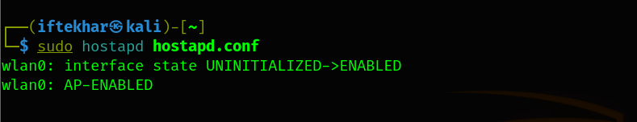
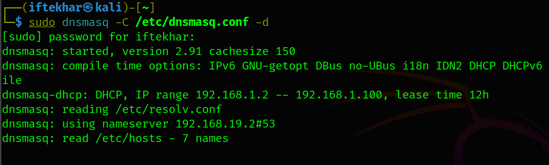
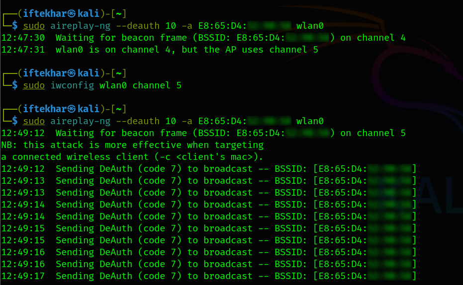
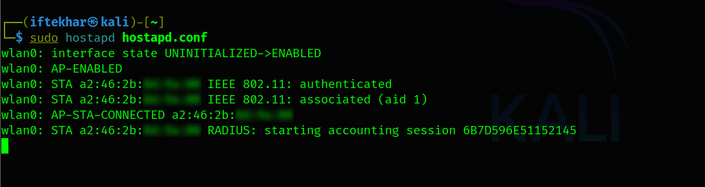
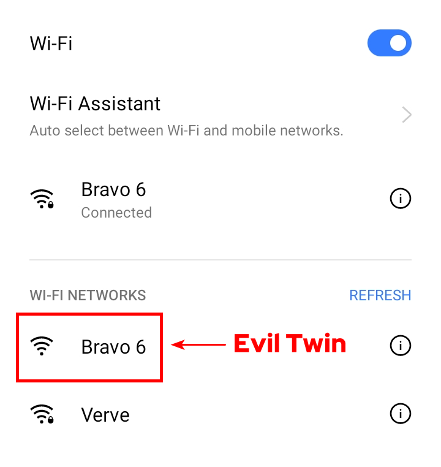

# The Evil Twin Deception

## Introduction

As a security researcher, I have observed the increasing sophistication of wireless network attacks, with the **Evil Twin attack** standing out as a particularly insidious threat. This attack exploits the trust users place in familiar Wi-Fi networks, enabling attackers to intercept sensitive data or deploy malicious payloads. In this blog, we will cover the attack's mechanics, execution methods, detection techniques, and mitigation strategies, grounded in real-world scenarios and technical rigor.

## What is an Evil Twin Attack?

An Evil Twin attack involves an attacker creating a rogue Wi-Fi access point (AP) that mimics a legitimate network. By broadcasting a Service Set Identifier (SSID) identical to that of a trusted network, the attacker tricks users into connecting to the malicious AP. Once connected, the attacker can intercept sensitive data, such as login credentials, financial information, or session tokens, or even serve malicious content to compromise the victim's device.

### Key Characteristics

- **Mimicry**: The rogue AP replicates the SSID, and sometimes the MAC address, of a legitimate network.
- **Manipulation**: Attackers may use techniques like signal strength amplification or deauthentication attacks to force users onto the rogue AP.
- **Data Interception**: Traffic routed through the rogue AP can be monitored, manipulated, or redirected to phishing sites.

This attack is particularly effective in public spaces like cafes, airports, or libraries, where users frequently connect to open Wi-Fi networks without verifying their authenticity.

## How Does an Evil Twin Attack Work?

1. **Reconnaissance**:
   - The attacker scans for nearby Wi-Fi networks using tools like `airodump-ng` or `Kismet`.
   - They identify a target network, noting its SSID, channel, encryption type (e.g., WPA2), and MAC address.

2. **Rogue AP Setup**:
   - The attacker configures a rogue AP with the same SSID as the target network using tools like `hostapd` or a portable router.
   - Optionally, they spoof the MAC address to further mimic the legitimate AP.
   - The rogue AP is set to broadcast a stronger signal to outcompete the legitimate network.

3. **Deauthentication (Optional)**:
   - To force users to connect to the rogue AP, the attacker may send deauthentication packets to disrupt connections to the legitimate AP using tools like `aireplay-ng`.
   - This causes devices to automatically reconnect to the strongest available AP, often the rogue one.

4. **User Connection**:
   - Unsuspecting users connect to the rogue AP, believing it to be legitimate.
   - If the target network is open (no password), the connection is seamless. For password-protected networks, attackers may use phishing portals to capture credentials.

5. **Data Interception and Exploitation**:
   - The attacker uses packet-sniffing tools like `Wireshark` or `tcpdump` to capture unencrypted traffic.
   - They may deploy a man-in-the-middle (MITM) framework like `Bettercap` to intercept HTTPS traffic or redirect users to malicious sites.
   - In advanced scenarios, attackers can serve malware or exploit vulnerabilities in the victim's device.

## Setting Up an Evil Twin Attack

**Note**: Performing this attack without explicit permission is illegal and unethical. Always conduct such experiments in a lab environment with consent.

### Prerequisites

- A Linux system (e.g., Kali Linux) with a compatible Wi-Fi adapter supporting monitor mode (e.g., Atheros AR9271).
- Tools: `aircrack-ng` suite, `hostapd`, `dnsmasq`, and `Wireshark`.
- A secondary device to simulate the victim.

### Execution

To set up a rogue access point that mimics a legitimate network (an Evil Twin), you need to configure two key tools: `hostapd` (for creating the Wi-Fi access point) and `dnsmasq` (for assigning IP addresses to devices that connect).

1. **Enable Monitor Mode**:

   

     
   

   
   This puts the Wi-Fi adapter into monitor mode, creating an interface like `wlan0`.

2. **Scan for Target Networks**:

   

     
   

   
   Identify the target network's SSID, BSSID (MAC address), and channel.

3. **Configure the Rogue AP**:

   Open the `hostapd.conf` file:

   

     
   

   Add the following lines:
   
   

     
   

   `hostapd.conf` file tells `hostapd` how to set up and manage the rogue AP.

   - `interface=wlan0`
   This line specifies which Wi-Fi interface on your computer will act as the rogue AP. In this case, `wlan0` is the name of your wireless network adapter (e.g., the Wi-Fi card). Think of it as choosing which "radio" your computer will use to broadcast the fake network. You need to ensure `wlan0` is available and not in use by another program.

   - `driver=nl80211`
   This tells `hostapd` which driver to use to communicate with your Wi-Fi adapter. The `nl80211` driver is a common choice for modern Linux systems (like Kali Linux) because it works with most Wi-Fi chips that support access point mode. It’s like selecting the right software to talk to your hardware.

   - `ssid=Bravo 6`
   The SSID is the name of the Wi-Fi network that users will see (e.g., "Bravo 6"). Here, you should put the name of the legitimate network you’re mimicking. This is the key trick of an Evil Twin - making the rogue AP look familiar to trick users into connecting.

   - `hw_mode=g`
   This sets the wireless mode to "g," which operates in the 2.4 GHz frequency band using the 802.11g standard. This is an older but widely supported Wi-Fi mode, suitable for most devices. It’s like choosing the "language" your rogue AP will use to communicate with phones or laptops.

   - `channel=6`
   This assigns the rogue AP to channel 6 within the 2.4 GHz band. Wi-Fi channels are like specific lanes on a highway. Channel 6 (around 2.437 GHz) is one of many options (1 through 13) to avoid interference with other networks. You should match this to the channel of the target network for an effective Evil Twin, which you can find using `airodump-ng`.

   - `macaddr_acl=0`
   This disables MAC address filtering, meaning any device can connect to the rogue AP regardless of its hardware address (MAC address). Setting it to `0` turns off access control, making the network open to all. Perfect for an Evil Twin to attract unsuspecting users.

   - `auth_algs=1`
   This specifies the authentication algorithm. A value of `1` enables open system authentication, which means no password is required to connect. This is common for public Wi-Fi and makes your rogue AP easier to join, increasing its effectiveness as an Evil Twin.

   - `ignore_broadcast_ssid=0`
   This ensures the SSID (Bravo 6) is broadcasted, so it appears in the list of available Wi-Fi networks on users’ devices (like in your phone’s Wi-Fi settings). Setting it to `0` means the network is visible, which is necessary for an Evil Twin to lure users.
   
   Launch the rogue AP:

   

     
   

5. **Set Up DHCP and DNS**:

   Open the `dnsmasq.conf` file to assign IP addresses to connected clients:

   

     
   

   Add the following lines:
   
   

     
   

   `dnsmasq.conf` file configures `dnsmasq` to act as a DHCP server, assigning IP addresses to devices that connect to your rogue AP.

   - `interface=wlan0`
   Similar to the `hostapd.conf` setting, this tells dnsmasq to use `wlan0` to handle network traffic. It’s the same "radio" used by `hostapd`, ensuring the rogue AP and DHCP server work together.

   - `dhcp-range=192.168.1.2,192.168.1.100,12h`
   This defines the range of IP addresses `dnsmasq` will assign to connected devices.
      - `192.168.1.2,192.168.1.100`: This sets the pool of IP addresses from 192.168.1.2 to 192.168.1.100. When a device connects, it will get an IP like 192.168.1.3, 192.168.1.4, and so on, up to 192.168.1.100.
      - `12h`: This sets the lease time to 12 hours, meaning each IP assignment lasts for 12 hours before the device needs to request a new one. This keeps the network running smoothly for your simulation.

   Start `dnsmasq`:

   

     
   

7. **Optional: Deauthentication Attack**:

   

     
   

8. **Capture Traffic**:

   Use `Wireshark` to monitor traffic on the `wlan0` interface, filtering for HTTP or other protocols of interest.

   

     
   

9. **Optional: Phishing Portal**:

   Set up a fake captive portal using tools like `SET` (Social-Engineer Toolkit) to capture credentials.

### Output

When executed correctly, the rogue AP will appear (in our example, it's "Bravo 6") in the victim's Wi-Fi list. Upon connection, the attacker can see all unencrypted traffic or redirect users to a phishing page.

  

  

  
  
Evil Twin Rogue AP

## Detection Techniques

### For End-Users

- **Verify Network Details**: Check the AP's MAC address or certificate (if using WPA2-Enterprise). A mismatch indicates a rogue AP.
- **Avoid Open Networks**: Public Wi-Fi without encryption is a prime target. Use a VPN to encrypt traffic.
- **Monitor Signal Strength**: Sudden changes in signal strength for a familiar network may indicate a rogue AP with a stronger signal.
- **Check for Captive Portals**: Unexpected login pages on familiar networks are a red flag.

### For Network Administrators

- **Wireless Intrusion Detection Systems (WIDS)**: Deploy tools like `Kismet` or `Snort` to detect rogue APs by monitoring for duplicate SSIDs or unauthorized MAC addresses.
- **Monitor Deauthentication Packets**: Excessive deauth packets can indicate an attack. Use tools like `airmon-ng` to capture and analyze 802.11 frames.
- **MAC Address Filtering**: Maintain a whitelist of authorized APs and alert on unrecognized BSSIDs.
- **802.1X Authentication**: Implement WPA2-Enterprise with certificate-based authentication to prevent unauthorized APs from mimicking your network.

## Mitigation Strategies

Preventing Evil Twin attacks requires a multi-layered approach:

1. **User Education**:

   - Train users to avoid connecting to unfamiliar or open Wi-Fi networks.
   - Encourage the use of VPNs (e.g., NordVPN, ProtonVPN) to encrypt traffic.

2. **Network Hardening**:

   - Use strong encryption (WPA3 or WPA2-Enterprise) to make it harder for attackers to mimic your network.
   - Disable SSID broadcasting for sensitive networks to reduce visibility.
   - Implement MAC address filtering and regularly update AP firmware.

3. **Advanced Security Measures**:

   - Deploy WIDS/WIPS (Wireless Intrusion Prevention Systems) to automatically detect and block rogue APs.
   - Use network segmentation to limit the impact of a compromised AP.
   - Enable HTTPS everywhere and HSTS (HTTP Strict Transport Security) to protect web traffic.

4. **For Public Wi-Fi Providers**:

   - Display clear signage with the official SSID and QR codes for secure connection.
   - Use unique, randomized SSIDs to make it harder for attackers to predict network names.

## Advanced Considerations for Practitioners

For security professionals, understanding the nuances of Evil Twin attacks opens opportunities for both offensive and defensive strategies:

- **Custom Rogue AP Tools**: Advanced attackers may use software-defined radios (SDRs) like HackRF to create highly customized rogue APs that mimic advanced network configurations (e.g., 5GHz WPA3 networks).
- **Layer 2 Attacks**: Combine Evil Twin with ARP spoofing or DNS poisoning for more sophisticated MITM attacks.
- **Automated Detection**: Develop scripts to monitor Wi-Fi channels for anomalies, such as sudden SSID duplicates or signal strength spikes, using tools like `Scapy` or `PyShark`.
- **Forensic Analysis**: After detecting a rogue AP, preserve packet captures and logs for legal action. Tools like `tcpdump` or `Wireshark` can help reconstruct the attack timeline.

### Example: Automated Rogue AP Detection Script
Below is a Python script using `Scapy` to detect potential Evil Twin APs by identifying duplicate SSIDs on different MAC addresses:

from scapy.all import *
import time

def detect_evil_twin(pkt):
    if pkt.haslayer(Dot11Beacon):
        ssid = pkt[Dot11Beacon].info.decode()
        bssid = pkt[Dot11].addr2
        if ssid in ssid_list:
            if bssid not in ssid_list[ssid]:
                print(f"Potential Evil Twin detected! SSID: {ssid}, New BSSID: {bssid}")
                ssid_list[ssid].append(bssid)
        else:
            ssid_list[ssid] = [bssid]

ssid_list = {}
sniff(iface="wlan0mon", prn=detect_evil_twin, timeout=60)

This script monitors beacon frames for 60 seconds and alerts if the same SSID appears with a new MAC address, indicating a possible rogue AP.

## Real-World Implications

Evil Twin attacks have been documented in various high-profile incidents:
- In 2017, researchers demonstrated Evil Twin attacks at DEF CON, compromising credentials in public Wi-Fi settings.
- Corporate environments have been targeted to steal employee credentials, bypassing VPNs that fail to verify AP authenticity.
- Attackers increasingly combine Evil Twin with social engineering, using fake captive portals to mimic legitimate login pages (e.g., Starbucks or airport Wi-Fi).

The rise of IoT devices, which often lack robust security, further amplifies the risk, as these devices may automatically connect to rogue APs without user intervention.
