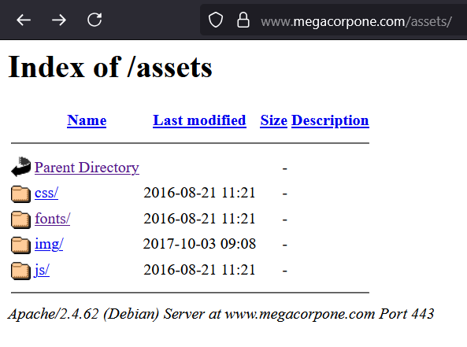
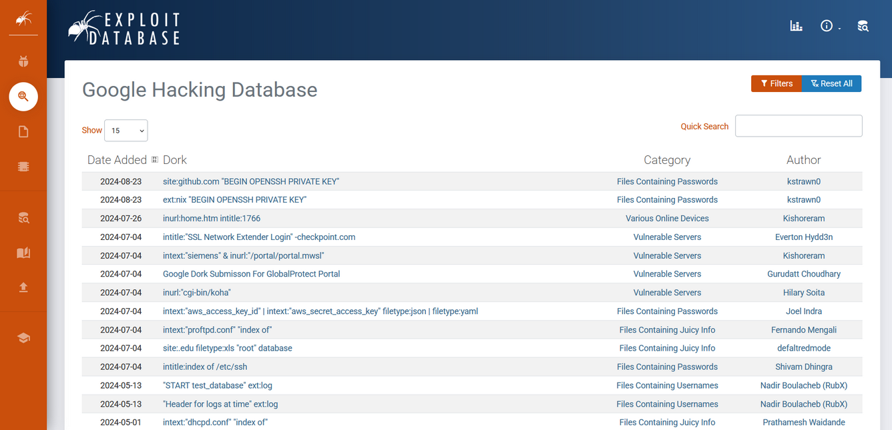
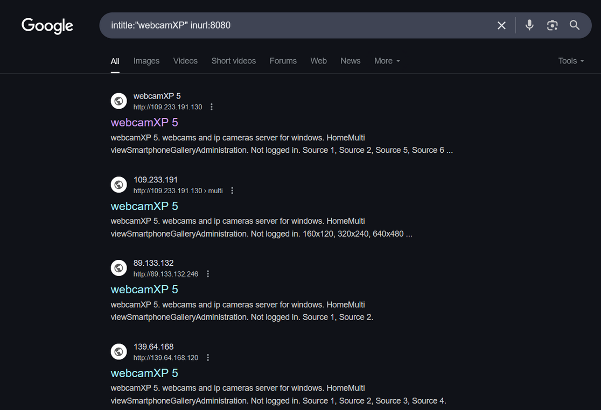

# Google Hacking Essentials

As a security researcher, one of the most powerful tools in your reconnaissance arsenal is the ability to leverage search engines to uncover sensitive information, misconfigurations, and potential vulnerabilities. Coined by Johnny Long in 2001, "Google Hacking" (also known as Google Dorking) involves crafting precise search queries using advanced operators to extract valuable data from public-facing systems. In this blog, we'll dive into Google Hacking and explore how to use search operators effectively, avoid common pitfalls, and apply these techniques during security assessments.

## What is Google Hacking?

Google Hacking uses advanced search operators to refine queries and uncover information that organizations may not intend to expose. This can include misconfigured servers, exposed files, directory listings, or even sensitive data like credentials. While the examples here focus on Google, many operators work across other search engines like Bing or DuckDuckGo. The process is iterative: start broad, refine with operators, and analyze results for actionable insights.

Note: Always conduct Google Hacking within the scope of authorized penetration testing engagements. Unauthorized access to systems or data is illegal and unethical.

## Basic Search Operators

For beginners, understanding Google’s search operators is the foundation of effective dorking. These operators allow you to narrow down results to specific domains, file types, or keywords.

### 1. The `site`: Operator

The `site:` operator restricts search results to a specific domain or subdomain. This is useful for mapping an organization’s web presence during reconnaissance.

```
site:example.com
```

This query returns all indexed pages for `example.com`. For a penetration test, this helps you understand the target’s web footprint, including subdomains or forgotten microsites.

<div style="text-align: center;">
  
</div>

### 2. The `filetype:` Operator

The `filetype:` (or `ext:`) operator filters results to specific file extensions, such as `pdf`, `txt`, or `php`. This is particularly useful for finding exposed configuration files or sensitive documents.

```
site:example.com filetype:pdf
```

This query finds all PDF files indexed on `example.com`. PDFs often contain sensitive information like employee handbooks, network diagrams, or financial reports.

<div style="text-align: center;">
  
</div>

We received an interesting result. Our query found the robots.txt file, containing the following content.

<div style="text-align: center;">
  
</div>

The robots.txt file instructs web crawlers, such as Google’s search engine crawler, to allow or disallow specific resources. In this case, it revealed a specific PHP page (/nanities.php) that was otherwise hidden from the regular search, despite being listed as allowed by the policy.

### 3. The `inurl:` Operator

The `inurl:` operator searches for specific strings within URLs. This is ideal for identifying login pages, admin panels, or specific scripts.

```
site:example.com inurl:login
```

This query finds pages on example.com with “login” in the URL, potentially revealing authentication portals.

### 4. The `intitle:` Operator

The `intitle:` operator searches for pages with specific words in their titles. This is useful for finding directory listings or specific page types.

```
intitle:"index of" site:example.com
```

This query looks for directory listings on `example.com`, which may expose files or directories not intended for public access.

<div style="text-align: center;">
  
</div>

### 5. The Exclusion Operator (`-`)

The `-` operator excludes specific terms from results, helping to filter out noise.

```
site:example.com -filetype:html
```

This query returns non-HTML pages on `example.com`, such as configuration files or scripts.

<div style="text-align: center;">
  
</div>

## Combining Operators

Once you’re comfortable with basic operators, combining them unlocks more powerful queries. The goal is to narrow results to the most relevant and potentially exploitable assets.

### Finding Exposed Configuration Files

```
site:example.com filetype:conf inurl:config
```

This query searches for configuration files (e.g., `.conf` files) with "config" in the URL. These files often contain sensitive settings like database credentials or API tokens.

### Discovering Exposed Admin Panels

```
site:*.example.com inurl:(admin | login | dashboard) -inurl:(signup | register)
```

This query targets subdomains of `example.com` with admin-related terms in the URL, excluding signup or registration pages to reduce false positives.

### Uncovering Directory Listings

```
site:example.com intitle:"index of" "parent directory"
```

<div style="text-align: center;">
  
</div>

This query finds directory listings that include "parent directory" links, indicating open directories without index pages.

<div style="text-align: center;">
  
</div>

## Leveraging the Google Hacking Database (GHDB)

For advanced practitioners, the Google Hacking Database (GHDB), maintained by Exploit-DB, is a treasure trove of pre-built dorks. These queries are designed to uncover specific vulnerabilities, such as exposed cameras, IoT devices, or error messages leaking sensitive information.

<div style="text-align: center;">
  
</div>

### GHDB Query for Exposed Webcams

```
intitle:"webcamXP" inurl:8080
```

<div style="text-align: center;">
  
</div>

This query finds webcams running webcamXP software, often misconfigured and accessible without authentication.

## Iterative Refinement

Advanced Google Hacking involves iteratively refining queries based on initial results. For example:

- Start with `site:example.com filetype:txt` to find text files.
- Analyze results for interesting files (e.g., `robots.txt` or `sitemap.xml`).
- Refine with `site:example.com inurl:backup filetype:sql` to target specific assets like database backups.

## Conclusion

Google Hacking is an essential skill for penetration testers, enabling the discovery of misconfigurations, exposed files, and hidden assets. By mastering search operators, leveraging resources like the GHDB, and applying iterative refinement, you can uncover critical vulnerabilities that might otherwise go unnoticed. However, this power comes with responsibility—always operate ethically and within authorized boundaries.

Start with basic operators, experiment with combinations, and explore tools like DorkSearch to enhance your workflow. With practice, Google Hacking can transform your reconnaissance phase into a goldmine of actionable intelligence.


### Resources:

- Google Hacking Database: https://www.exploit-db.com/google-hacking-database
- Johnny Long’s Google Hacking for Penetration Testers
