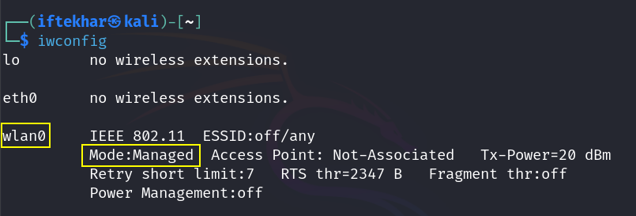
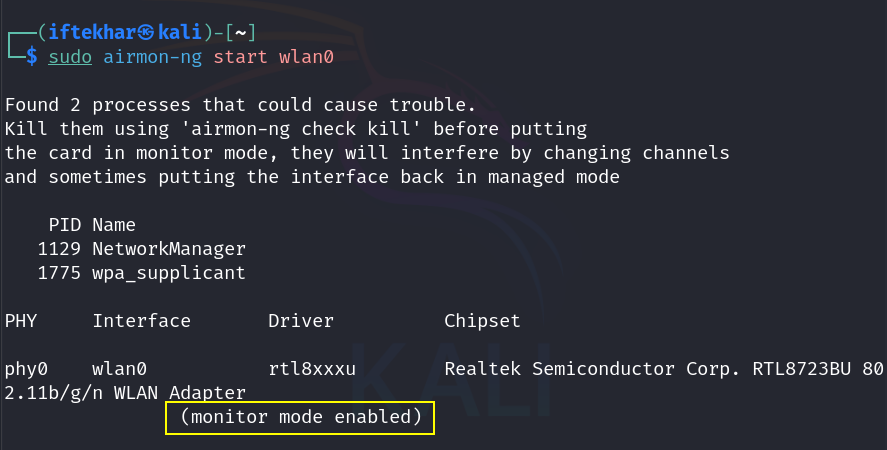
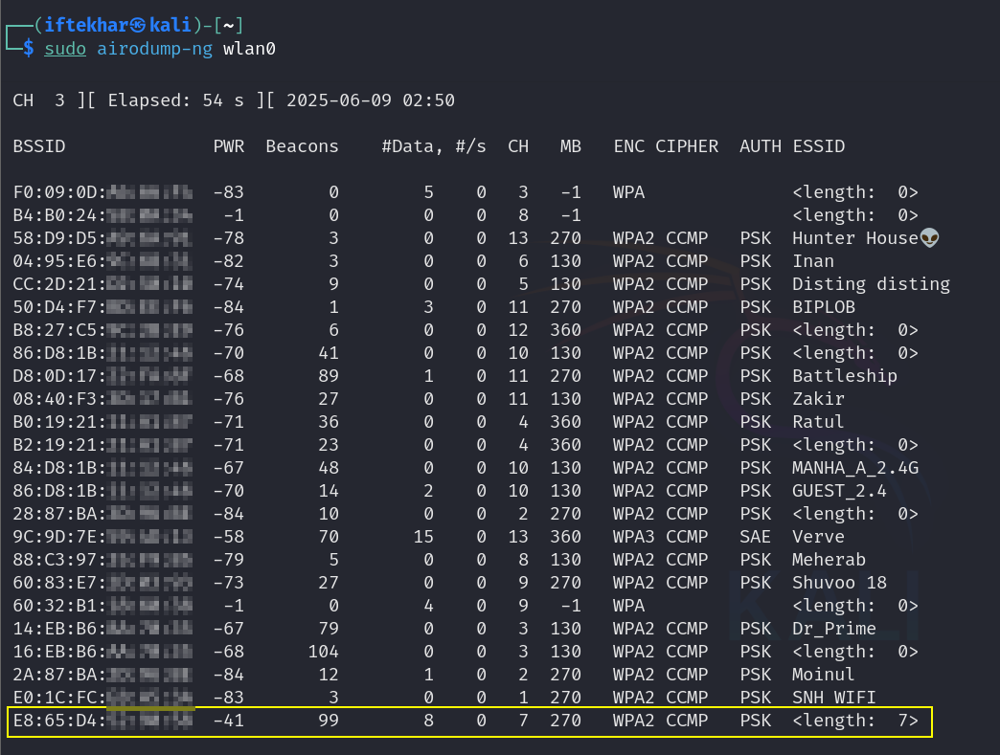
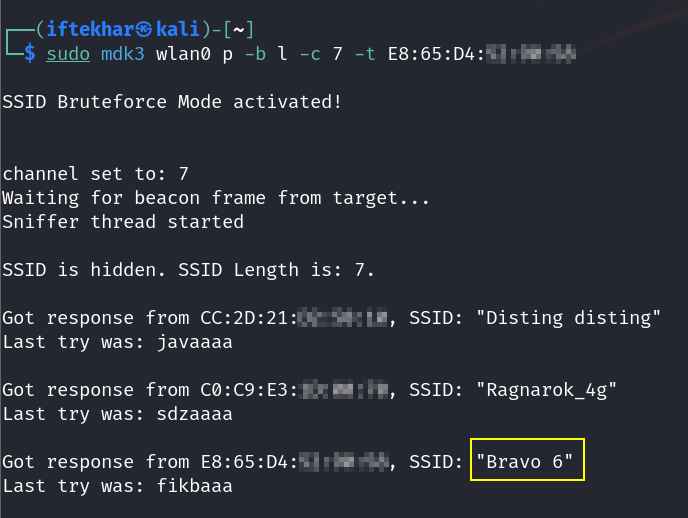

# Detecting Hidden Wi-Fi Networks

Wireless networks are ubiquitous, and their security is a critical concern for organizations and individuals alike. One common security measure is hiding a Wi-Fi network’s Service Set Identifier (SSID), which prevents the network name from appearing in standard scans. While this adds a layer of obscurity, it is not foolproof. Hidden SSIDs can still be detected using specialized tools and techniques, such as `mdk3` and `airodump-ng`. In this blog, we'll provide a detailed and practical guide for security researchers on detecting hidden SSIDs as part of a wireless network security audit.

**Disclaimer:** The techniques described here are for educational purposes and authorized security testing only. Unauthorized access or interference with wireless networks is illegal and unethical. Always obtain explicit permission from the network owner before conducting any security assessments.

## What is a Hidden SSID?

A hidden SSID is a Wi-Fi network that does not broadcast its name, making it invisible to standard Wi-Fi scanning tools like those built into operating systems or mobile devices. When an SSID is hidden, devices cannot detect the network unless they already know its name and are configured to connect to it. This obscurity is often used as a basic security measure to deter casual attackers. However, hidden SSIDs are not truly secure, as they can be revealed by analyzing probe responses or using specialized tools to force the network to disclose its name.

Detecting hidden SSIDs is a valuable skill for security researchers conducting wireless network audits. By identifying these networks, researchers can assess their configurations, encryption methods, and potential vulnerabilities. This guide focuses on using `mdk3`, a powerful tool for wireless network testing, to uncover hidden SSIDs through a controlled process.

## Prerequisites

- **A Linux-based system:** Tools like `mdk3` and `airodump-ng` are typically used on Linux distributions like Kali Linux or Parrot Security OS, which are designed for security testing.
- **A compatible wireless adapter:** The adapter must support monitor mode and packet injection. Popular choices include those with chipsets like Atheros AR9271 or Ralink RT3070 (e.g., Alfa Network AWUS036NHA).
- **Administrative privileges:** You’ll need root access to run the commands.
- **Legal authorization:** Ensure you have explicit permission to test the target network.
- **Software tools:** Install `mdk3` and `aircrack-ng` (which includes `airodump-ng`).

## Detecting Hidden SSIDs

### 1: Setting Up the Environment

To begin, you need to install the necessary tools. We’ll use `mdk3` for SSID detection and `airodump-ng` (part of the `aircrack-ng` suite) to scan for wireless networks.

1. **Install `mdk3`**:

  ```
  sudo apt update
  sudo apt install mdk3
  ```

  This command updates the package lists and installs mdk3. Verify the installation by checking the version:

  ```
  mdk3 --version
  ```

2. **Install `aircrack-ng`** (if not already installed):

  ```
  sudo apt install aircrack-ng
  ```

  `aircrack-ng` includes `airodump-ng`, which we’ll use to scan for networks.

3. **Prepare the Wireless Adapter**: Ensure your wireless adapter is connected and supports monitor mode. Identify your wireless interface name (e.g., `wlan0`) using:

  <div style="text-align: center;">
    
  </div>

4. **Enable monitor mode on the interface:**

  <div style="text-align: center;">
    
  </div>

  This command may create a new interface (e.g., `wlan0`). Use this interface name in subsequent steps.

### 2. Scanning for Wireless Networks

To identify hidden SSIDs, you first need to locate the target network. `airodump-ng` is a powerful tool for scanning wireless networks and capturing relevant information, such as the Basic Service Set Identifier (BSSID, or MAC address), channel, and encryption type.

Run the following command to scan for available networks:

```
sudo airodump-ng wlan0
```
The output will display a list of nearby wireless networks. Look for entries where the SSID field is blank or shows `<hidden>`. 

<div style="text-align: center;">
  
</div>

In this example:

- **BSSID**: `E8:65:D4:xx:xx:xx` is the MAC address of the access point.
- **CH**: The network operates on channel 7.
- **ESSID**: The SSID is blank (`<length: 7>`).

Note the BSSID and channel number, as these will be used in the next step.

### 3. Using `mdk3` to Uncover the Hidden SSID

`mdk3` is a versatile tool for testing wireless networks, including probing for hidden SSIDs. It can operate in bruteforce mode to force the access point to reveal its SSID by sending probe requests and analyzing responses.

Run the following command to start `mdk3` in bruteforce mode:

<div style="text-align: center;">
  
</div>

**Command Breakdown:**

- `wlan0`: The wireless interface in monitor mode.
- `p`: Activates bruteforce mode (ESSID probing).
- `b l`: Specifies the character set for bruteforcing (lowercase alphabets). Other options include:
  - `U`: Uppercase alphabets
  - `N`: Digits
  - `A`: All printable characters
  - `C`: Lowercase and uppercase alphabets
- `M`: Lowercase, uppercase, and numbers
- `c 7`: Targets channel 7 (based on the `airodump-ng` output).
- `t E8:65:D4:xx:xx:xx`: Specifies the BSSID of the target access point.

How It Works:mdk3 sends probe requests to the target access point, attempting to elicit a response that includes the hidden SSID. When the access point responds, the SSID is revealed and displayed in the terminal.
Example Output:After running the command, you might see:
Trying character set: abcdefghijklmnopqrstuvwxyz
Probing BSSID: C4:E5:32:A1:E0:28
Found SSID: SecretNetwork

In this case, the hidden SSID is SecretNetwork. This information can now be used for further analysis or testing (with authorization).
Step 4: Interpreting Results and Next Steps
Once the SSID is revealed, you can:

Document the findings: Record the SSID, BSSID, channel, and encryption type for your audit report.
Assess security: Check the encryption (e.g., WPA2, WPA3) and test for vulnerabilities like weak passwords or misconfigurations.
Report to stakeholders: If conducting an authorized audit, share the findings with the network owner, highlighting the risks of relying solely on hidden SSIDs for security.

Advanced Techniques and Considerations
For advanced practitioners, consider the following to enhance your approach:

Optimizing mdk3 Parameters:

Use a broader character set (e.g., -b M) to increase the likelihood of success if the SSID includes numbers or mixed case letters.
Combine with wordlists for faster results: mdk3 supports custom wordlists with the -f <file> option to test common SSID names.


Passive Monitoring:Instead of active probing, you can use airodump-ng to capture packets passively until a client connects to the hidden network, revealing the SSID. Run:
sudo airodump-ng --bssid C4:E5:32:A1:E0:28 --channel 11 --write capture wlan0mon

Analyze the capture file using tools like Wireshark to extract the SSID from probe responses.

Dealing with Countermeasures:Some access points implement protections against SSID probing, such as ignoring probe requests from unknown devices. In such cases, advanced techniques like deauthentication attacks (with tools like aireplay-ng) may be needed to force clients to reconnect and reveal the SSID. Use with caution and only with explicit permission.

Automation:Script the process using Bash or Python to automate scanning, SSID detection, and reporting. For example, a Python script using the scapy library can parse packets and extract SSIDs programmatically.


Ethical and Legal Considerations
Detecting hidden SSIDs can be a valuable part of a security audit, but it must be conducted ethically:

Obtain Permission: Always secure written authorization from the network owner or administrator before testing.
Minimize Disruption: Avoid aggressive probing that could disrupt network operations.
Comply with Laws: Unauthorized interception or manipulation of network traffic may violate laws like the U.S. Computer Fraud and Abuse Act or the EU’s GDPR.
Secure Your Tools: Ensure your testing environment is secure to prevent misuse of tools like mdk3.

Common Pitfalls and Troubleshooting

Wireless Adapter Issues: If airodump-ng or mdk3 fails, verify that your adapter supports monitor mode and packet injection. Use aireplay-ng --test wlan0mon to test injection capabilities.
Channel Hopping: If the target network is on a different channel, ensure airodump-ng is locked to the correct channel using --channel <number>.
False Positives: Some access points may respond with incorrect or dummy SSIDs. Cross-verify findings with passive monitoring.
Rate Limiting: Some networks limit probe responses. Increase the probing rate with mdk3’s -s <speed> option, but be cautious to avoid denial-of-service conditions.

Conclusion
Detecting hidden SSIDs is a fundamental skill for wireless network security assessments. Tools like mdk3 and airodump-ng provide powerful capabilities to uncover hidden networks, but their use must be guided by ethical principles and legal compliance. By following the steps outlined in this guide, security researchers can systematically identify hidden SSIDs, assess network configurations, and provide actionable recommendations to improve security.
For beginners, mastering these tools builds a strong foundation in wireless security testing. Advanced practitioners can extend these techniques with automation, passive monitoring, and integration with other tools to conduct comprehensive audits. Always prioritize ethical conduct and continuous learning to stay ahead in the ever-evolving field of cybersecurity.
