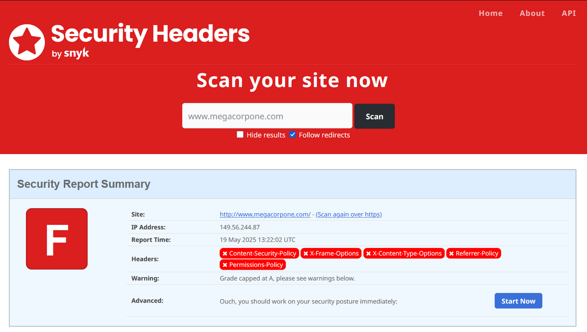
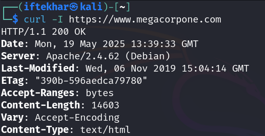
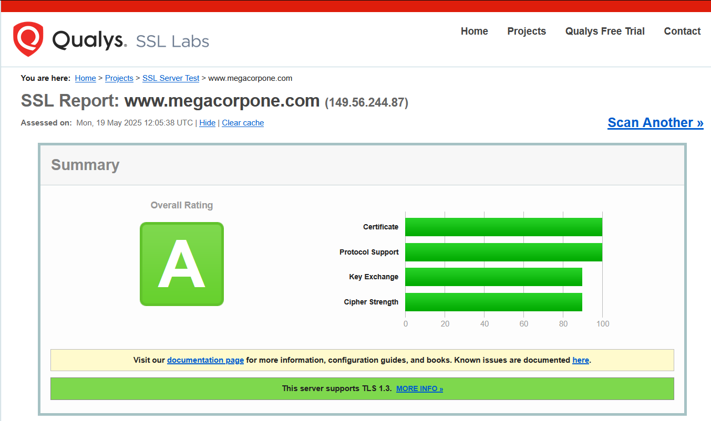
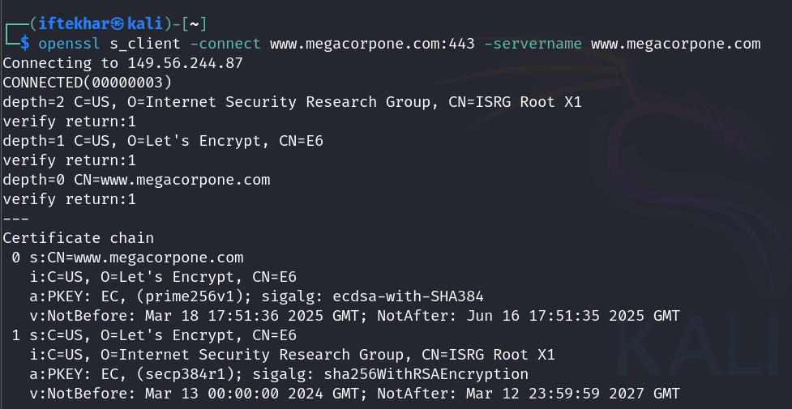

# Mastering Website Security with HTTP Headers and SSL/TLS Analysis

As security researchers, understanding a website's security posture is a critical step in assessing potential vulnerabilities during reconnaissance. Two key areas to evaluate are **HTTP security headers** and **SSL/TLS configurations**. These elements provide insights into an organization's server hardening practices and adherence to security best practices. In this blog post, we'll explore how to analyze these components using third-party tools like Security Headers and Qualys SSL Labs for seasoned researchers.

## Introduction to Website Security Analysis

When conducting reconnaissance, security researchers often aim to gather information about a target's infrastructure without directly interacting with it. Third-party tools like Security Headers and Qualys SSL Labs allow us to perform **passive** or **semi-passive analysis** by leveraging scans initiated by external services. These tools evaluate HTTP response headers and SSL/TLS configurations, respectively, revealing potential weaknesses in a website's security posture.

For beginners, this process helps identify misconfigurations or outdated practices that could indicate broader security gaps. For advanced researchers, these findings can inform targeted attack strategies or highlight areas for deeper investigation during a penetration test.

## Why HTTP Security Headers Matter

HTTP security headers are server responses included in HTTP replies to instruct browsers on how to handle content securely. They act as a first line of defense against common web vulnerabilities like cross-site scripting (XSS), clickjacking, and data injection attacks. Missing or misconfigured headers often suggest that server administrators or developers may lack awareness of modern web security practices.

## Key HTTP Security Headers to Check

- **Content-Security-Policy (CSP):** Defines approved sources for content (e.g., scripts, images) to mitigate XSS attacks. A missing or weak CSP can allow malicious scripts to execute.
- **X-Frame-Options:** Prevents clickjacking by controlling whether a page can be rendered in an iframe. Values like `DENY` or `SAMEORIGIN` are recommended.
- **X-Content-Type-Options:** Enforces MIME type sniffing rules with `nosniff`, preventing browsers from misinterpreting file types.
- **Strict-Transport-Security (HSTS):** Forces browsers to use HTTPS, reducing man-in-the-middle (MITM) risks. Look for `max-age` and `includeSubDomains`.
- **Referrer-Policy:** Controls how much referrer information is sent with requests, protecting user privacy.
- **Permissions-Policy:** Restricts access to powerful browser features like geolocation or camera.

## Using Security Headers for Analysis

The Security Headers tool scans a target website and assigns a grade (A to F) based on the presence and configuration of these headers. Let's walk through a practical example.

### Scanning a Website

1. **Visit Security Headers:** Navigate to securityheaders.com.
2. **Enter the Target URL:** For this example, let's use `www.megacorpone.com`.
3. **Review the Results:** The tool provides a grade and details missing or misconfigured headers.

For instance, if `www.megacorpone.com` lacks `Content-Security-Policy` and `X-Frame-Options`, it might receive a low grade (e.g., D or F). This suggests the server is not hardened against common attacks, potentially indicating broader security weaknesses.

  

Using Security Headers, we find:

- Missing `Content-Security-Policy` and `X-Frame-Options`.

This suggests the site is vulnerable to XSS and clickjacking. As a researcher, you might prioritize testing for these vulnerabilities in later phases of a penetration test.

## Interpreting Results

A missing `Content-Security-Policy` could allow attackers to inject malicious scripts, while the absence of `X-Frame-Options` might enable clickjacking attacks. These findings don't necessarily indicate exploitable vulnerabilities but suggest that developers may not follow server hardening best practices, as outlined in resources like NIST SP 800-123. You can use this information to hypothesize about the organization's overall security maturity.

## Advanced Manual Header Inspection Techniques

For deeper analysis, manually inspect headers using browser developer tools or `curl`:

  

If critical headers are missing, consider whether the site is vulnerable to specific attacks. For example, without `X-Frame-Options`, test for clickjacking by embedding the site in an iframe locally. Advanced researchers can also check for header misconfigurations, such as overly permissive CSP directives (e.g., `script-src 'unsafe-inline'`).

## Evaluating SSL/TLS Configurations

SSL/TLS secures data in transit, and its configuration is a cornerstone of server security. Misconfigured SSL/TLS settings can expose websites to attacks like POODLE or Heartbleed. The Qualys SSL Labs SSL Server Test is a powerful tool for assessing a server's SSL/TLS setup against industry best practices.

### Key SSL/TLS Components to Analyze

- **Protocol Versions:** Modern servers should support TLS 1.2 and 1.3, with TLS 1.0 and 1.1 disabled due to known vulnerabilities.
- **Cipher Suites:** Secure suites like `TLS_AES_256_GCM_SHA384` are preferred. Avoid insecure suites like `TLS_DHE_RSA_WITH_AES_256_CBC_SHA` due to weaknesses in CBC mode and SHA-1.
- **Certificate Validity:** Check for expired certificates, weak key lengths (e.g., <2048 bits), or untrusted certificate authorities (CAs).
- **Vulnerability Exposure:** Look for known issues like Heartbleed, POODLE, or weak Diffie-Hellman parameters.

## Using Qualys SSL Labs

### Running an SSL/TLS Scan

1. **Access SSL Labs:** Go to ssllabs.com/ssltest.
2. **Input the Target:** Enter `www.megacorpone.com` and run the scan.
3. **Analyze the Report:** The tool assigns a grade (A+ to F) based on protocol support, cipher suites, and vulnerabilities.

For example, a server supporting TLS 1.0 and weak ciphers like `TLS_DHE_RSA_WITH_AES_256_CBC_SHA` might receive a B or C grade, indicating outdated practices.

  

The Qualys SSL Labs scan reveals no major vulnerabilities like Heartbleed.

### Understanding Weaknesses

If the scan reveals support for TLS 1.0 or 1.1, the server is using legacy protocols with known vulnerabilities. For instance, TLS 1.0 is susceptible to attacks like BEAST. Similarly, cipher suites using SHA-1 or CBC mode are considered insecure due to cryptographic weaknesses. These findings suggest the organization may not regularly update its SSL/TLS configurations, a red flag for security researchers.

## Advanced Deep-Dive Analysis Techniques

For advanced researchers, dive into the Qualys report details:

- **Cipher Suite Analysis:** Cross-reference supported suites with resources like the Mozilla SSL Configuration Generator to identify outdated or insecure ciphers.
- **Certificate Chain Issues:** Verify the certificate chain for missing intermediates or weak signatures (e.g., SHA-1).
- Use tools like `openssl` to manually inspect certificates:

  

- **Vulnerability Testing:** If the scan flags vulnerabilities like Heartbleed, attempt to replicate them in a controlled environment (with permission). For example, use Metasploit's `auxiliary/scanner/ssl/heartbleed` module to test for Heartbleed exposure.

## Best Practices for Server Hardening

- **Implement All Security Headers:** Configure CSP, X-Frame-Options, HSTS, and others following OWASP guidelines.
- **Disable Legacy TLS Protocols:** Enforce TLS 1.2 and 1.3, disabling TLS 1.0, 1.1, and SSLv3.
- **Use Strong Cipher Suites:** Prioritize GCM-based ciphers and avoid CBC or SHA-1-based suites.
- **Regularly Update Configurations:** Use tools like Mozilla's SSL Configuration Generator to stay aligned with best practices.
- **Monitor for Vulnerabilities:** Regularly scan with tools like Qualys SSL Labs to catch misconfigurations early.

## Conclusion

Analyzing HTTP security headers and SSL/TLS configurations is a powerful technique for assessing a website's security posture. Tools like Security Headers and Qualys SSL Labs provide actionable insights, from identifying missing defenses to flagging outdated protocols. For beginners, these tools offer an accessible entry point into reconnaissance. For advanced researchers, they provide a foundation for deeper investigation, informing targeted attack strategies or hardening recommendations.

### Resources:

- Security Headers
- Qualys SSL Labs
- OWASP Secure Headers Project
- Mozilla SSL Configuration Generator
- NIST SP 800-123: Guide to General Server Security
