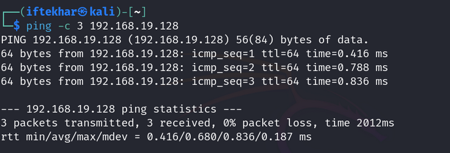

# Metasploitable 2

Metasploitable 2, developed by Rapid7, is a deliberately vulnerable Ubuntu-based VM designed for security training. It hosts vulnerable services like Apache, Samba, and FTP, making it an ideal target for vulnerability scans.

## Installation

### 1. Download Metasploitable 2:

- Obtain the VM from SourceForge.
- File format: `.zip` containing a VMware or VirtualBox-compatible VM.

### 2. Configure the VM:

- Use **VirtualBox** (free) or **VMware Workstation Player** (free for non-commercial use).
- Unzip the file and import the VM into your virtualization software.
- Set the network to **Host-Only** or **NAT** mode to isolate it from your production network.

### 3. Verify Connectivity:

- Boot the Metasploitable 2 VM. Log in with default credentials: `msfadmin:msfadmin`.
- Find the VM’s IP address by running:

```
ifconfig
```
- From your Kali Linux VM, ping the Metasploitable IP to confirm connectivity:

```
ping -c 3 <metasploitable-ip>
```



**Note:** Never expose Metasploitable 2 to the internet, as its vulnerabilities can be easily exploited.
