# Executing Man-in-the-Middle Attacks with Rogue Access Points

Man-in-the-Middle (MITM) attacks are a significant threat in wireless networks, allowing attackers to intercept and manipulate communication between clients and access points (APs). One potent method involves creating a rogue access point, a malicious Wi-Fi network designed to lure unsuspecting users. In this blog, I'll provide a detailed, practical guide to understanding and executing a rogue AP-based MITM attack, aimed at both beginners and advanced security enthusiasts. We'll focus on using Kali Linux and tools like `airbase-ng` to demonstrate the attack, while emphasizing legal boundaries.

**Disclaimer:** This guide is for educational purposes only. Performing MITM attacks on networks or devices without explicit permission is illegal. Always conduct security research in controlled and authorized environments.

## What is a Rogue Access Point MITM Attack?

A rogue access point is a malicious Wi-Fi network set up by an attacker to mimic a legitimate AP. By enticing users to connect, the attacker can intercept traffic, modify data, or launch further attacks like phishing or session hijacking. This technique is particularly effective in public Wi-Fi environments, where users may not verify the authenticity of networks.

MITM attacks via rogue APs exploit the trust users place in Wi-Fi networks. Other related techniques include ARP spoofing, Evil Twin attacks, Wi-Fi Pineapple, and DNS spoofing, each with unique mechanisms for intercepting traffic. This blog focuses on the rogue AP method, as it's accessible yet powerful for demonstrating MITM concepts.

## Prerequisites

To follow this guide, you'll need:

- A Kali Linux machine (physical or virtual).
- An external Wi-Fi adapter that supports monitor mode.
- Basic familiarity with Linux terminal commands.
- Tools from the Aircrack-ng suite (`airbase-ng`, `airodump-ng`, etc.).
- A controlled lab environment with explicit permission to test.

## Key Concepts for Beginners

Before diving in, let’s clarify some terms:

- **Virtual AP (Access Point):** A software-simulated Wi-Fi network (e.g., `at0` interface) created by tools like `airbase-ng`. It mimics a real AP without requiring dedicated hardware.
- **DHCP Server:** A service that automatically assigns IP addresses to devices connecting to the network, ensuring they can communicate.
- **DNSmasq:** A lightweight tool that acts as both a DHCP and DNS server, simplifying network configuration for the rogue AP.
- **Why Configure a Server?:** Configuring a DHCP server (via `dnsmasq`) ensures connected clients get IP settings, making the rogue AP functional and convincing.
- **Configuration File:** A text file (e.g., `/etc/dnsmasq.conf`) that defines how `dnsmasq` assigns IPs and handles DNS requests.

## Creating a Rogue AP for MITM

### 1. Set Up Your Wi-Fi Adapter in Monitor Mode

To capture and manipulate wireless traffic, your Wi-Fi adapter must be in _monitor_ mode, which allows it to listen to all wireless packets, not just those destined for your device.

1. Connect your external Wi-Fi adapter to your Kali Linux machine.

2. Verify the adapter is recognized:
<div style="text-align: center;">
  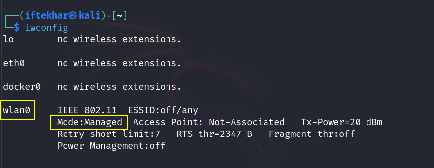
</div>

Look for your adapter's interface name (e.g., `wlan0`).

3. Enable monitor mode:
<div style="text-align: center;">
  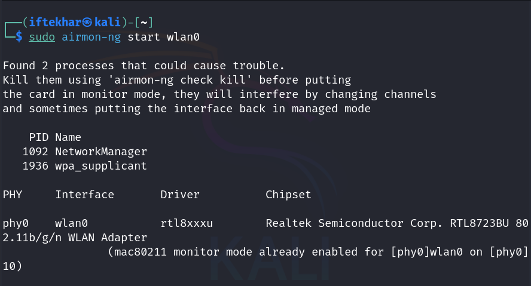
</div>

This creates a new interface (e.g., `wlan0`). Confirm with `iwconfig`.

<div style="text-align: center;">
  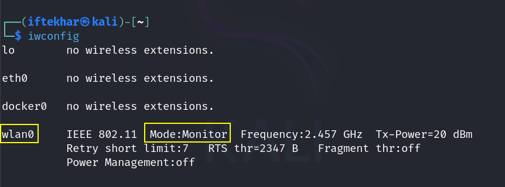
</div>

## 2. Create the Rogue Access Point

Using `airbase-ng` from the Aircrack-ng suite, we'll create a rogue AP with a customized SSID to mimic a legitimate network.

1. Launch the rogue AP:

<div style="text-align: center;">
  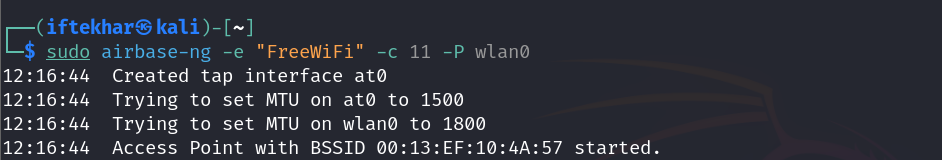
</div>

- `e "FreeWiFi"`: Sets the SSID to "FreeWiFi" (choose a name that blends with the environment).
- `c 11`: Specifies the channel (e.g., channel 6; match the target AP's channel for realism).
- `P`: Enables the AP to respond to all probe requests, increasing the likelihood of client connections.
- `wlan0`: The monitor-mode interface.

This command creates a virtual AP interface (e.g., `at0`). Confirm with `iwconfig` and `ifconfig`.

<div style="text-align: center;">
  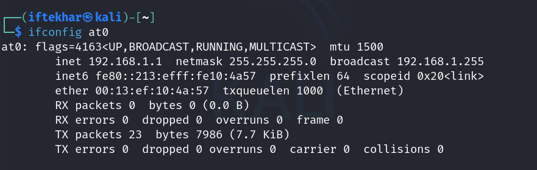
</div>

<div style="text-align: center;">
  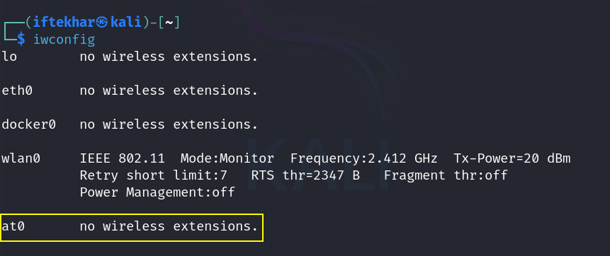
</div>

2. Monitor the AP activity in the terminal. You'll see clients attempting to connect:

<div style="text-align: center;">
  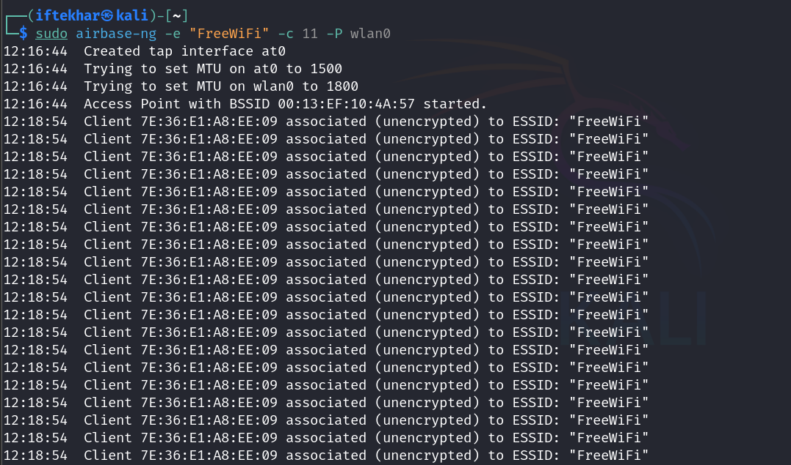
</div>

## 3. Configure Network Routing

To intercept traffic, you need to route client traffic through your Kali machine and assign IPs to clients.

1. Enable IP forwarding:

<div style="text-align: center;">
  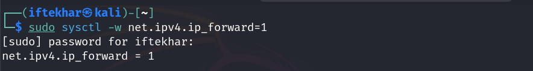
</div>

This allows traffic to pass between the rogue AP and your machine.

2. Set up the virtual AP interface (`at0`) with an IP address:

<div style="text-align: center;">
  
</div>

This assigns a static IP to `at0`, acting as the gateway for clients.

3. Configure a DHCP server to assign IP addresses to connecting clients.

- Install and configure `dnsmasq`:

<div style="text-align: center;">
  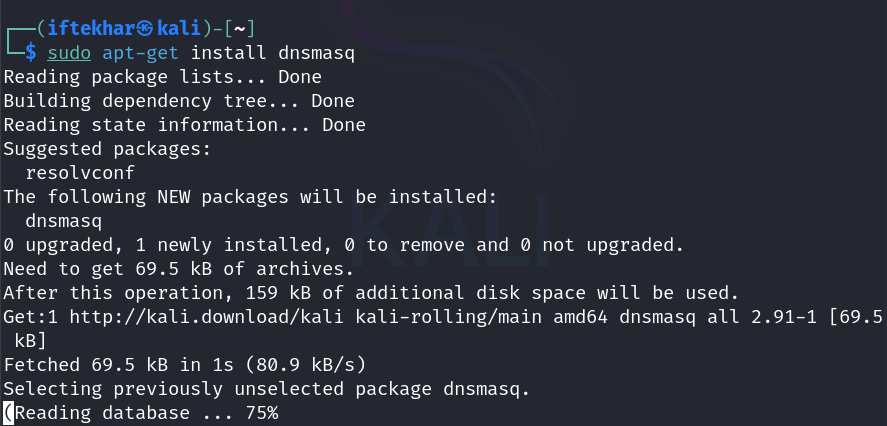
</div>

- Create a configuration file (`/etc/dnsmasq.conf`):

```bash
sudo gedit /etc/dnsmasq.conf
```
Add:

```plain
interface=at0
dhcp-range=192.168.1.2,192.168.1.100,12h
```
  - `interface=at0`: Tells `dnsmasq` to use the virtual AP.
  - `dhcp-range`: Defines the IP range (`192.168.1.2` to `192.168.1.100`) and lease time (12 hours) for clients.
  - Save and exit.

<div style="text-align: center;">
  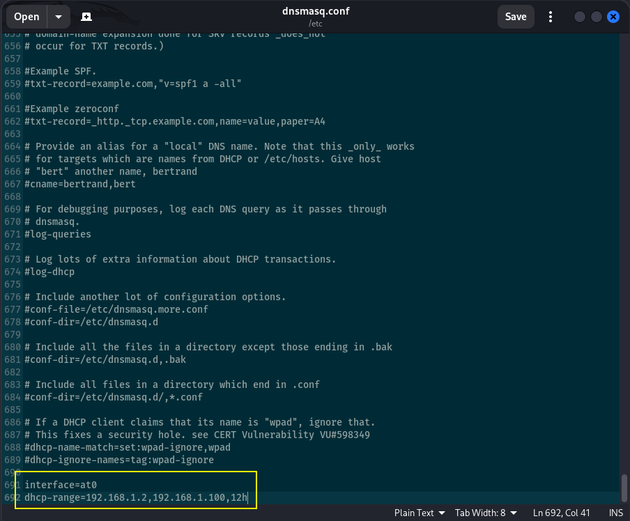
</div>

- Start `dnsmasq`:

<div style="text-align: center;">
  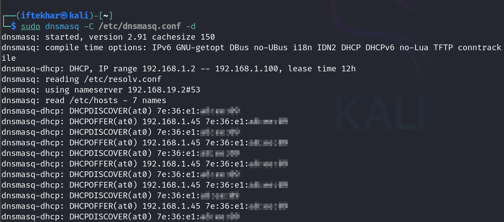
</div>

<div style="text-align: center;">
  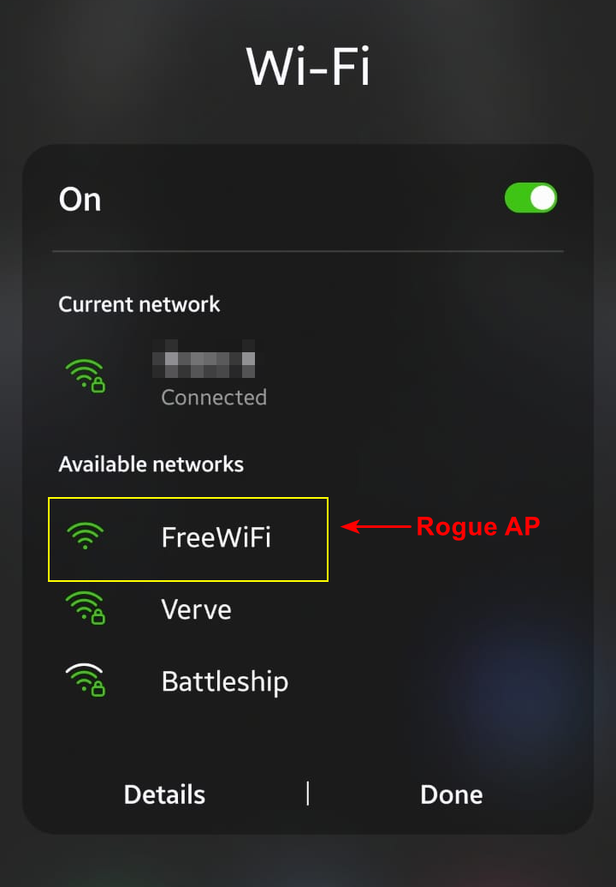
  <p style="text-align: center; margin-top: -5px;">Rogue AP Created and Publicly Accessible</p>
</div>

- Set up NAT to allow clients internet access (optional, to make the rogue AP convincing):

```bash
sudo iptables -t nat -A POSTROUTING -o eth0 -j MASQUERADE
```

## 4. Intercept and Analyze Traffic

Once clients connect to your rogue AP, their traffic routes through your Kali machine. Use tools like Wireshark or tcpdump to capture and analyze packets.

1. Start Wireshark:
```bash
sudo wireshark &
```

2. Select the `at0` interface and filter for protocols like HTTP, DNS, or TLS to inspect traffic.
<div style="text-align: center;">
  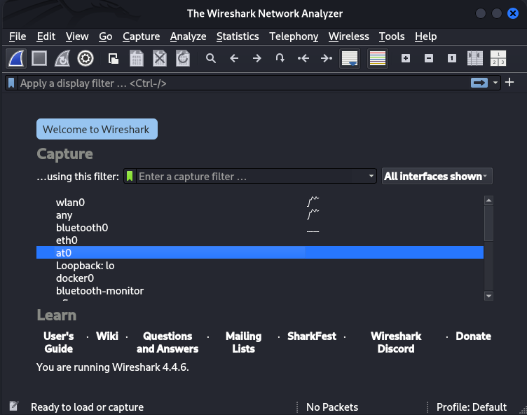
</div>

<div style="text-align: center;">
  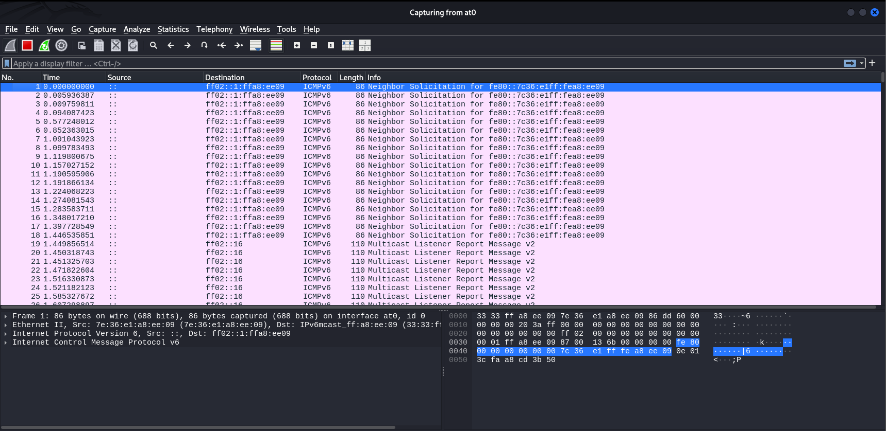
</div>

<div style="text-align: center;">
  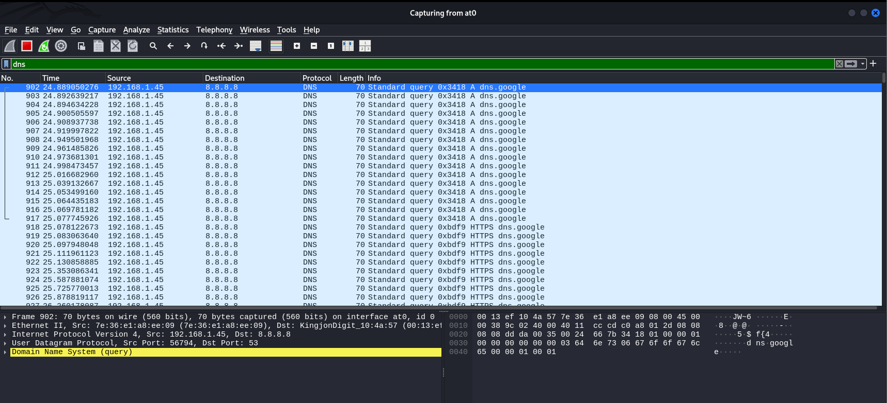
</div>

## 5. Clean Up

After testing, dismantle the rogue AP and restore your system:

- Stop `airbase-ng`.

- Disable monitor mode:

<div style="text-align: center;">
  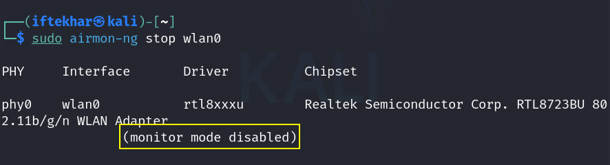
</div>

- Stop `dnsmasq` and reset IP forwarding:

<div style="text-align: center;">
  

<div style="text-align: center;">
  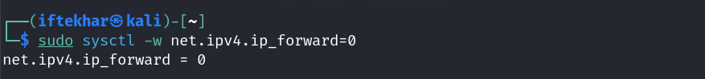
</div>

## Advanced Techniques and Mitigations

### Related MITM Techniques

- **SSL Stripping:** Downgrade HTTPS connections to HTTP (use `sslstrip`).
- **Evil Twin Attack:** A variant where the rogue AP mimics a specific legitimate AP, often combined with de-authentication attacks to force clients to connect.
- **Wi-Fi Pineapple:** A hardware device that automates rogue AP and MITM attacks.
- **ARP Spoofing:** Manipulates ARP tables to intercept traffic on wired or wireless networks.
- **DNS Spoofing:** Redirect clients to malicious sites by altering DNS responses (use tools like `dnsspoof`).
- **Session Hijacking:** Steal cookies or tokens using tools like `ettercap`.

## Mitigations

To protect against rogue AP attacks:

- **Use VPNs:** Encrypt traffic to prevent interception.
- **Verify SSIDs:** Avoid connecting to unverified or suspiciously named networks.
- **Enable WPA3:** Modern encryption protocols make rogue APs harder to exploit.
- **Monitor Network Activity:** Use intrusion detection systems to spot unauthorized APs.

## Conclusion

Rogue access point-based MITM attacks are a powerful demonstration of wireless network vulnerabilities. By setting up a rogue AP with tools like `airbase-ng`, security researchers can study how attackers intercept and manipulate traffic. However, this knowledge must be used responsibly. For beginners, mastering these steps builds a foundation in wireless security testing, while advanced users can explore related techniques like DNS spoofing or session hijacking to deepen their expertise.

Stay curious, and keep securing the digital world.
