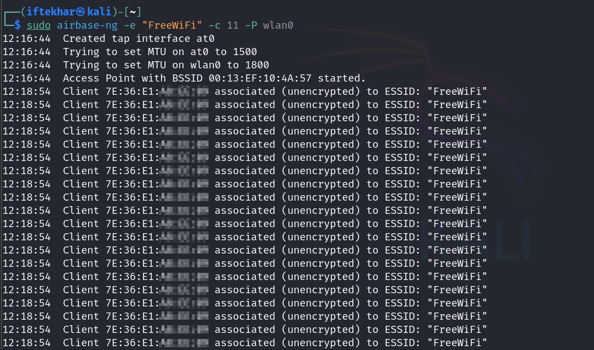

# Executing Man-in-the-Middle Attacks with Rogue Access Points

Man-in-the-Middle (MITM) attacks are a significant threat in wireless networks, allowing attackers to intercept and manipulate communication between clients and access points (APs). One potent method involves creating a rogue access point, a malicious Wi-Fi network designed to lure unsuspecting users. In this blog, I'll provide a detailed, practical guide to understanding and executing a rogue AP-based MITM attack, aimed at both beginners and advanced security enthusiasts. We'll focus on using Kali Linux and tools like `airbase-ng` to demonstrate the attack, while emphasizing legal boundaries.

**Disclaimer:** This guide is for educational purposes only. Performing MITM attacks on networks or devices without explicit permission is illegal. Always conduct security research in controlled and authorized environments.

## What is a Rogue Access Point MITM Attack?

A rogue access point is a malicious Wi-Fi network set up by an attacker to mimic a legitimate AP. By enticing users to connect, the attacker can intercept traffic, modify data, or launch further attacks like phishing or session hijacking. This technique is particularly effective in public Wi-Fi environments, where users may not verify the authenticity of networks.

MITM attacks via rogue APs exploit the trust users place in Wi-Fi networks. Other related techniques include ARP spoofing, Evil Twin attacks, Wi-Fi Pineapple, and DNS spoofing, each with unique mechanisms for intercepting traffic. This blog focuses on the rogue AP method, as it's accessible yet powerful for demonstrating MITM concepts.

## Prerequisites

To follow this guide, you'll need:

- A Kali Linux machine (physical or virtual).
- An external Wi-Fi adapter that supports monitor mode.
- Basic familiarity with Linux terminal commands.
- Tools from the Aircrack-ng suite (`airbase-ng`, `airodump-ng`, etc.).
- A controlled lab environment with explicit permission to test.

## Key Concepts for Beginners

Before diving in, let's clarify some terms:

- **Virtual AP (Access Point):** A software-simulated Wi-Fi network (e.g., `at0` interface) created by tools like `airbase-ng`. It mimics a real AP without requiring dedicated hardware.
- **DHCP Server:** A service that automatically assigns IP addresses to devices connecting to the network, ensuring they can communicate.
- **DNSmasq:** A lightweight tool that acts as both a DHCP and DNS server, simplifying network configuration for the rogue AP.
- **Why Configure a Server?:** Configuring a DHCP server (via `dnsmasq`) ensures connected clients get IP settings, making the rogue AP functional and convincing.
- **Configuration File:** A text file (e.g., `/etc/dnsmasq.conf`) that defines how `dnsmasq` assigns IPs and handles DNS requests.

## Creating a Rogue AP for MITM

### 1. Set Up Your Wi-Fi Adapter in Monitor Mode

To capture and manipulate wireless traffic, your Wi-Fi adapter must be in _monitor_ mode, which allows it to listen to all wireless packets, not just those destined for your device.

1. Connect your external Wi-Fi adapter to your Kali Linux machine.

2. Verify the adapter is recognized:

   <div style="text-align: center;">
     
   </div>

   Look for your adapter's interface name (e.g., `wlan0`).

3. Enable monitor mode:

   <div style="text-align: center;">
     
   </div>

   This creates a new interface (e.g., `wlan0`). Confirm with `iwconfig`.

   <div style="text-align: center;">
     
   </div>

## 2. Create the Rogue Access Point

Using `airbase-ng` from the Aircrack-ng suite, we'll create a rogue AP with a customized SSID to mimic a legitimate network.

1. Select a Channel:

   - Before launching the AP, scan for nearby networks to choose a less congested channel (e.g., 1, 6, or 11, which are non-overlapping in the 2.4 GHz band). Use `airodump-ng`:
  
   ```
   sudo airodump-ng wlan0
   ```

   Note the channel with the least interference (e.g., channel 11 if fewer APs are using it).
   
2. Launch the rogue AP:

   <div style="text-align: center;">
     
   </div>
   
   - `e "FreeWiFi"`: Sets the SSID to "FreeWiFi" (choose a name that blends with the environment).
   - `c 11`: Specifies the channel (we'll be using 11 in our case).
   - `P`: Enables the AP to respond to all probe requests, increasing the likelihood of client connections.
   - `wlan0`: The monitor-mode interface.

   This command creates a virtual AP interface (e.g., `at0`). Confirm with `iwconfig` and `ifconfig`.

   <div style="text-align: center;">
     
   </div>

   <div style="text-align: center;">
     
   </div>

3. Monitor the AP activity in the terminal. You'll see clients attempting to connect:

   <div style="text-align: center;">
     
   </div>

   **Warning:** Modern Android devices (Android 10 and above) may reject unencrypted APs like this one due to security features. If your device fails to connect, try:

   - Using an older device for testing (e.g., Android 9 or earlier).
   - Disabling Wi-Fi security checks in your device.
   - Alternatively, use `hostapd` to create an encrypted AP.

## 3. Configure Network Routing

To intercept traffic, you need to route client traffic through your Kali machine and assign IPs to clients.

1. Enable IP forwarding:

   <div style="text-align: center;">
     
   </div>

   This allows traffic to pass between the rogue AP and your machine.

2. Set up the virtual AP interface (`at0`) with an IP address:

   <div style="text-align: center;">
     
   </div>

   This assigns a static IP to `at0`, acting as the gateway for clients.

3. Configure a DHCP server to assign IP addresses to connecting clients.

   - Install and configure `dnsmasq`:
   
   <div style="text-align: center;">
     
   </div>

   - Create a configuration file (`/etc/dnsmasq.conf`):

   ```bash
   sudo gedit /etc/dnsmasq.conf
   ```

   Add:

   ```plain
   interface=at0
   dhcp-range=192.168.1.2,192.168.1.100,12h
   ```
   
     - `interface=at0`: Tells `dnsmasq` to use the virtual AP.
     - `dhcp-range`: Defines the IP range (`192.168.1.2` to `192.168.1.100`) and lease time (12 hours) for clients.
     - Save and exit.

   <div style="text-align: center;">
     
   </div>

   - Start `dnsmasq`:

   <div style="text-align: center;">
     
   </div>

   <div style="text-align: center;">
     
     <p style="text-align: center; margin-top: -5px;">Rogue AP Created and Publicly Accessible</p>
   </div>

   - Set up NAT to allow clients internet access (optional, to make the rogue AP convincing):

   ```bash
   sudo iptables -t nat -A POSTROUTING -o eth0 -j MASQUERADE
   ```

   Note: Internet access makes the AP more convincing, as modern devices (e.g., Android) often disconnect if they can't verify connectivity (e.g., by pinging `connectivitycheck.gstatic.com`).

## 4. Intercept and Analyze Traffic

Once clients connect to your rogue AP, their traffic routes through your Kali machine. Use tools like Wireshark or tcpdump to capture and analyze packets.

1. Start Wireshark:

   ```bash
   sudo wireshark &
   ```

2. Select the `at0` interface and filter for protocols like HTTP, DNS, or TLS to inspect traffic.

   <div style="text-align: center;">
     
   </div>

   <div style="text-align: center;">
     
   </div>

   <div style="text-align: center;">
     
   </div>

   **Note for Advanced Users:** To increase client connections, combine this with a deauthentication attack using `aireplay-ng` to force nearby clients to disconnect from legitimate APs and connect to yours:

   ```
   sudo aireplay-ng --deauth 10 -a <target-AP-MAC> wlan0
   ```

## 5. Clean Up

After testing, dismantle the rogue AP and restore your system:

- Stop `airbase-ng`.

- Disable monitor mode:

   <div style="text-align: center;">
     
   </div>

- Stop `dnsmasq` and reset IP forwarding:

   <div style="text-align: center;">
     
   </div>

   <div style="text-align: center;">
     
   </div>

## Troubleshooting Common Issues

### Clients Can't Get an IP:

- Ensure `dnsmasq` is running after `at0` is created:

   ```
   sudo dnsmasq -C /etc/dnsmasq.conf -d
   ```

- Check for errors like `interface at0 does not currently exist`.

### Clients Disconnect Frequently:

- Check for driver issues: `dmesg | grep wlan0`.
- Try a different channel (e.g., 1 or 6) if interference is high.

### No Internet Access:

- Verify NAT rules: `sudo iptables -t nat -L -v -n`.
- Test connectivity from Kali: `ping 8.8.8.8` and `ping google.com`.

## Why Is Setting Up NAT (Internet Access) Optional?

Imagine an attacker is setting up "FreeWiFi" to trick people into connecting to it. The goal of a rogue AP can be different depending on what the attacker wants to do:

### Option 1: Just Capture Data Without Internet

Sometimes, the attacker doesn't care about giving you internet. They might just want to capture your device's info (like your phone's MAC address or what websites you try to visit) or trick you into entering a password on a fake login page. For example, if you try to open a website and it shows a fake login screen (a phishing attack), the attacker can steal your username and password without needing real internet.

In this case, setting up NAT (which lets traffic go out to the internet) isn't necessary. The attacker can still use tools like Wireshark to see what your device sends, even if it fails because there's no internet.

### Option 2: Make It Look Real with Internet

If the attacker wants to make "FreeWiFi" super convincing, they might give you internet access. This keeps you connected longer because you can browse websites, check emails, or stream videos. The longer you stay connected, the more chances the attacker has to watch your traffic or launch other attacks (like stealing cookies or redirecting you to fake sites).

Setting up NAT makes this happen by letting your device's traffic go through the attacker's Kali machine to the internet. But this takes extra work (configuring rules, ensuring your VM has internet), so it's optional. Only do it if you want that extra realism.

## Can You Intercept Traffic in Wireshark Without Internet?

Wireshark captures all the network traffic going through the attacker's Kali machine on the `at0` interface (the rogue AP). But if there's no internet, your phone won't send much traffic to intercept.

When you connect to "FreeWiFi" and there's no internet, your phone might try to load a website (e.g., google.com), but it fails. Wireshark will only see those failed attempts (like DNS requests or HTTP errors), not the full website data.

Without internet, you can't browse, stream, or use apps that need online access, so there's less traffic to analyze.

If you set up NAT and give internet access, your phone will send more traffic—visiting websites, checking emails, etc. Wireshark can then see all that data (e.g., usernames, passwords in plain text if not HTTPS, or cookies). This gives the attacker more to work with.

You can still intercept some traffic without internet, like local network requests or if you trick the user with a fake page. But for real-world MITM attacks (e.g., stealing login details from a website), internet access is key to lure the user into action.

## What's the Purpose of `dnsmasq` If There's No Internet?

`dnsmasq` is like a helper that gives your phone an IP address when it connects to "FreeWiFi." Think of it as a librarian handing out library card numbers (IP addresses) so everyone in the network knows who's who.

It also acts as a DNS server, which translates website names (e.g., g`oogle.com`) into IP addresses your phone can understand.

When your phone connects to the rogue AP, it asks for an IP address using DHCP. Without `dnsmasq`, your phone wouldn't get one, and it would say "Couldn't get IP address" and disconnect. `dnsmasq` makes the network look real by assigning IPs (e.g., `192.168.1.2` to `192.168.1.100`).

Even without internet, this lets your phone "talk" on the local network (e.g., send requests to the rogue AP), which Wireshark can capture.

**Without Internet:**

If there's no internet, getting an IP won't let you visit websites. Your phone might try to load `google.com`, but since there's no NAT to route traffic out, it fails. `dnsmasq` still works, it gives the IP, but the lack of internet limits what you can do.

The purpose here is to keep the connection alive long enough for the attacker to capture initial data or trick you (e.g., with a fake login page). Without `dnsmasq`, the connection wouldn't even start.

**With Internet (NAT):** 

If you add NAT, `dnsmasq` works with it to give your phone an IP and let traffic go to the internet. Now you can browse, and `dnsmasq` helps resolve domain names (e.g., via `8.8.8.8`), making the experience seamless.

So, `dnsmasq` is like the foundation of the rogue AP, it gets your phone connected and ready. Without internet, it's limited, but it's still essential for the network to function at all.

## Advanced Related MITM Techniques

- **SSL Stripping:** Downgrade HTTPS connections to HTTP (use `sslstrip`).
- **Evil Twin Attack:** A variant where the rogue AP mimics a specific legitimate AP, often combined with de-authentication attacks to force clients to connect.
- **Wi-Fi Pineapple:** A hardware device that automates rogue AP and MITM attacks.
- **ARP Spoofing:** Manipulates ARP tables to intercept traffic on wired or wireless networks.
- **DNS Spoofing:** Redirect clients to malicious sites by altering DNS responses (use tools like `dnsspoof`).
- **Session Hijacking:** Steal cookies or tokens using tools like `ettercap`.

## Mitigations

To protect against rogue AP attacks:

- **Use VPNs:** Encrypt traffic to prevent interception.
- **Verify SSIDs:** Avoid connecting to unverified or suspiciously named networks (e.g., "FreeWiFi" in unexpected locations).
- **Enable WPA3:** Modern encryption protocols make rogue APs harder to exploit.
- **Monitor Network Activity:** Use intrusion detection systems (e.g., Kismet) to spot unauthorized APs.

## Conclusion

Rogue access point-based MITM attacks are a powerful demonstration of wireless network vulnerabilities. By setting up a rogue AP with tools like `airbase-ng`, security researchers can study how attackers intercept and manipulate traffic. However, this knowledge must be used responsibly. For beginners, mastering these steps builds a foundation in wireless security testing, while advanced users can explore related techniques like DNS spoofing or session hijacking to deepen their expertise.

Stay curious, and keep securing the digital world.
