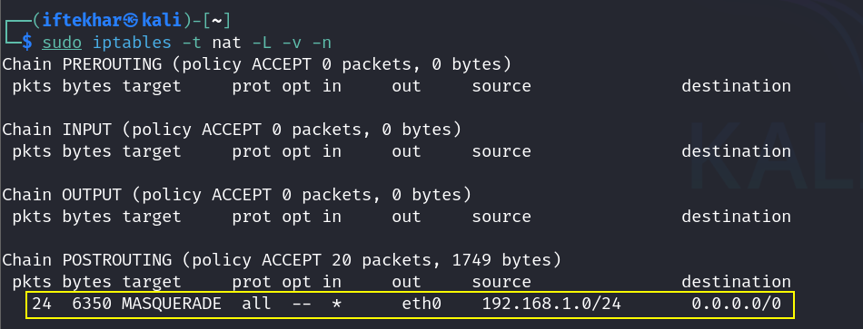
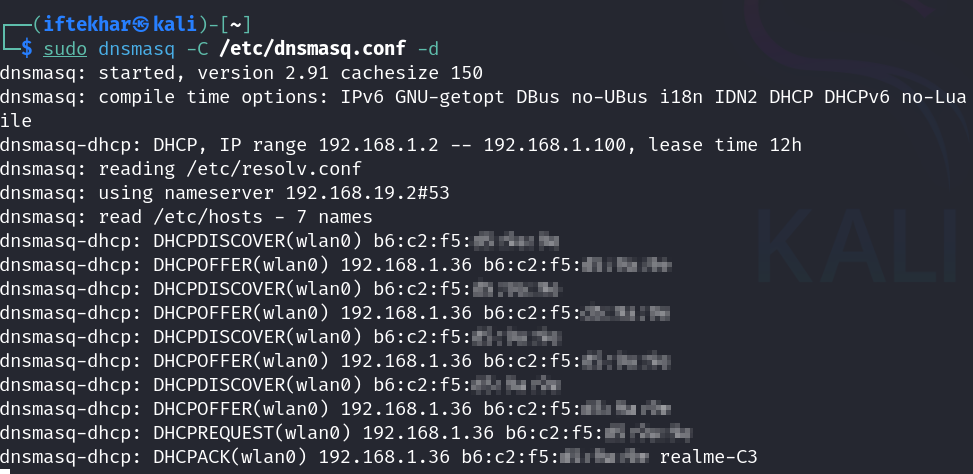

# Creating Encrypted Rogue Access Points in Wireless Man-in-the-Middle Scenarios

As a security researcher, I often explore wireless network vulnerabilities to understand how attackers exploit them and how we can defend against such threats. One powerful technique involves setting up a rogue access point (AP) to simulate man-in-the-middle (MITM) attacks. While tools like `airbase-ng` from the Aircrack-ng suite are excellent for creating unencrypted APs, modern devices, particularly those running Android 10 and above, reject open networks due to enhanced security features. This is where `hostapd` shines, offering the ability to create an encrypted AP with WPA2 or WPA3 protocols. In this blog, I'll provide a practical, hands-on guide to setting up an encrypted AP using `hostapd` on Kali Linux, tailored for security testing in controlled environments.

**Disclaimer:** This guide is for educational purposes only. Creating and using rogue APs on networks or devices without explicit permission is illegal. Conduct all experiments in a lab environment with devices you own or have authorization to test.

## Why Use an Encrypted AP?

Modern operating systems, such as Android and iOS, enforce strict Wi-Fi security policies. Unencrypted APs (like those created by `airbase-ng`) are often flagged as insecure, leading to connection refusals or warnings like "No Internet." An encrypted AP, secured with WPA2 or WPA3, mimics legitimate networks more convincingly, allowing you to test client behavior, intercept encrypted traffic (with proper tools), or simulate advanced MITM scenarios. `hostapd` is the go-to tool for this, as it supports robust encryption and is well-integrated with Kali Linux.

## Prerequisites

To follow this guide, ensure you have:

- A Kali Linux machine (physical or virtual, e.g., in VMware).
- A Wi-Fi adapter that supports Access Point (AP) mode. Verify compatibility with `iw list | grep -A 10 "Supported interface modes"`.
- Basic Linux terminal skills.
- Administrative (root) access on Kali Linux.
- A controlled lab environment with devices you own or have permission to test.

## 1. Prepare Your Wi-Fi Adapter

Before creating the AP, ensure your Wi-Fi adapter is ready and supports the necessary modes.

1. Connect the Adapter:

   - Plug your external Wi-Fi adapter into your Kali Linux machine.

2. Verify Adapter Recognition:

   - Check the available interfaces:

      <div style="text-align: center;">
        
      </div>

   - If `wlan0` isn't listed, troubleshoot with `lsusb` or `dmesg | grep wlan` to confirm detection.

3. If it shows `Mode:Monitor` (e.g., `wlan0`), switch it back to managed mode:

   ```
   sudo airmon-ng stop wlan0
   sudo ifconfig wlan0 down
   sudo ifconfig wlan0 up
   ```

   - Confirm it’s in managed mode with `iwconfig` again.

## 2. Install and Configure `hostapd`

`hostapd` is pre-installed on Kali Linux, but let's ensure it's set up correctly.

1. Install `hostapd` (if needed):

   - Update and install:

     ```bash
     sudo apt-get update
     sudo apt-get install hostapd
     ```

2. Create a Configuration File:

   - Open a new configuration file:

      ```bash
      sudo nano /etc/hostapd/hostapd.conf
      ```

   - Add the following, customizing as needed:

      <div style="text-align: center;">
      
      </div> 
      
      - `interface=wlan0`: The Wi-Fi interface to use.
      - `ssid=SecureFreeWiFi`: The network name (choose something convincing).
      - `channel=11`: A non-overlapping channel (scan with `airodump-ng wlan0` to pick a less congested one).
      - `wpa=2`: Enables WPA2 encryption.
      - `wpa_passphrase=yourpassword123`: The password clients will use (at least 8 characters).
      - `wpa_key_mgmt=WPA-PSK`: Uses Pre-Shared Key authentication.
      - `wpa_pairwise=CCMP` and `rsn_pairwise=CCMP`: Use AES encryption (stronger than TKIP).

   - Save and exit (`Ctrl+O`, `Enter`, `Ctrl+X`).
  
### 3. Start the Encrypted AP

Now, launch the AP with the configured settings.

1. Bring Up the Interface:

   - Ensure `wlan0` is up:

      <div style="text-align: center;">
      
      </div> 

2. Launch `hostapd`:

   - Start the AP and check for output indicating the AP is running, e.g.:

      <div style="text-align: center;">
      
      </div>

   - If it fails, check for errors (e.g., "Could not set channel" or "interface not found") and revisit adapter compatibility.
 
### 4. Configure Network Settings

To make the AP functional, assign an IP and set up a DHCP server.

1. Assign an IP to the AP Interface:

   - Set a static IP for `wlan0`:

      <div style="text-align: center;">
      
      </div>

2. Install and Configure `dnsmasq`:

   - Install if not present:

      ```
      sudo apt-get install dnsmasq
      ```

   - Edit the configuration:

      ```
      sudo nano /etc/dnsmasq.conf
      ```

   - Add:
 
      <div style="text-align: center;">
      
      </div>

      - `interface=wlan0`: Uses the AP interface.
      - `dhcp-range`: IP range for clients (`192.168.1.2` to `192.168.1.100`) with a 12-hour lease.

   - Save and exit.
 
3. Start `dnsmasq`:

   - Launch the DHCP server:

      <div style="text-align: center;">
      
      </div>

   - **Note:** The `-d` flag runs it in debug mode; remove it for background operation after testing.
  
## 5. Enable Internet Access (Optional)

For a convincing AP, allow clients to access the internet via NAT.

1. Enable IP Forwarding:

   - Allow traffic routing:
  
      <div style="text-align: center;">
      
      </div>

2. Set Up NAT:

   - Forward traffic to your internet interface (e.g., `eth0`):
  
      <div style="text-align: center;">
      
      </div>

   - Verify with:

      <div style="text-align: center;">
      
      </div>

3. Test Connectivity:

   - From your Kali machine, ping an external address:

      <div style="text-align: center;">
      
      </div>

   - Clients should now get internet access if NAT is correctly configured.

## 6. Connect and Test

1. Connect a Device:

   - On your test device (e.g., phone or laptop), scan for Wi-Fi networks and connect to "SecureFreeWiFi" using the password `yourpassword123`.

   - Check the assigned IP:

      <div style="text-align: center;">
      
      </div>

   - Look for the client's IP in the 192.168.1.x range (in our case it's 192.68.1.36).

      <div style="text-align: center;">
      
      </div>

      <div style="text-align: center;">
      
      </div>

      <div style="text-align: center;">
      
      <p style="text-align: center; margin-top: -5px;">Encrypted Rogue WiFi Created and Publicly Accessible</p>
      </div>

2. Verify Traffic:

   - Use Wireshark to monitor traffic on `wlan0`:

      <div style="text-align: center;">
      
      </div>

      <div style="text-align: center;">
      
      </div>

   - Filter for HTTP, DNS, or TLS to analyze client activity.

## 7. Clean Up

After testing, dismantle the AP to avoid interference:

- Stop `hostapd`.

- Stop `dnsmasq` (`Ctrl+C` if in debug mode, or `sudo killall dnsmasq`).

- Disable IP forwarding:

   <div style="text-align: center;">
   
   </div>

- Reset `wlan0`:

   <div style="text-align: center;">
   
   </div>

## Troubleshooting Common Issues

- **AP Fails to Start:**
   - Check adapter compatibility with `iw list`.
   - Ensure no conflicting processes (e.g., `NetworkManager`) with `sudo airmon-ng check kill`.

- **Clients Can't Connect:**
   - Verify the password and channel. Test with a different channel (e.g., 1 or 6).
   - Ensure `dnsmasq` is running after `wlan0` is up.

- **No Internet Access:**
   - Confirm `eth0` has internet (ping 8.8.8.8).
   - Check NAT rules with `sudo iptables -t nat -L -v -n`.

## Advanced Applications

As a security researcher, you can extend this setup:

- MITM Testing: Use `sslstrip` or `dnsspoof` to manipulate traffic after clients connect.
- Evil Twin Simulation: Mimic a specific AP's SSID and use deauthentication attacks (`aireplay-ng`) to force connections.
- Penetration Testing: Test client vulnerability to encrypted MITM in a controlled lab.

## Mitigations

To protect against encrypted rogue APs:

- Use a VPN to encrypt traffic beyond the AP.
- Verify SSIDs and avoid unfamiliar networks.
- Monitor network activity with tools like Kismet.

## Conclusion

Creating an encrypted AP with `hostapd` on Kali Linux is a valuable skill for security researchers studying wireless vulnerabilities. This setup enables realistic testing of modern devices, overcoming the limitations of unencrypted APs like those from `airbase-ng`. 

Always use this knowledge responsibly in authorized environments.
