# Nessus for Advanced Penetration Testing

Vulnerability scanning is a cornerstone of penetration testing and cybersecurity assessments, enabling security professionals to identify weaknesses in systems before they can be exploited. Among the many tools available, **Nessus**, developed by Tenable, stands out as one of the most widely used vulnerability scanners, boasting over 67,000 CVEs and 168,000 plugins. This blog provides a detailed guide to using Nessus, from installation to advanced plugin configuration, tailored for both beginners and seasoned security researchers. 

## 1. Introduction to Nessus
Nessus is a powerful vulnerability scanner designed to identify security weaknesses in networks, systems, and applications. It is available in two primary versions: **Nessus Essentials** (free, with limitations such as scanning only 16 IP addresses) and **Nessus Professional** (a paid version with advanced features). This guide focuses on Nessus Essentials, which is sufficient for learning the core concepts of vulnerability scanning and is applicable to most commercial scanners.

Nessus leverages a vast database of plugins—scripts written in the Nessus Attack Scripting Language (NASL)—to detect vulnerabilities across various systems, including web servers, databases, and operating systems. These plugins are organized into families, such as Ubuntu Local Security Checks or Web Servers, and are regularly updated to address new vulnerabilities.

### Why Use Nessus?

- **Comprehensive Coverage:** With over 168,000 plugins, Nessus can detect a wide range of vulnerabilities, from missing patches to misconfigurations.
- **Ease of Use:** Its intuitive web interface simplifies scan configuration and result analysis.
- **Flexibility:** Supports both unauthenticated and authenticated scans, allowing for deeper system insights.
- **Reporting:** Offers detailed reports in formats like PDF, aiding in remediation and compliance.

This guide assumes you are using a Kali Linux virtual machine (VM) to run Nessus and scan a Metasploitable 2 VM, which is designed for security training and contains numerous vulnerabilities.

## 2. Installing Nessus on Kali Linux

### Prerequisites

- **System Requirements:** Tenable recommends 4 CPU cores and 8GB of RAM, but 2 CPU cores and 4GB of RAM suffice for Nessus Essentials in a lab environment.
- **Internet Connection:** Required for downloading the installer and activating Nessus.
- **Email Address:** Needed to register for an activation code.
- **Metasploitable 2:** A vulnerable Linux VM, downloadable from SourceForge.

### Installation

**1. Download Nessus:**

- Visit the Tenable downloads page.
- Select **Linux - Debian - amd64** as the platform and download the `.deb` installer (e.g., Nessus-10.8.4-debian10_amd64.deb).

<div style="text-align: center;">
  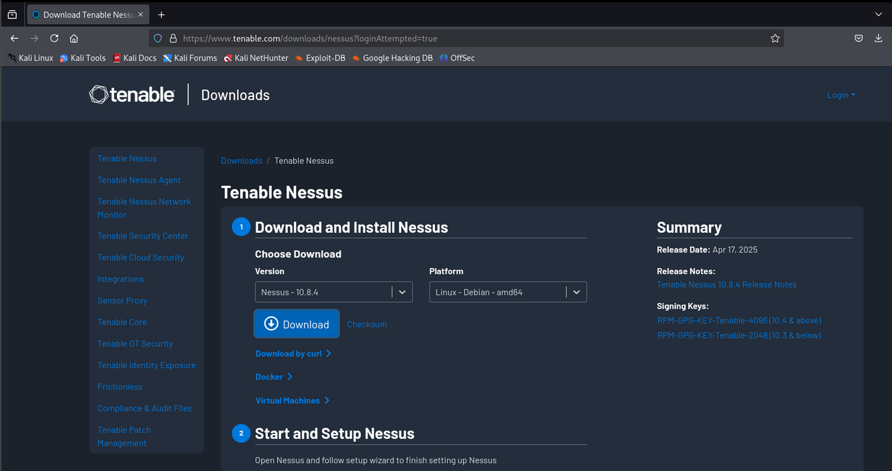
</div>

- Copy the provided SHA256 checksum for verification.

**2. Verify the Installer:**

- Navigate to the download directory.
- Create a checksum file with the copied SHA256 value and the filename:

<div style="text-align: center;">
  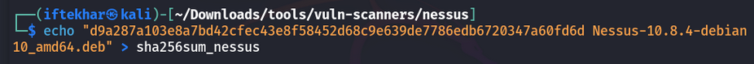
</div>

- Verify the checksum

<div style="text-align: center;">
  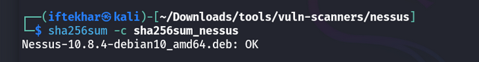
</div>

- Expected output: `Nessus-10.8.4-debian10_amd64.deb: OK`. If the checksum does not match, re-download the installer to ensure integrity.

**3. Install Nessus:**

- Install the `.deb` package using `apt`:

<div style="text-align: center;">
  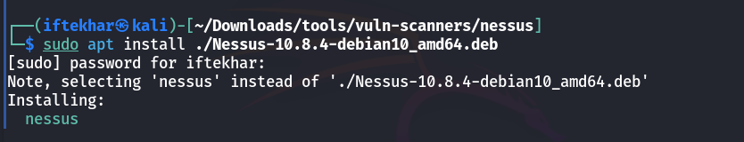
</div>

- The installation process will unpack and configure Nessus core components.

**4. Start the Nessus Service:**

- Start the `nessusd` service

<div style="text-align: center;">
  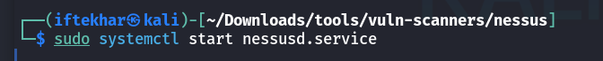
</div>

- Verify the service is running

<div style="text-align: center;">
  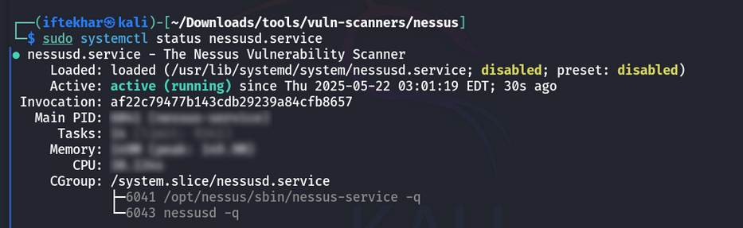
</div>

**5. Access the Nessus Web Interface:**

- Open a browser and navigate to `https://127.0.0.1:8834`.
- You’ll encounter a certificate warning due to Nessus using a self-signed certificate. Click **Advanced** and **Accept the Risk and Continue**.

<div style="text-align: center;">
  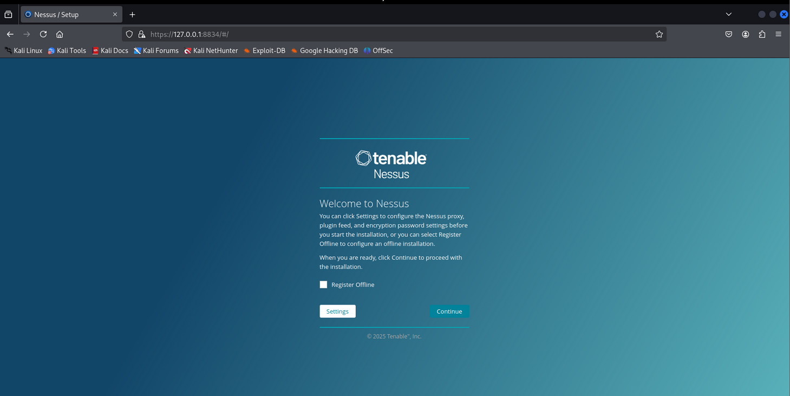
</div>

**6. Activate Nessus:**

- Select **Nessus Essentials** and click **Continue**.

<div style="text-align: center;">
  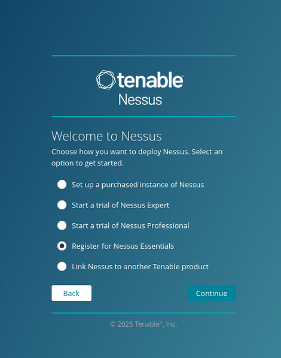
</div>

- Register with your email to receive an activation code.
- Enter the activation code to proceed.
- Create a local Nessus user account (e.g., username: `admin`, with a strong password).

<div style="text-align: center;">
  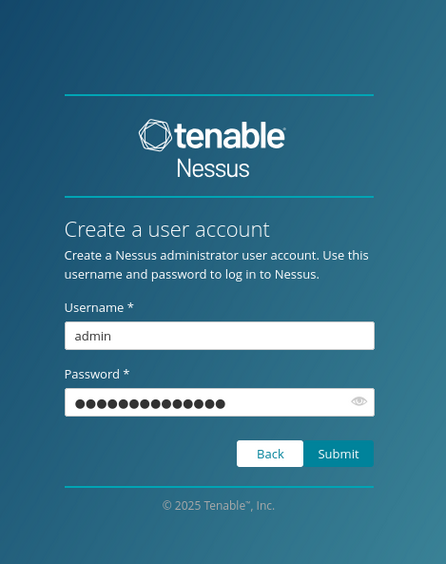
</div>

- Nessus will download and compile plugins, which may take several minutes.

<div style="text-align: center;">
  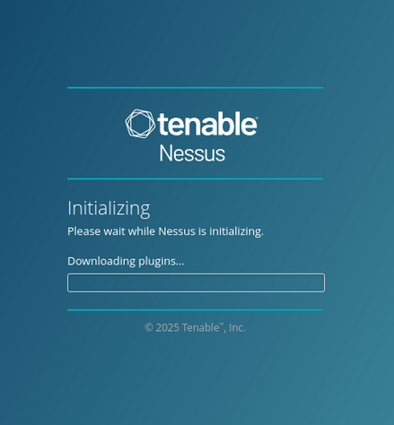
</div>

**Pro Tip:** Always verify the installer’s checksum to prevent installing compromised software. If you encounter issues, ensure your Kali VM has sufficient resources and an active internet connection.

## 3. Setting Up Metasploitable 2

For installing Metasploitable 2 in the VM, check [Building a Safe Hacking Lab with Metasploitable 2](https://iftekmahmud.github.io/blog/metasploitable-2/).

## 4. Understanding Nessus Components

Before diving into scanning, let’s explore Nessus’s core components, which are critical for effective use.

### Nessus Dashboard

Upon logging in, the Nessus dashboard displays two main tabs in the Essentials version:

- **Scans:** Where you create, manage, and view scan results.
- **Settings:** For configuring global settings, such as SMTP for email notifications or advanced performance options.

<div style="text-align: center;">
  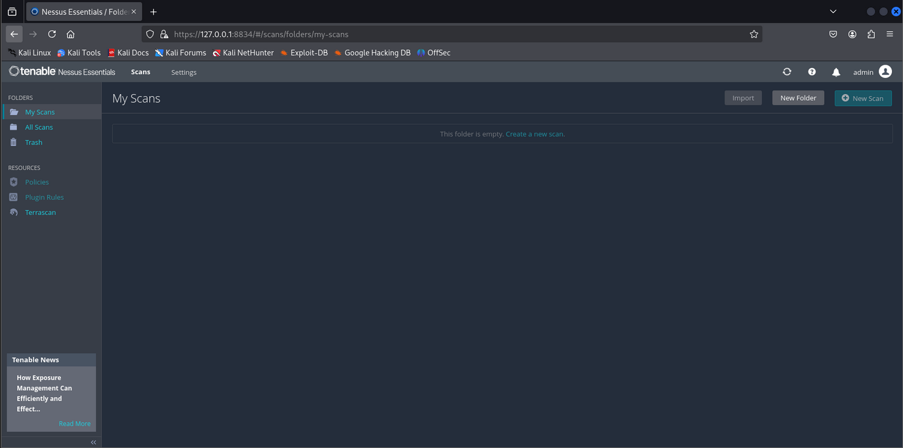
</div>

The **About** menu in the Settings tab provides details on your license and the number of remaining hosts you can scan (16 IPs for Essentials).

### Policies and Templates

- **Policies:** Predefined configurations for scans, which can be saved as templates for reuse.
- **Templates:** Nessus offers templates grouped into three categories:
  - **Discovery:** Includes **Host Discovery** for identifying live hosts and open ports.
  - **Vulnerabilities:** Templates like **Basic Network Scan** (preconfigured for broad scans), **Advanced Scan** (fully customizable), and **Advanced Dynamic Scan** (uses dynamic plugin filters).
  - **Compliance:** Available in the Professional version for compliance checks.

### Plugins

Plugins are the heart of Nessus, written in NASL to detect specific vulnerabilities. Each plugin belongs to a **plugin family** (e.g., Web Servers, Ubuntu Local Security Checks) and checks for vulnerabilities in a particular context. Nessus Essentials automatically enables relevant plugins based on the selected template, but advanced users can customize plugin selection.

## 5. Configuring and Performing a Vulnerability Scan

Let’s perform an unauthenticated vulnerability scan on Metasploitable 2 using the **Basic Network Scan** template, which is ideal for beginners due to its preconfigured settings.

### Configuration

**1. Create a New Scan:**

- From the **Scans** tab, click **New Scan**.
- Select **Basic Network Scan**.

<div style="text-align: center;">
  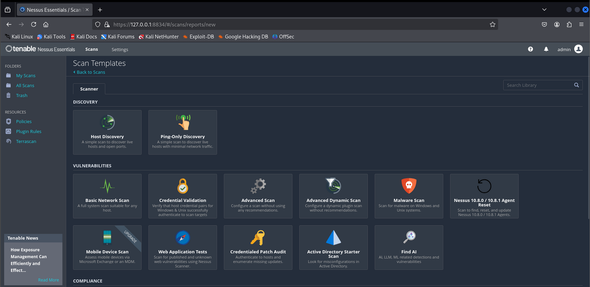
</div>

**2. Configure Basic Settings:**

- **Name:** Enter a descriptive name, e.g., `Metasploitable Scan`.
- **Targets:** Specify the IP address of your Metasploitable 2 VM (e.g., `192.168.19.128`). Nessus supports single IPs, ranges, or FQDNs.

<div style="text-align: center;">
  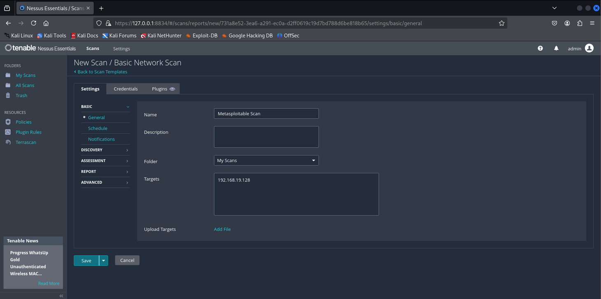
</div>

**3. Customize Discovery Settings:**

- Navigate to the **Discovery** tab and select **Custom** from the dropdown.

<div style="text-align: center;">
  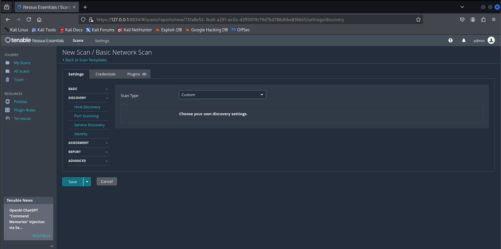
</div>

- In the **Port Scanning** section, set **Port scan range** to **80,443** to focus on web ports, as Metasploitable 2 hosts vulnerable web services like Apache.

<div style="text-align: center;">
  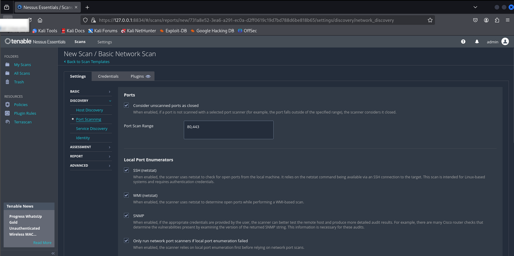
</div>

- Enable **Consider unscanned ports as closed** to treat all other ports as closed.

<div style="text-align: center;">
  
</div>

- Disable **Host Discovery** by toggling **Ping the remote host** to **Off**, since you’ve confirmed the VM is live.

<div style="text-align: center;">
  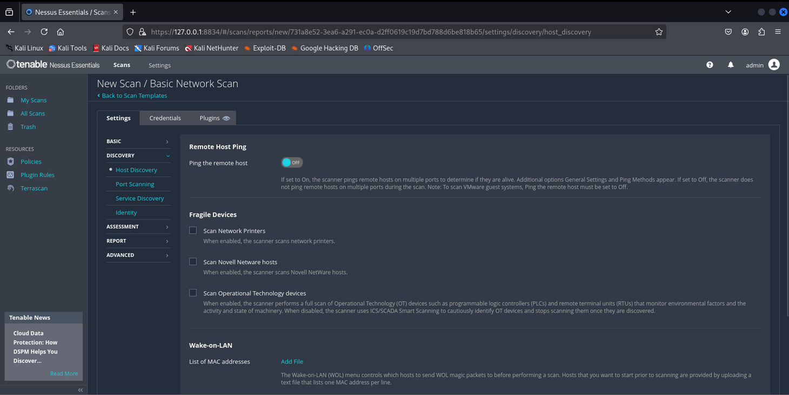
</div>

**4. Review Other Settings:**

- The **Assessment**, **Report**, and **Advanced** tabs contain default settings suitable for most scans. For now, leave them unchanged.
- Note that this scan is unauthenticated (no credentials provided), which may limit visibility into system-level vulnerabilities.

**5. Launch the Scan**

<div style="text-align: center;">
  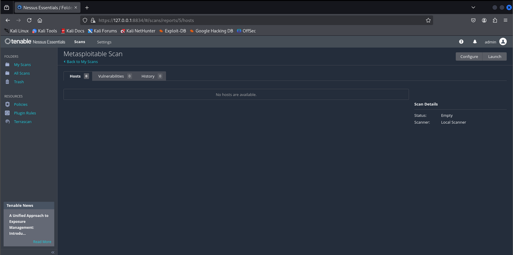
</div>

- The scan status will appear as **Running** in the **My Scans** dashboard. You can pause or stop it if needed.

<div style="text-align: center;">
  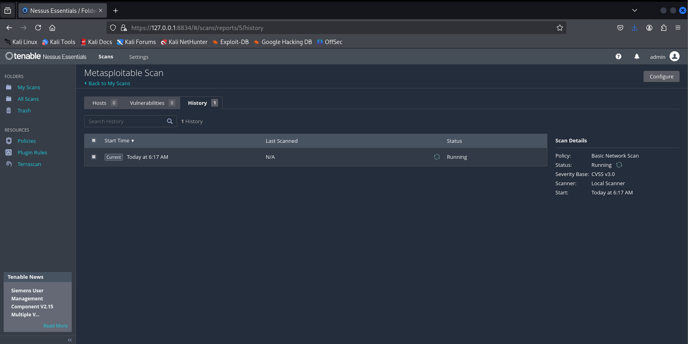
</div>

**Note:** Unauthenticated scans generate significant network traffic and may be detected by intrusion detection systems. In a lab like Metasploitable 2, this is not a concern, but exercise caution in production environments.

## 6. Analyzing Scan Results

Once the scan completes, Nessus provides a detailed results dashboard for analyzing Metasploitable 2’s vulnerabilities.

<div style="text-align: center;">
  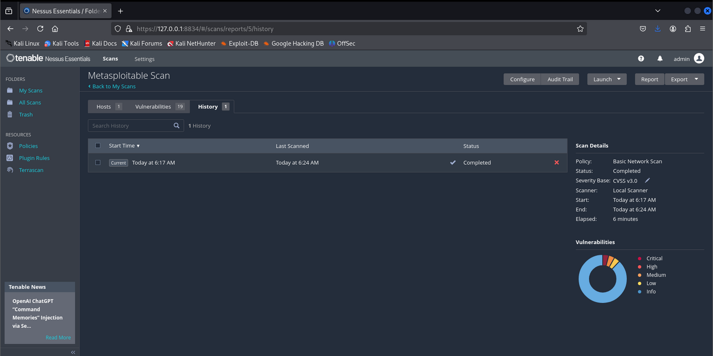
</div>

### Navigating the Results

**1. Hosts Page:**

- Click on the scan in the **My Scans** list to view the **Hosts** page.
- This page lists the Metasploitable 2 host (e.g., `192.168.19.128`) with a visual representation of vulnerabilities by severity (Critical, High, Medium, Low, Info).
- You might see multiple findings due to Metasploitable’s outdated Apache and other services.

<div style="text-align: center;">
  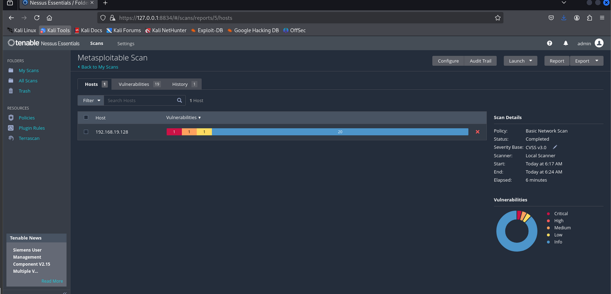
</div>

**2. Vulnerabilities Page:**

- Click on the Metasploitable IP to view its vulnerabilities. You may find grouped findings like **HTTP (Multiple Issues)** in the Web Servers family.

<div style="text-align: center;">
  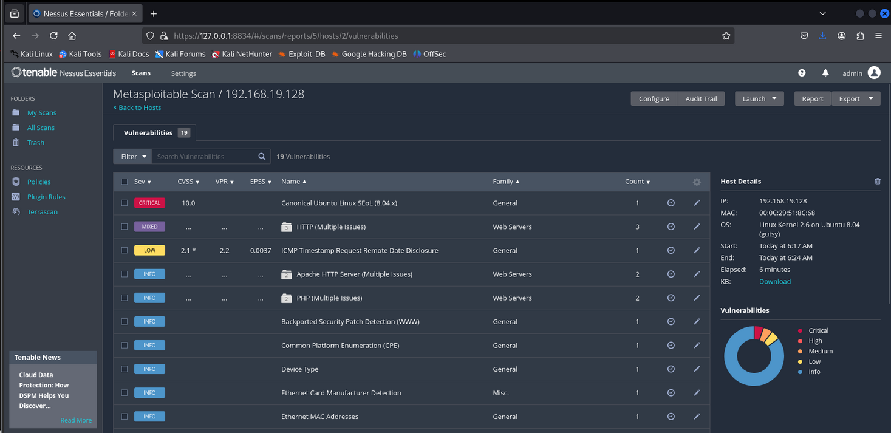
</div>

- Drill down into a finding (e.g., **Canonical Ubuntu Linux SEoL (8.04.x)**) for details, including:
  - **Description:** Explains the vulnerability (e.g., outdated Canonical Ubuntu Linux version).
  - **Risk Information:** Includes Risk Factor and CVSS score.
  - **Solution:** Provides mitigation strategies, such as upgrading to a version of Canonical Ubuntu Linux that is currently supported.
  - **References:** Links to CVE entries or vendor advisories.
  - **Exploit Status:** Indicates if exploits are available, which is common for Metasploitable vulnerabilities.

**3. VPR (Vulnerability Priority Rating) Top Threats:**

Navigate to the VPR Top Threats tab (if available) to see a prioritized list of the top vulnerabilities on Metasploitable 2, based on Tenable’s Vulnerability Priority Rating.

**4. History:**

The History tab logs all scans run with this configuration, useful for tracking changes over time.

<div style="text-align: center;">
  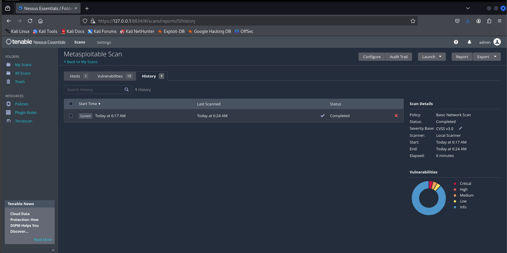
</div>

### Generating a Report

<div style="text-align: center;">
  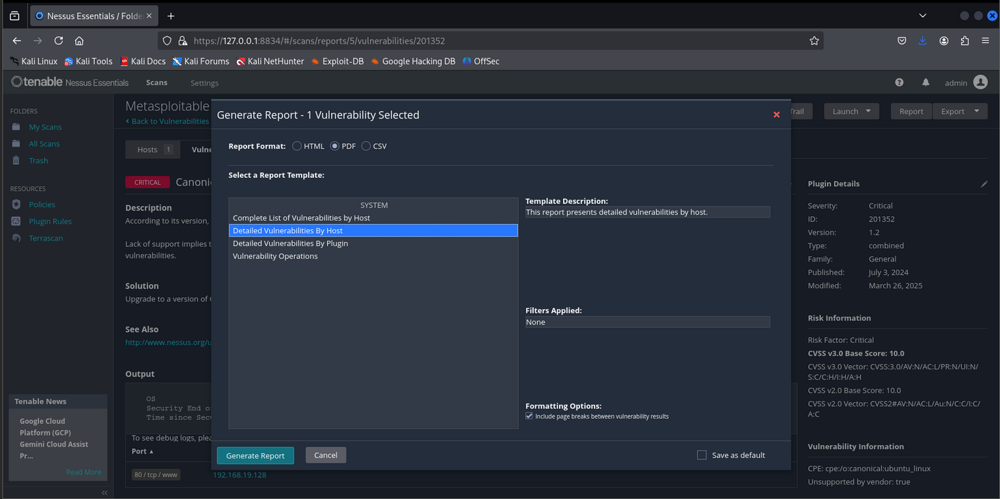
</div>

- From the results dashboard, click Report.
- Select the Detailed Vulnerabilities By Host template and choose PDF as the format.
- Click Generate Report to download a comprehensive PDF summarizing findings for each host.
- For a high-level overview, use the Complete List of Vulnerabilities by Host template.

**Pro Tip:** Regularly review the Audit Trail feature to understand plugin behavior and reduce false negatives, especially in complex environments.

## 7. Performing an Authenticated Vulnerability Scan

Authenticated scans provide deeper insights by accessing Metasploitable 2’s internals, reducing false positives, and identifying issues like missing patches or outdated software.

### Configuration

**1. Create a New Scan:**

- Click **New Scan** and select **Credentialed Patch Audit**. This template focuses on local security checks, ideal for authenticated scans.

<div style="text-align: center;">
  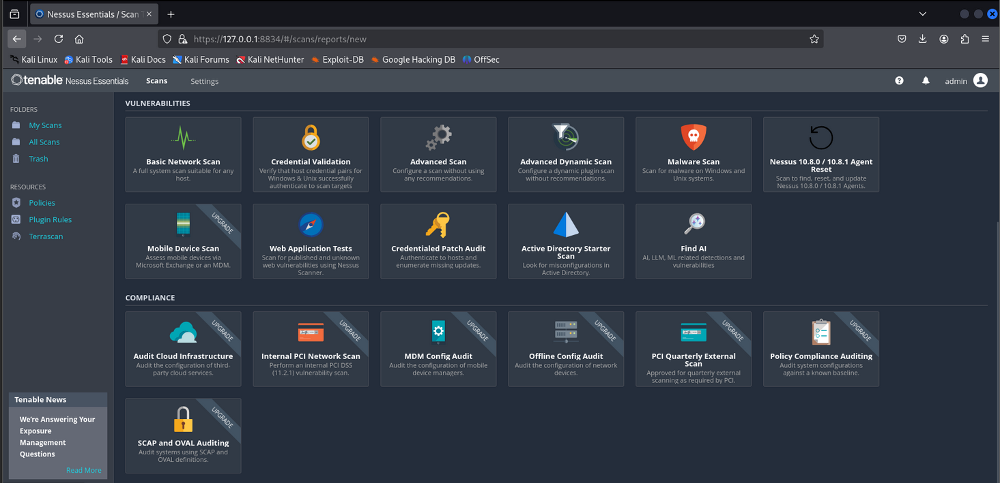
</div>

**2. Configure Basic Settings:**

- **Name:** `Metasploitable Authenticated Scan`.
- **Target:** Enter the IP address of Metasploitable 2 (e.g., `192.168.19.128`).

<div style="text-align: center;">
  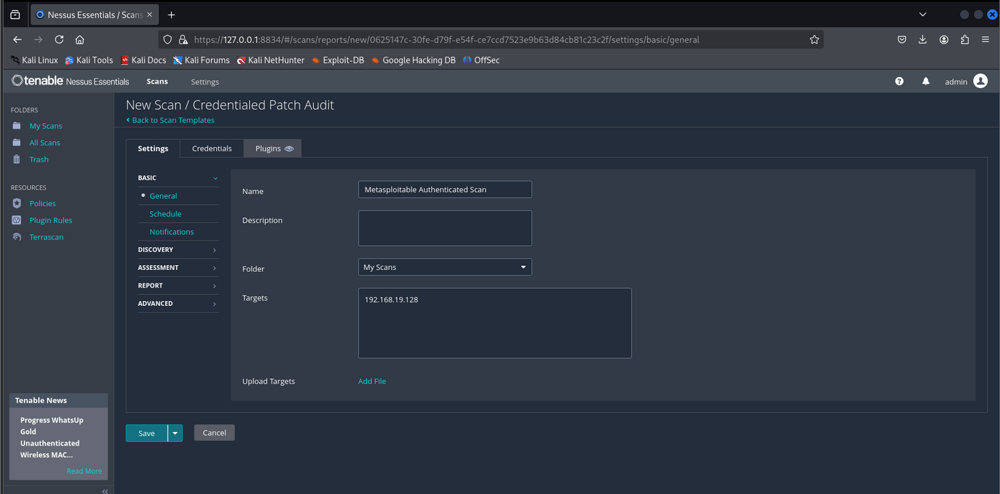
</div>

**3. Add Credentials:**

- Navigate to the **Credentials** tab and select **SSH** under the **Host** category.
- Set **Authentication method** to **password**.
- Enter:
  - Username: `msfadmin`
  - Password: `msfadmin`
  - Elevate privileges with: `sudo`
  - Sudo user: `root`
  - Sudo password: `msfadmin`

<div style="text-align: center;">
  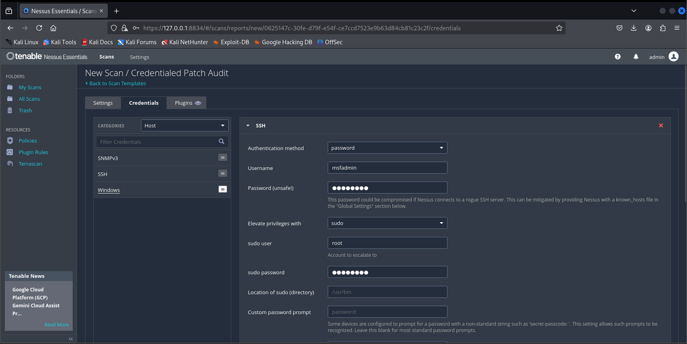
</div>

Metasploitable 2’s default credentials simplify authenticated scanning, but ensure they match your VM’s configuration.

**4. Consider Environmental Factors:**

- Metasploitable 2 lacks antivirus or strict firewalls, so no additional configuration is needed.
- In real-world scenarios, ensure no firewall blocks the scanner and check for antivirus interference.

**5. Launch the Scan:**

- Click **Launch** next to **Configure**.

### Analyzing Authenticated Scan Results

- Navigate to the **Vulnerabilities** tab after the scan completes.

<div style="text-align: center;">
  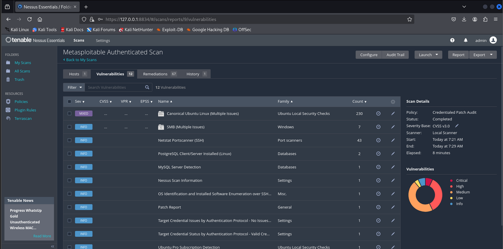
</div>

- Disable grouped results for clarity:
  - Click the settings wheel and select **Disable Groups**.

<div style="text-align: center;">
  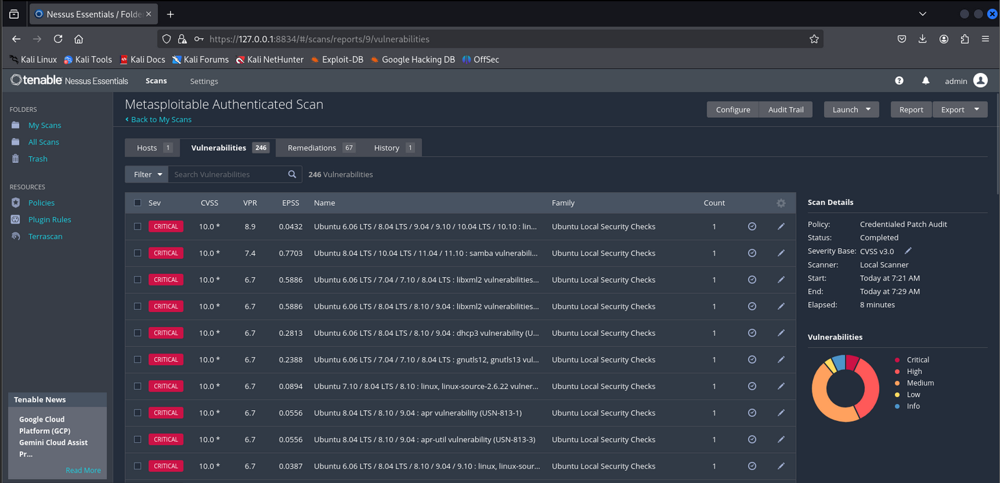
</div>

- Review findings, such as vulnerabilities from the **Ubuntu Local Security Checks** plugin family, which may identify outdated software like Samba or vsftpd on Metasploitable 2.
- Each finding includes:
  - **Severity:** E.g., High, Medium.
  - **Description:** Details the vulnerability and affected software version.
  - **Patch Information:** Specifies the patch or update required.

<div style="text-align: center;">
  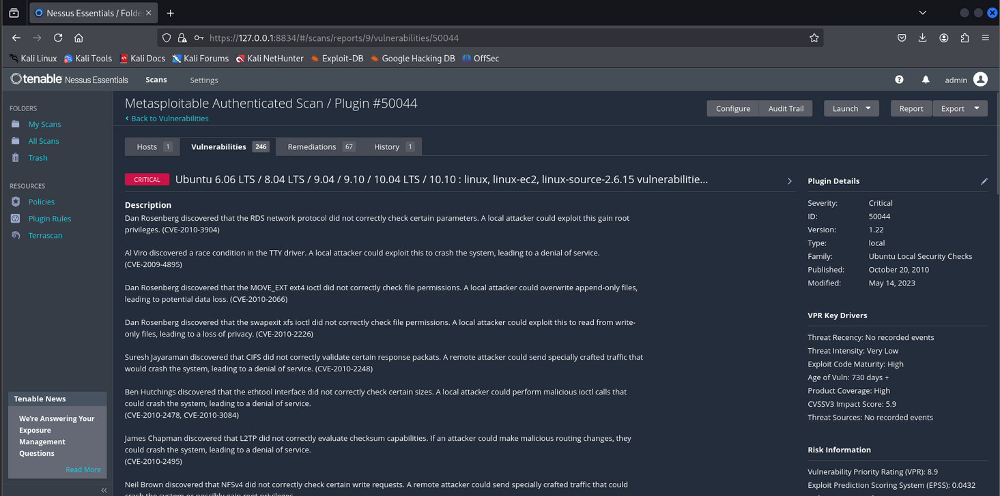
</div>

**Note:** Authenticated scans generate system noise (e.g., log entries). In a lab like Metasploitable 2, this is not an issue, but coordinate with system owners in production environments.

## 8. Working with Nessus Plugins

For advanced users, Nessus’s plugin system allows precise vulnerability detection. Let’s configure a scan to check for **CVE-2014-6271** (Shellshock), a known vulnerability in Bash on Metasploitable 2.

### Plugin Configuration

**1. Create a New Scan:**
- Click **New Scan** and select **Advanced Dynamic Scan**.

<div style="text-align: center;">
  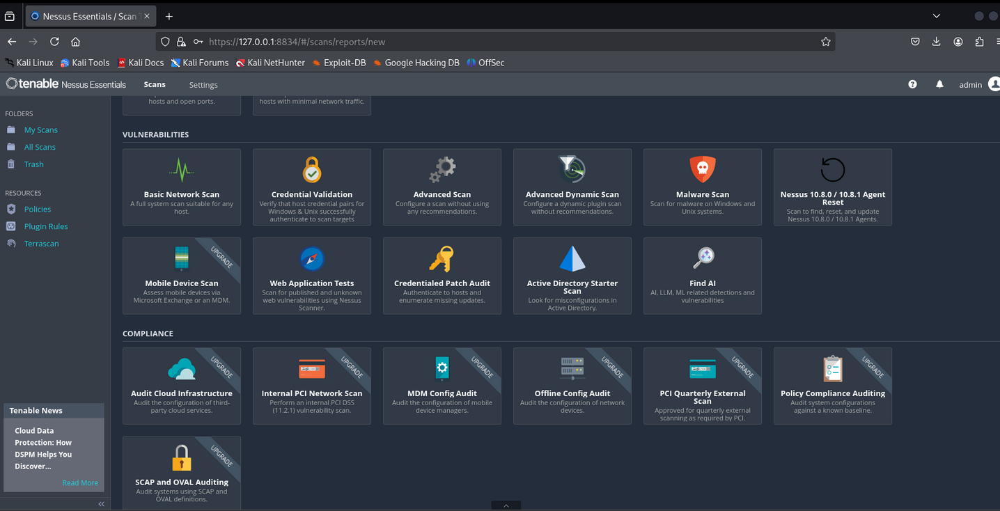
</div>

**2. Configure Basic Settings:**

- Name: **Shellshock Scan**.
- Target: **192.168.19.128** (Metasploitable 2).

<div style="text-align: center;">
  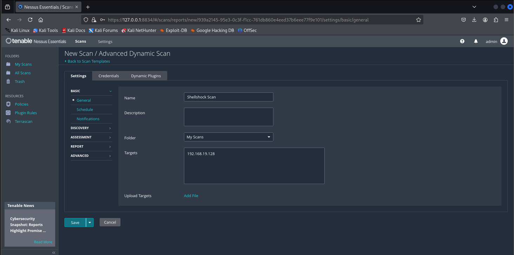
</div>

**3. Add Credentials:**

- Use the same SSH credentials (`msfadmin:msfadmin`) as in the authenticated scan.

<div style="text-align: center;">
  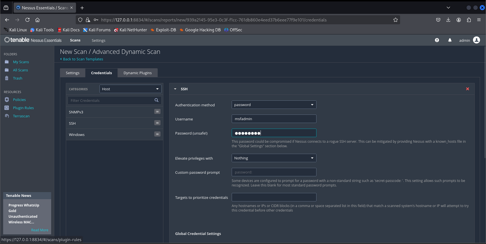
</div>

**4. Configure Dynamic Plugin Filter:**

- Navigate to the **Dynamic Plugins** tab.
- Add a filter:
  - **Left Dropdown:** Select **CVE**.
  - **Middle Dropdown:** Choose **is equal to**.
  - **Right Dropdown:** Enter **CVE-2014-6271**.

<div style="text-align: center;">
  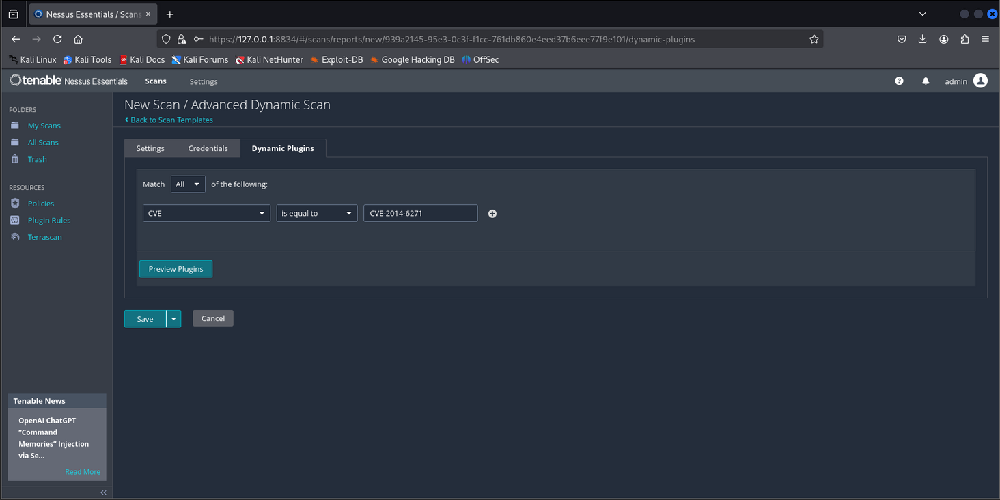
</div>

- Click **Preview Plugins** to list matching plugins (this may take a few minutes).

**5. Review Plugin Details:**

- Select the **CGI abuses** plugin family from the dropdown.
- The preview list will show plugins matching your filters, such as **"GNU Bash Environment Variable Handling Code Injection (Shellshock)"** in the **CGI abuses** family.

<div style="text-align: center;">
  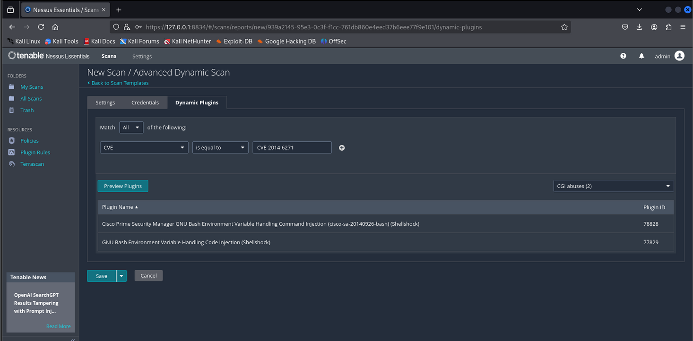
</div>

- To find the Plugin ID, click on the plugin name (e.g., **"GNU Bash Environment Variable Handling Code Injection (Shellshock)"**) to open its detailed view.

<div style="text-align: center;">
  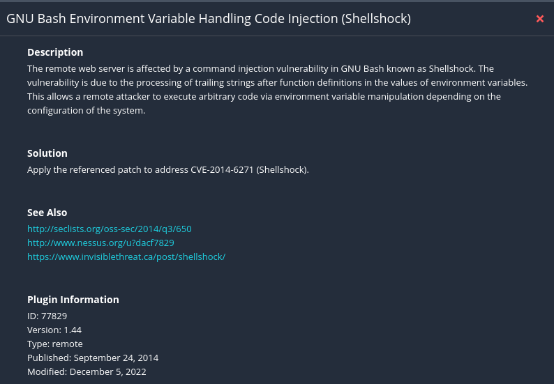
</div>

- In the detailed view, you’ll see:
  - **Plugin Name:** GNU Bash Environment Variable Handling Code Injection (Shellshock).
  - **Plugin ID:** 77829 (confirmed for this version).
  - **Description:** Details the Shellshock vulnerability affecting Bash.
  - **Solution:** Apply the patch for CVE-2014-6271.
  - **Type:** remote, indicating a non-authenticated check.

**6. Launch the Scan**

<div style="text-align: center;">
  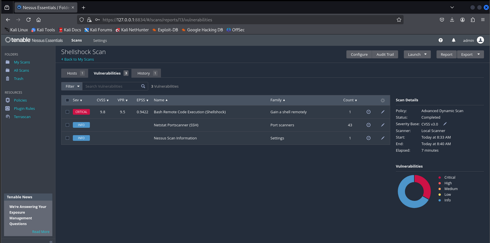
</div>

**7. Analyze Results:**

- After the scan completes, navigate to the **Vulnerabilities** tab.
- Check for a **CRITICAL** severity finding confirming CVE-2014-6271, associated with Plugin ID 77829.

<div style="text-align: center;">
  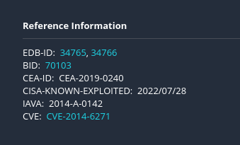
</div>

- The plugin output includes evidence of an active exploitation attempt:

<div style="text-align: center;">
  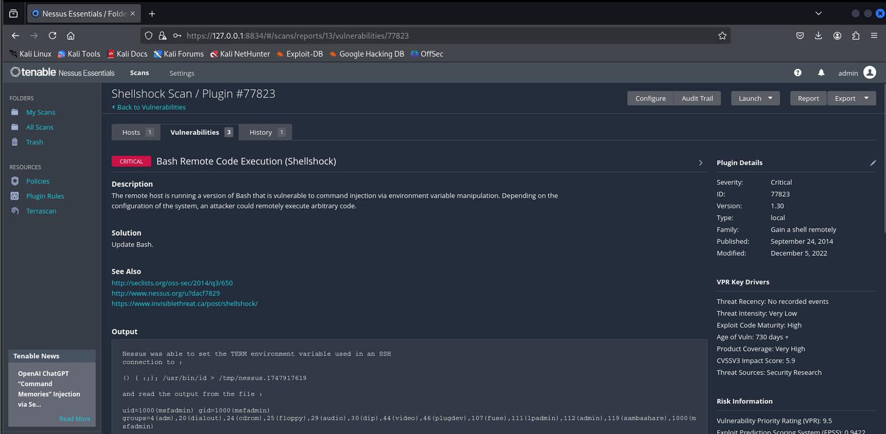
</div>

### Analysis of the Output

<div style="text-align: center;">
  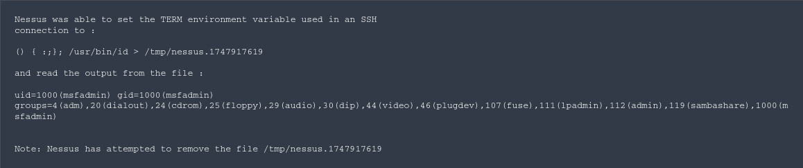
</div>

- "Nessus was able to set the TERM environment variable used in an SSH connection to: `() { :;}; /usr/bin/id > /tmp/nessus.1747917619`"
  - This is a crafted environment variable that exploits the Shellshock vulnerability. The `() { :;};` syntax is a malicious function definition, followed by a command (`/usr/bin/id > /tmp/nessus.1747917619`) that executes the `id` command and redirects its output to a file (`/tmp/nessus.1747917619`). 

- "and read the output from the file: `uid=1000(msfadmin) gid=1000(msfadmin) groups=4(adm),20(dialout),24(cdrom),25(floppy),29(audio),30(dip),44(video),46(plugdev),107(fuse),111(lpadmin),112(admin),119(sambashare),1000(msfadmin)`"
  - This shows the successful execution of the `id` command, which returned the user and group information of the `msfadmin` account on Metasploitable 2. This output confirms that the arbitrary code injection worked, indicating the system is vulnerable to Shellshock.

- "Note: Nessus has attempted to remove the file /tmp/nessus.1747917619"
  - Nessus cleaned up the temporary file it created during the test, which is a standard security practice to minimize impact.

This indicates Nessus actively exploited the vulnerability by injecting a malicious environment variable via an SSH connection and verifying the execution of the `id` command, confirming Metasploitable 2’s susceptibility to Shellshock.

**Note:** This active test goes beyond version checks, providing definitive proof of exploitability.

**Advanced Tip:** Combine multiple filters (e.g., CVE and Plugin Family) to reduce scan time and focus on specific vulnerabilities. If the Plugin ID differs in your instance, verify it in the detailed view or check Tenable’s plugin database at https://www.tenable.com/plugins using "Shellshock" or "CVE-2014-6271". Manually verify critical findings with tools like Metasploit, as Metasploitable 2’s Shellshock vulnerability is exploitable (e.g., using the `bash_payload` module).

### Additional Notes

- **Active vs. Passive Detection:** The output confirms that Nessus uses an active exploitation technique for Shellshock when possible, likely leveraging the SSH connection to Metasploitable 2 (authenticated scan). This is more conclusive than a version check, which only infers vulnerability based on software versions.
- **Security Implications:** The successful execution of arbitrary code (via `id`) highlights the severity of Shellshock on Metasploitable 2. In a real-world scenario, this could allow a remote attacker to gain full system access.
- **Cleanup:** Nessus’s attempt to remove the temporary file (`/tmp/nessus.1747917619`) shows its effort to mitigate any residual impact, though you should manually verify the file’s removal on Metasploitable 2 if needed:

```
ls /tmp/nessus.1747917619
```

If it still exists, delete it with:

```
rm /tmp/nessus.1747917619
```

- **Validate the Exploit:** You can use Metasploit to confirm the vulnerability. Start Metasploit on Kali Linux, use the `exploit/multi/bash/shellshock` module, and target Metasploitable 2’s IP (`192.168.19.128`) with the default SSH credentials (`msfadmin:msfadmin`).
- **Review Other Vulnerabilities:** Since Metasploitable 2 has many vulnerabilities, explore other plugins (e.g., for Samba or Apache) to broaden your scan results.

## 9. Best Practices and Considerations

- **Minimize Noise:** Unauthenticated scans are noisy and may trigger intrusion detection systems. Authenticated scans create additional system logs. Metasploitable 2 is a lab environment, so this is not a concern, but be cautious in real-world scenarios.
- **Optimize Scan Scope:** Use specific port ranges (e.g., `80,443`) and disable unnecessary features (e.g., Host Discovery) to reduce scan duration on Metasploitable 2.
- **Validate Findings:** Nessus may report false positives. Manually verify critical vulnerabilities using Metasploit or manual exploits against Metasploitable 2.
- **Stay Updated:** Ensure Nessus is connected to the internet for the latest plugin updates to detect vulnerabilities like Shellshock accurately.
- **Secure Credentials:** Protect Metasploitable’s credentials (`msfadmin:msfadmin`) in your lab setup, as they are well-known and easily exploitable.
- **Consult Documentation:** Refer to Tenable’s documentation for advanced configuration and troubleshooting.
- **Isolate the Environment:** Keep Metasploitable 2 in **Host-Only** or **NAT** mode to prevent accidental exposure.

## 10. Conclusion

Nessus is a versatile and powerful tool for vulnerability scanning, suitable for both beginners and advanced security researchers. By using Metasploitable 2 as our lab environment, we’ve learned how to:

- Install and configure Nessus on Kali Linux.
- Set up Metasploitable 2 as a vulnerable target.
- Understand Nessus’s core components, including policies, templates, and plugins.
- Perform unauthenticated and authenticated scans.
- Analyze results and generate reports.
- Leverage dynamic plugin filters for targeted vulnerability detection, such as Shellshock (CVE-2014-6271).

For beginners, start with the **Basic Network Scan** template to explore Metasploitable 2’s vulnerabilities. Advanced users can harness the **Advanced Dynamic Scan** and plugin filters to focus on specific CVEs. Experiment with different configurations to understand Nessus’s full potential in a safe lab environment.
