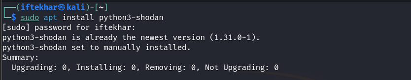

# Shodan for Security Researchers

As security researchers, we constantly seek tools that provide deep visibility into the attack surface of networks, devices, and services. Shodan, often dubbed “the search engine for hackers,” is a powerful reconnaissance tool that indexes internet-connected devices, offering unparalleled insights into exposed systems. Unlike traditional search engines like Google, which focus on web content, Shodan scans ports and collects service banners to reveal metadata about devices, from webcams to industrial control systems (ICS). This guide provides a detailed, technical introduction to Shodan for beginner to intermediate security researchers, covering its functionality, search syntax, and practical use cases.

## What is Shodan?

Developed by John Matherly in 2009, Shodan is a search engine that continuously scans the internet, cataloging devices and services by collecting service banners — metadata returned by servers and devices when queried. These banners include details like software versions, open ports, and device types. Shodan primarily targets protocols such as HTTP (ports 80, 443), FTP (port 21), SSH (port 22), Telnet (port 23), SNMP (port 161), SIP (port 5060), and RTSP (port 554), among others, covering over 200 services.

For security researchers, Shodan is invaluable for reconnaissance, vulnerability assessment, and identifying misconfigured or exposed devices. However, its power comes with responsibility — unauthorized access to devices found via Shodan is illegal and unethical. This guide focuses on legitimate, ethical use cases for penetration testing, asset management, and threat intelligence.

## Getting Started with Shodan

### 1. Creating an Account

To begin, navigate to shodan.io and create an account. Free accounts are limited to 50 search results and basic functionality, while paid subscriptions unlock advanced filters, API access, and higher result limits. For researchers, a paid account is recommended to leverage Shodan’s full potential.

### 2. Understanding the Interface

Shodan’s web interface is straightforward:

- **Search Bar:** Enter queries to find devices or services.
- **Filters Sidebar:** Refine results by country, port, organization, etc.
- **Explore:** View popular searches (e.g., webcams, routers) for inspiration.
- **Shodan Monitor:** Set up alerts for new devices matching your criteria.
- **Maps:** Visualize device locations geographically (requires a paid account).

Browser plugins for Chrome and Firefox provide quick insights into a website’s exposed services, such as open ports and software versions.

### 3. Shodan CLI

For advanced users, Shodan offers a command-line interface (CLI). Install it using Python:

Initialize the CLI with your API key (found in your Shodan account):

You can now query searches using the Shodan CLI:

For example, the command `shodan search "port:22 country:IN"` should return devices with open SSH ports in India. However, the command failed with a 403 Forbidden error because Shodan’s free accounts have extremely limited API access, and my account currently has 0 query credits, as shown by `shodan info`.
