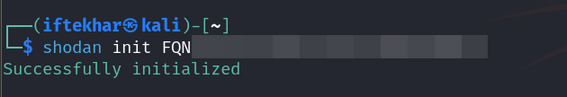
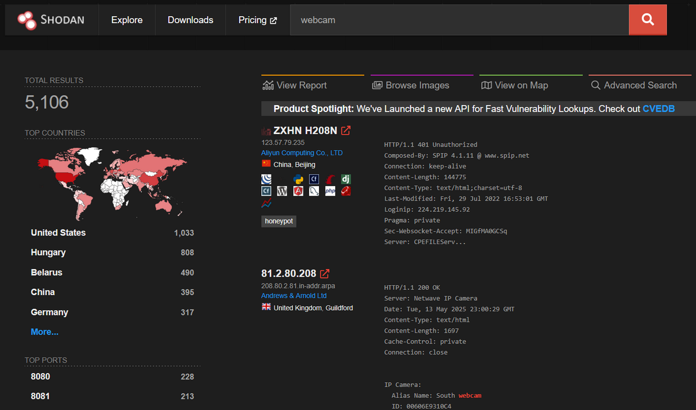
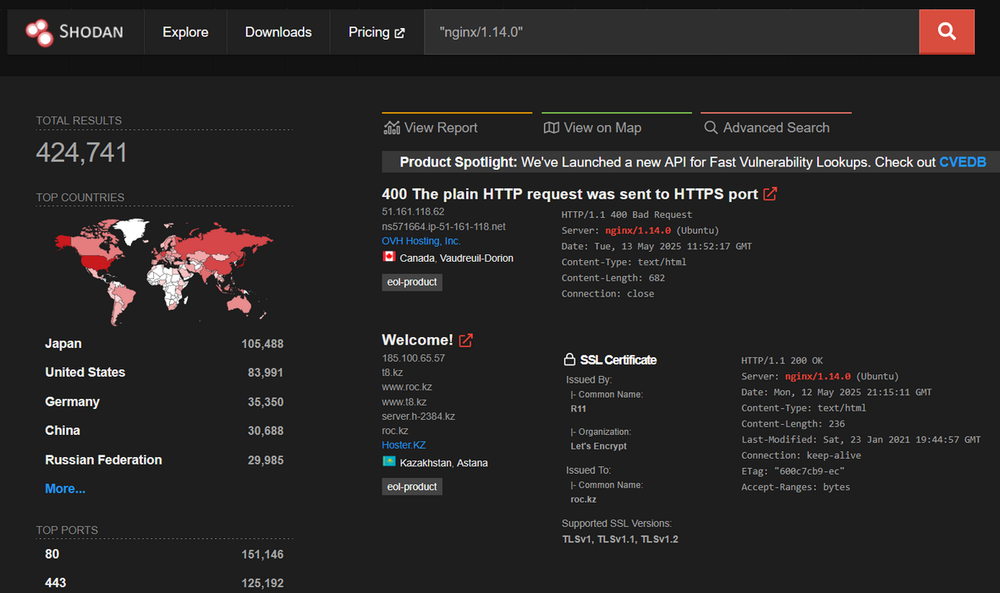
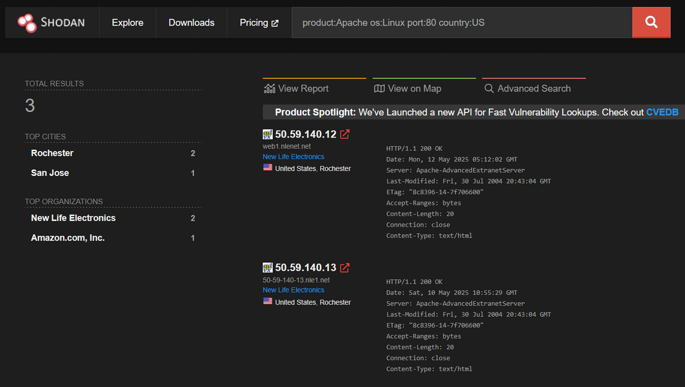
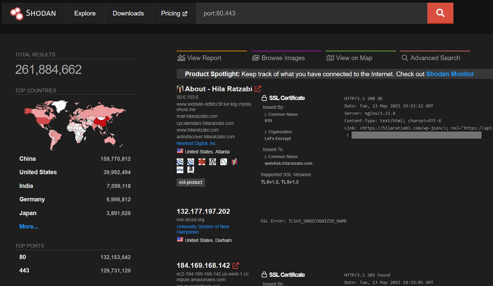
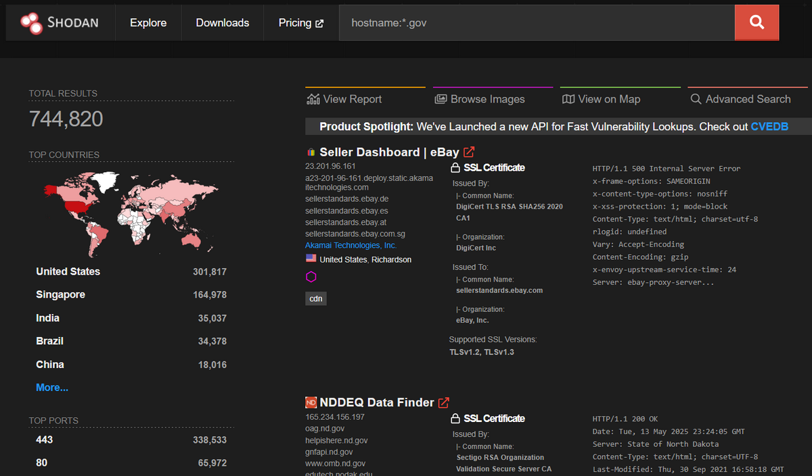
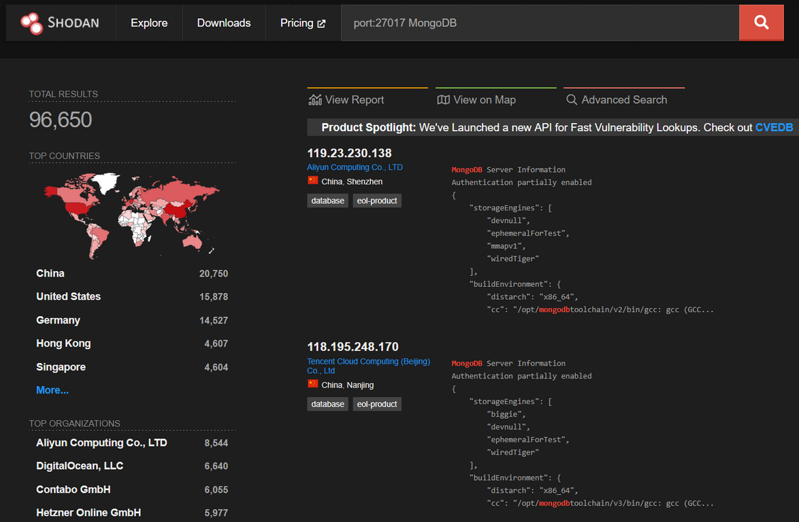
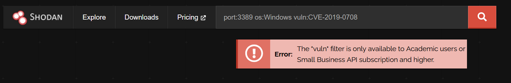
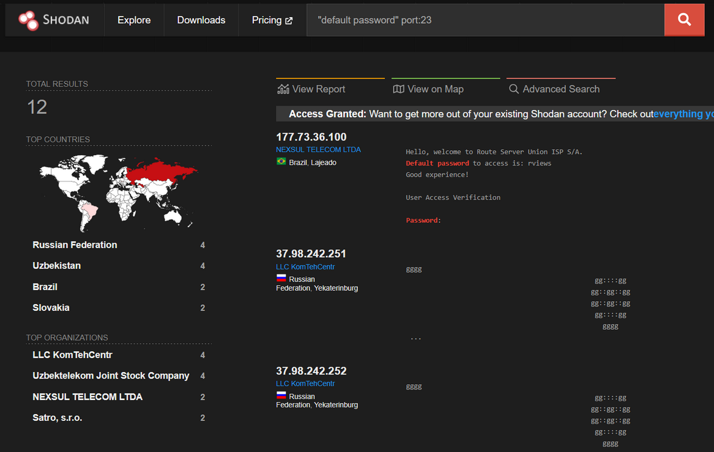
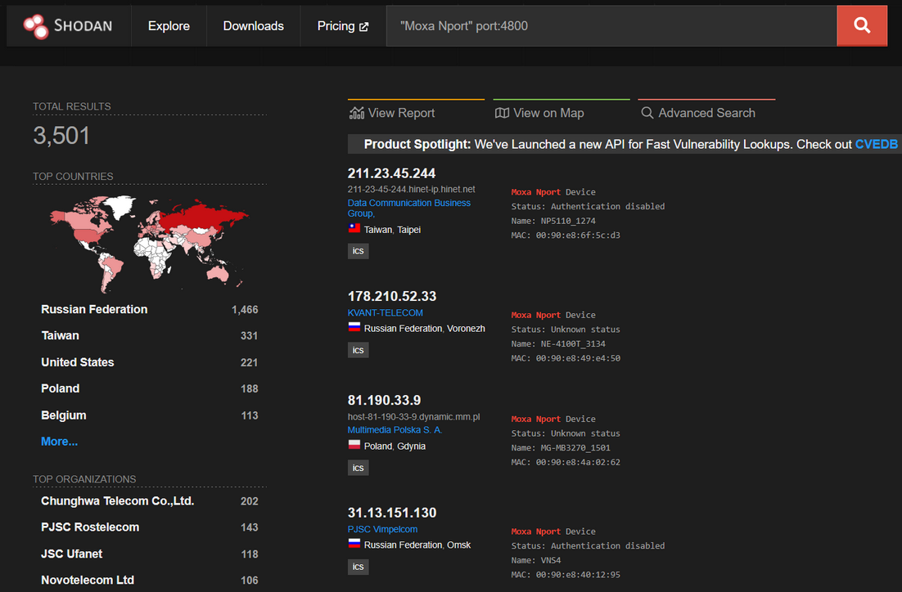

# Shodan for Security Researchers

As security researchers, we constantly seek tools that provide deep visibility into the attack surface of networks, devices, and services. Shodan, often dubbed "the search engine for hackers," is a powerful reconnaissance tool that indexes internet-connected devices, offering unparalleled insights into exposed systems. Unlike traditional search engines like Google, which focus on web content, Shodan scans ports and collects service banners to reveal metadata about devices, from webcams to industrial control systems (ICS). This guide provides a detailed, technical introduction to Shodan for beginner to intermediate security researchers, covering its functionality, search syntax, and practical use cases.

## What is Shodan?


Developed by John Matherly in 2009, Shodan is a search engine that continuously scans the internet, cataloging devices and services by collecting service banners — metadata returned by servers and devices when queried. These banners include details like software versions, open ports, and device types. Shodan primarily targets protocols such as HTTP (ports 80, 443), FTP (port 21), SSH (port 22), Telnet (port 23), SNMP (port 161), SIP (port 5060), and RTSP (port 554), among others, covering over 200 services.

By querying Shodan, you can:

- **Discover Uncharted Assets:** Organizations often overlook internet-facing devices like misconfigured servers, IoT devices, or legacy systems. A query like `port:22 product:OpenSSH country:IN` can uncover SSH servers in India that a client didn't know were exposed, expanding your attack surface analysis.
- **Identify Configuration Weaknesses:** Banners often expose software versions or default settings (e.g., `http.title:"Index of /"` for directory listings), highlighting misconfigurations ripe for exploitation.
- **Pinpoint Vulnerabilities:** With filters like `vuln:CVE-2014-0160`, Shodan flags systems potentially affected by known exploits, such as Heartbleed, allowing you to prioritize testing efforts.
- **Monitor Emerging Threats:** Queries like `port:80 country:CA after:2025-04-01` track newly exposed web servers, enabling proactive defense against recent misconfigurations.

This reconnaissance lays the groundwork for a comprehensive penetration testing engagement, providing a starting point to assess a target's security posture before active testing begins.

Note: Unauthorized access to devices found via Shodan is illegal and unethical. This guide focuses on legitimate, ethical use cases for penetration testing, asset management, and threat intelligence.

## Getting Started with Shodan

### 1. Creating an Account

To begin, navigate to shodan.io and create an account. Free accounts are limited to 50 search results and basic functionality, while paid subscriptions unlock advanced filters, API access, and higher result limits. For researchers, a paid account is recommended to leverage Shodan's full potential.

### 2. Understanding the Interface

Shodan's web interface is straightforward:

- **Search Bar:** Enter queries to find devices or services.
- **Filters Sidebar:** Refine results by country, port, organization, etc.
- **Explore:** View popular searches (e.g., webcams, routers) for inspiration.
- **Shodan Monitor:** Set up alerts for new devices matching your criteria.
- **Maps:** Visualize device locations geographically (requires a paid account).

Browser plugins for Chrome and Firefox provide quick insights into a website's exposed services, such as open ports and software versions.

### 3. Shodan CLI

For advanced users, Shodan offers a command-line interface (CLI). Install it using Python:


Initialize the CLI with your API key (found in your Shodan account):



You can now query searches using the Shodan CLI:


For example, the command `shodan search "port:22 country:IN"` should return devices with open SSH ports in India. However, the command failed with a 403 Forbidden error because Shodan's free accounts have extremely limited API access, and my account currently has 0 query credits, as shown by `shodan info`.

The CLI is ideal for scripting and automation but requires familiarity with command-line workflows.

## Shodan Search Syntax and Filters

Shodan's power lies in its query syntax, which allows precise searches using filters. By default, Shodan searches the data property of banners, which contains service-specific metadata (e.g., HTTP headers, FTP welcome messages).

### Basic Search Syntax

- **Simple Queries:** Enter a keyword like `webcam` to find devices with "webcam" in their banners.



This returns IP addresses, ports, and banners for webcams worldwide.

- **Quoted Phrases:** Use quotes for exact matches:



Finds devices running Nginx version 1.14.0.

### Essential Filters

Filters refine searches by specific banner properties. Combine them with keywords for targeted results. Examples:

- **port:** Specify a port number.

```
port:3389
```

Finds devices with open Remote Desktop Protocol (RDP) ports.

- **country:** Filter by country code (e.g., US, IN).

```
country:US
```

- **city:** Narrow to a specific city.

```
city:"New York"
```

- **os:** Filter by operating system.

```
os:Linux
```

- **org:** Target a specific organization.

```
org:"Google LLC"
```

- **product:** Filter by software or device type.

```
product:Apache
```

- **version:** Specify a software version.

```
version:1.14.0
```

- **vuln:** Search for known vulnerabilities by CVE.

```
vuln:CVE-2023-1234
```

- **before/after:** Limit results by scan date.

```
before:2023-01-01
```

- **asn:** Filter by Autonomous System Number.

```
asn:AS15169
```

- **hostname:** Match a specific hostname.

```
hostname:nasa.gov
```

### Combining Filters

Combine filters for precision. Example:



This finds Apache web servers running on Linux with port 80 open in the US.

- **Negative Filters:** Exclude results using a minus sign.


Finds devices with port 80 open, excluding Windows systems.

- **Multiple Ports:** Use commas for multiple ports.



- **Wildcard Hostnames:** Use partial matches.



- **Exposed Databases:**



Finds open MongoDB instances, which may lack authentication.

- **Vulnerable RDP Services:**



Identifies Windows systems vulnerable to BlueKeep.

- **Default Credentials:**



Finds Telnet services with default credentials (e.g., `admin:123456`).

- **IoT Devices:**



Targets Moxa Nport devices with authentication disabled.

## Advanced Queries

### 1. Outdated SSH Servers with Known Vulnerabilities


- **Query:** `port:22 product:OpenSSH version:7.4 country:IN`
- **Purpose:** Targets SSH servers in India running OpenSSH 7.4, vulnerable to CVE-2016-10009 (key injection). This query is ideal for scoping a client's infrastructure for outdated software.
- **VAPT Use:** Cross-reference with NIST NVD to validate exploits, then use Nmap (nmap -sV -p 22 <IP>) to confirm versions during an authorized test.

### 2. Misconfigured Web Servers with Directory Listings


- **Query:** `http.title:"Index of /" port:80,443 country:US -http.status:403`
- **Purpose:** Identifies web servers in the US exposing directory listings, a common misconfiguration that may leak sensitive files.
- **VAPT Use:** During a pentest, manually browse directories (with permission) to locate backups or configuration files, then recommend server hardening.

### 3. Heartbleed-Vulnerable Apache Servers

- **Query:** `vuln:CVE-2014-0160 product:Apache country:IN`
- **Purpose:** Finds Apache servers potentially affected by the Heartbleed bug in India. Note that Shodan's vuln filter may include unverified results.
- **VAPT Use:** Validate with a Heartbleed scanner (e.g., `testssl.sh`) on authorized IPs to confirm exploitability.

### 4. Unauthenticated MongoDB Instances


- **Query:** `port:27017 product:MongoDB -authentication country:US`
- **Purpose:** Locates MongoDB databases in the US without authentication, a frequent misconfiguration leading to data exposure.
- **VAPT Use:** Assess database accessibility (with consent) and report to clients for immediate remediation.

### 5. Exposed Industrial Control Systems (ICS)

- **Query:** `port:102 product:Siemens country:EU`
- **Purpose:** Targets Siemens PLCs (port 102, S7 protocol) in Europe, often found in critical infrastructure.
- **VAPT Use:** Identify misconfigured ICS for reporting to asset owners, avoiding interaction due to high-risk implications.

### 6. Devices with Default Telnet Credentials


- **Query:** `port:23 "Login incorrect" country:CN`
- **Purpose:** Finds Telnet servers in China with default credentials attempted, indicating unchanged factory settings.
- **VAPT Use:** Pinpoint IoT devices for clients, testing default credentials (with permission) to simulate real-world attacks.

### 7. Vulnerable RouterOS Devices

- **Query:** `port:8291 product:RouterOS version:"6.29" country:BR`
- **Purpose:** Identifies MikroTik RouterOS devices in Brazil on port 8291 (WinBox), vulnerable to CVE-2018-14847.
- **VAPT Use:** Scope network perimeters for outdated routers, validating with Metasploit modules if authorized.

### 8. Exposed Jenkins Servers


- **Query:** `http.component:Jenkins port:8080 country:JP`
- **Purpose:** Locates Jenkins CI/CD servers in Japan, often misconfigured to expose version details.
- **VAPT Use:** Check for unauthenticated access or known CVEs (e.g., CVE-2018-1000861) during application pentests.

### 9. Publicly Accessible Docker API


- **Query:** `port:2375 product:Docker country:AU`
- **Purpose:** Targets Docker API endpoints in Australia without TLS, allowing container manipulation.
- **VAPT Use:** Assess cloud environments for misconfigurations, testing access (with consent) to recommend security fixes.

### 10. Newly Exposed Devices by Date

- **Query:** `port:80 country:CA after:2025-04-01`
- **Purpose:** Finds web servers in Canada exposed after April 1, 2025, detecting recent misconfigurations.
- **VAPT Use:** Monitor for new attack surfaces in ongoing client engagements.

## Advanced Shodan Queries to Find CCTVs Globally

Below are advanced queries specifically designed to identify CCTVs and target common CCTV software, protocols, and misconfigurations.

- **General Search for Webcams/CCTVs:** `webcam`
  - **Purpose:** A broad query to find devices with "webcam" in their banner, often including CCTVs.
  - **Use Case:** Identify a wide range of cameras to understand global exposure trends.

- **CCTVs with Screenshots (Preview Images):** `has_screenshot:true webcam`
  - **Purpose:** Finds devices Shodan has captured screenshots from, often RTSP-based cameras (port 554). Screenshots indicate potentially accessible feeds.
  - **Use Case:** In VAPT, this helps identify cameras that might stream without authentication, though accessing the feed requires permission.

- **RTSP Protocol (Common for CCTV Streaming):** `port:554 has_screenshot:true`
  - **Purpose:** Targets devices using RTSP (port 554), a protocol for live video streaming, often used by CCTVs. The `has_screenshot:true` filter shows devices with preview images.
  - **Use Case:** Useful for finding cameras that might be streaming publicly, though free accounts can't directly access feeds.

- **Specific CCTV Software (e.g., WebcamXP):** `server:webcamxp`
  - **Purpose:** Targets WebcamXP, a popular software for IP cameras on Windows. Many such cameras are misconfigured with default credentials.
  - **Use Case:** During pentesting, you might check if a client's cameras are running outdated or insecure software.

- **Hikvision IP Cameras (Common in Surveillance):** `product:Hikvision`
  - **Purpose:** Identifies Hikvision cameras, a widely used brand often found in corporate and public surveillance systems.
  - **Use Case:** Assess if Hikvision devices in a target network (with authorization) are vulnerable to known exploits (e.g., CVE-2017-7921).

- **Geographically Specific Search (e.g., Melbourne, Australia):** `webcamxp geo:-37.81,144.96`
  - **Purpose:** Narrows results to WebcamXP cameras at specific coordinates (here, Melbourne, Australia). Use `geo:latitude,longitude` for precision.
  - **Use Case:** In a scoped pentest, you might target a specific region to reduce noise in results.

- **CCTVs with Default Credentials in Banners:** `"default password" webcam`
  - **Purpose:** Finds cameras with banners indicating default credentials, a common misconfiguration.
  - **Use Case:** Identify high-risk devices for reporting to clients or securing your own systems.

## Technical Steps to View a Feed (For Authorized Use Only)

If you have explicit permission (e.g., during a pentest or for your own camera), here's how you might access a feed:

- Copy the IP and Port: From Shodan results (e.g., `192.0.2.1:554`).
- Use a Media Player for RTSP:
  - Open VLC Media Player.
  - Go to Media → Open Network Stream.
  - Enter the RTSP URL: `rtsp://192.0.2.1:554/`.
  - If unauthenticated, the feed may play. If it prompts for credentials, you'd need them (and permission to use them).
 


## Secure Your Own CCTVs Against Shodan Indexing

To prevent your own cameras from appearing in Shodan, apply these best practices:

- **Enable Authentication:** Set strong, unique passwords (not `admin:12345`).
- **Use Firewalls:** Block public access to camera ports (e.g., `554`, `80`) using a firewall.
- **VPN or NAT:** Place cameras behind a VPN or NAT to avoid direct internet exposure.
- **Disable UPnP:** Universal Plug and Play can expose devices unintentionally.
- **Check Exposure:** Search Shodan for your IP or organization (e.g., net:YOUR_IP) to confirm your cameras aren't indexed.

## Use Cases for Security Researchers

### 1. Asset Discovery

Organizations often lose track of internet-facing assets. Shodan helps identify exposed devices:

- Query: `org:"Your Organization" port:80,443`
- Action: Verify if these assets are authorized and secure. Check for outdated software (e.g., Apache 2.2.x) or misconfigured services.

### 2. Vulnerability Assessment

Shodan can pinpoint systems running vulnerable software versions or exposed to known CVEs:

- Query: `product:nginx version:1.14.0 vuln:CVE-2021-23017`
- Action: Cross-reference results with vulnerability databases (e.g., NIST NVD) and prioritize patching.

### 3. Reconnaissance for Penetration Testing

During authorized pentests, Shodan aids in mapping the target's attack surface:

- Query: `hostname:target.com port:22,3389`
- Action: Identify open ports and services (e.g., SSH, RDP) for further testing with tools like Nmap or Metasploit.

### 4. Threat Intelligence

Shodan reveals trends in exposed services, aiding proactive defense:

- Query: `port:445 os:Windows`
- Action: Monitor for SMB services vulnerable to exploits like EternalBlue (CVE-2017-0144).

### 5. IoT Security Research

With billions of IoT devices online, Shodan is critical for studying their security:

- Query: `webcam city:"Tokyo"`
- Action: Analyze exposed webcams for default credentials or outdated firmware.

## Leveraging Shodan Data

The metadata extracted from Shodan — IPs, ports, banners, locations, and screenshots — serves as a springboard for actionable steps in a penetration testing workflow. You can integrate and exploit this data ethically and effectively during an authorized engagement:

**1. Initial Reconnaissance and Asset Mapping**

- **Action:** Use a query like `product:Hikvision org:"Client Name"` to identify a client's exposed CCTV systems.
- **Utilization:** Compile a list of IPs and cross-reference with the client's asset inventory. This reveals unauthorized or forgotten devices, such as a Hikvision camera streaming publicly due to a misconfigured firewall.
- **Next Step:** Share this with the client to update their asset management, ensuring all systems are accounted for in the VAPT scope.

**2. Vulnerability Assessment**

- **Action:** Apply `port:27017 product:MongoDB -authentication country:US` to find unauthenticated MongoDB instances.
- **Utilization:** Note the IPs and banners, then validate with a tool like Nmap (`nmap -sV -p 27017 <IP>`) to confirm the lack of authentication. Check banner versions against vulnerability databases (e.g., NIST NVD) for CVEs like CVE-2015-7882 (MongoDB remote code execution).
- **Next Step:** Document potential vulnerabilities in a report, recommending patches or access controls, and test exploitation (if authorized) to assess impact.

**3. Penetration Testing**

- **Action:** Target `port:8291 product:RouterOS version:"6.29" country:BR` to locate vulnerable MikroTik routers.
- **Utilization:** Extract IP addresses and use Metasploit (use `exploit/windows/http/mikrotik_routeros_cmd`) to simulate CVE-2018-14847 exploitation, confirming remote code execution potential. Cross-check with banner data to ensure version accuracy.
- **Next Step:** If successful, document the exploit path and suggest firmware updates or network segmentation to mitigate risks.

**4. Threat Intelligence and Reporting**

- **Action:** Run `port:23 "Login incorrect" country:CN` to detect Telnet devices with default credentials.
- **Utilization:** Analyze the prevalence of such devices to build a threat profile for a client's region. Manually copy IPs and banners (due to the free account's export limitation) into a spreadsheet for tracking.
- **Next Step:** Include this in a penetration testing report, highlighting IoT exposure risks and recommending credential changes or Telnet disabling, supported by real-world attack examples (e.g., Mirai botnet).

**5. Continuous Monitoring**

- **Action:** Set up a saved search for `port:80 country:CA after:2025-04-01` to monitor new web servers.
- **Utilization:** Periodically revisit the query to detect newly exposed systems, using location and organization data to correlate with client networks.
- **Next Step:** Alert the client to investigate these systems, integrating findings into ongoing security posture reviews.

## Tips for Effective Pentesting with Shodan

- **Refine Queries:** Combine filters (e.g., `port:22 product:OpenSSH version:7.4 os:Linux`) to reduce noise.
- **Validate Findings:** Shodan data may be outdated; use Nmap or manual testing to confirm vulnerabilities.
- **Document Results:** Manually copy IPs and banners into a text file (free account limitation) for reporting.
- **Stay Within Limits:** The 50-result cap requires prioritizing high-risk systems; rerun queries as needed.
- **Ethical Scope:** Limit queries to authorized targets to avoid legal issues.

## Practical Workflow with Shodan

- **Recon Phase:** Start with broad queries (e.g., `webcam` or `port:22`) to map the landscape, then refine with filters to focus on client-specific assets.
- **Assessment Phase:** Use vulnerability-targeted queries (e.g., `vuln:CVE-2014-0160`) to prioritize high-risk systems, validating with active scans if authorized.
- **Exploitation Phase:** Leverage Shodan IPs for controlled penetration testing (e.g., Metasploit, Nmap) to simulate attacks, ensuring all actions are within scope.
- **Reporting Phase:** Document Shodan findings—IPs, banners, potential CVEs—in a detailed report, offering remediation strategies like patching or reconfiguration.

## Tools to Complement Shodan Findings

- **Nmap:** Validate ports and versions (e.g., `nmap -sV -p 22 <IP>`).
- **Metasploit:** Test exploits on identified vulnerabilities (e.g., SSH or RouterOS modules).
- **Wireshark:** Analyze traffic from authorized CCTV or server tests.
- **Censys:** Cross-check findings for broader coverage (e.g., `services.port:22 location.country_code:IN`).

## Common Pitfalls and How to Avoid Them

- **Misinterpreting Banners:** Banners can be spoofed or outdated. Verify findings with active scanning (if authorized).
- **Overloading Queries:** Complex queries may exceed free account limits. Upgrade or simplify searches.
- **Ignoring Context:** A device listed on Shodan isn't necessarily vulnerable. Check for authentication or firewalls.

## Ethical and Legal Considerations

- **Do Not Access Unauthorized Systems:** Querying Shodan is legal, but attempting to log in to devices (even with default credentials) without permission is illegal.
- **Obtain Authorization:** For pentesting, ensure you have explicit client consent.
- **Secure Your Own Assets:** Use Shodan to audit your organization's exposure (e.g., search for org:"Your Company" "default password").
- **Report Vulnerabilities Responsibly:** If you discover exposed systems, notify the owner or follow responsible disclosure protocols.
  
## Final Thoughts

Shodan is a cornerstone tool for security researchers, offering unmatched visibility into internet-connected devices. By mastering its search syntax, leveraging its API, and applying its insights ethically, you can uncover vulnerabilities, enhance asset management, and bolster threat intelligence. Start with simple queries, experiment with filters, and integrate Shodan into your workflow alongside tools like Nmap and Metasploit. As you grow comfortable, explore advanced features like Shodan Monitor and CLI to automate and scale your research.

Happy hunting, and stay vigilant.

### Resources:

- Shodan Official Website: shodan.io
- Awesome Shodan Queries: github.com/jakejarvis/awesome-shodan-queries
