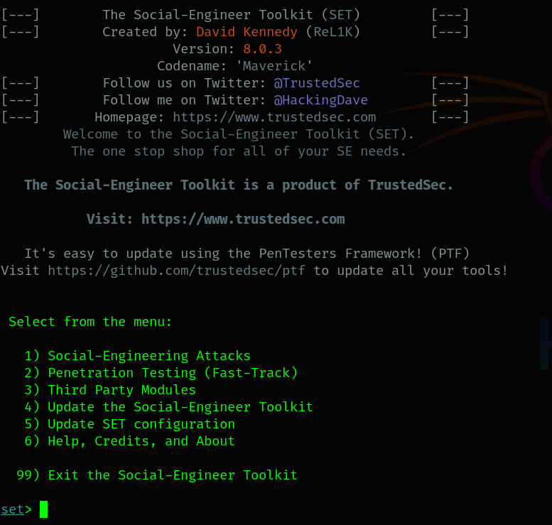
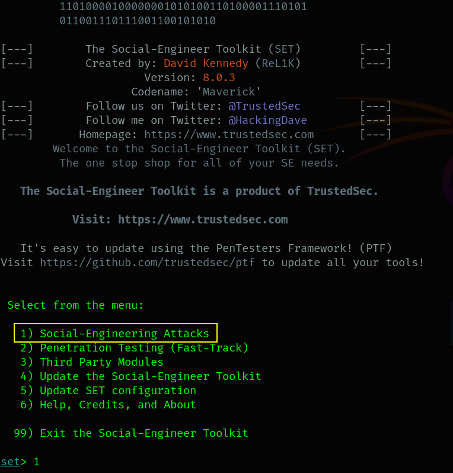
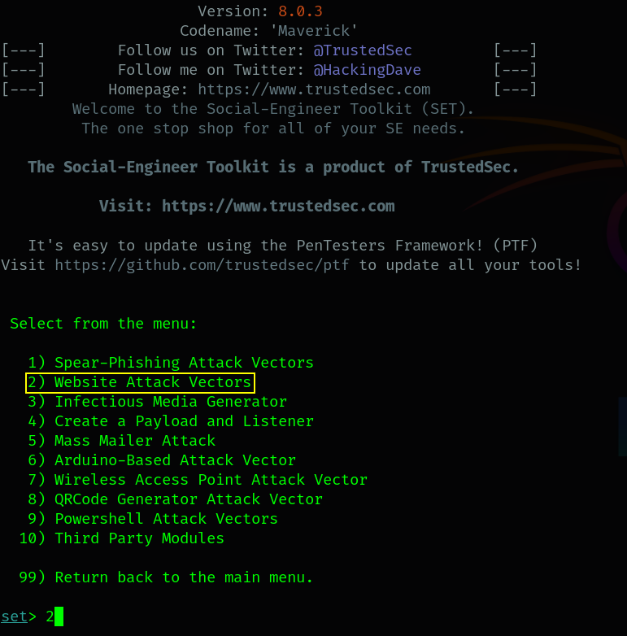
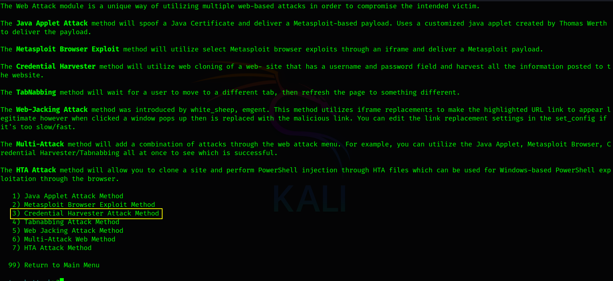
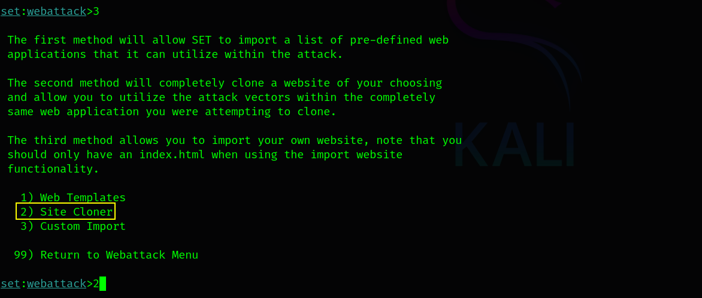

# Crafting Fake Phishing Login Page with SET

Social engineering exploits human trust to bypass technical security measures, often tricking users into revealing sensitive information like login credentials. A common technique is creating a fake login page that mimics a legitimate website, deceiving users into entering their usernames and passwords. The Social-Engineer Toolkit (SET) in Kali Linux simplifies this process, making it an accessible tool for security researchers to study phishing attacks in a controlled environment. In this blog, we'll be setting up a fake phishing login page using SET, focusing on general social engineering principles. For demonstration, we'll use a test login page (`http://testphp.vulnweb.com/login.php`) and a Parrot Linux virtual machine as the test device, with the setup validated using the wireless interface (`wlan0`) IP address, which was successfully accessed in testing.

**Disclaimer**: This tutorial is for educational purposes only. Creating and deploying phishing pages without explicit consent is illegal and unethical. Always conduct experiments in a controlled lab environment with devices you own or have permission to test.

## Overview

Phishing attacks rely on deception, presenting users with fraudulent webpages that appear legitimate to capture sensitive data. A fake login page, such as one mimicking a website's authentication portal, is a cornerstone of such attacks. SET automates the creation of these pages, allowing researchers to clone real websites and harvest credentials in a lab setting. This technique is commonly used in scenarios like phishing emails or malicious links, where users are directed to a fake page via deceptive means. This guide walks through using SET on Kali Linux to create a fake login page, testing it with a Parrot Linux virtual machine by accessing the wireless interface (`wlan0`) IP address, and analyzing captured data.

## Prerequisites

Before starting, ensure the following are ready:

- **Kali Linux Environment**: A fully updated Kali Linux system with SET installed. Install SET if needed:

  <div style="text-align: center;">
    
  </div>

- **Controlled Lab Environment**: Use virtual machines, such as a Kali Linux VM for the attack and a Parrot Linux VM as the test device ("victim"), to avoid impacting real users.

- **Internet Access**: Required to clone websites or download SET payloads.

- **Basic Networking Knowledge**: Familiarity with IP addresses and HTTP traffic.

- **Test Website**: For this tutorial, we'll use `http://testphp.vulnweb.com/login.php` as a safe, vulnerable test page to clone. Never target real websites without permission.

## Creating Fake Phishing Login Page

### 1. Launch the Social-Engineer Toolkit

SET is a command-line tool tailored for social engineering attacks. To begin:

1. Start SET by typing:

    ```bash
    sudo setoolkit
    ```
   
2. SET displays an interactive menu with numbered attack options.

    <div style="text-align: center;">
      
    </div>

**Purpose**: Initializes SET to configure the phishing attack environment.

### 2. Select the Website Attack Vector

To focus on creating a fake webpage:

1. Type `1` and press Enter to select **Social-Engineering Attacks**.

    <div style="text-align: center;">
      
    </div>

2. Type `2` and press Enter to choose **Website Attack Vectors**. This focuses on web-based deception techniques.

    <div style="text-align: center;">
      
    </div>

**Purpose**: Narrows the attack scope to website-based phishing, ideal for fake login pages.

### Step 3: Choose the Credential Harvester Method

To capture user credentials:

1. Type `3` and press Enter to select **Credential Harvester Attack Method**.

    <div style="text-align: center;">
      
    </div>

2. Type `2` and press Enter to choose **Site Cloner**. This clones a target website to create a convincing login page.

    <div style="text-align: center;">
      
    </div>

**Purpose**: Configures SET to harvest credentials from a cloned webpage that mimics a legitimate site.

### Step 4: Specify the Attacking Machine's IP Address

SET needs the IP address of your Kali Linux machine to host the fake page:

1. Find your IP address by running:
   ```bash
   ifconfig wlan0
   ```
   Look for the `inet` address (e.g., `192.168.1.10`) on your wireless interface (`wlan0`).
2. Enter this IP (e.g., `192.168.1.10`) when SET prompts.

**Purpose**: Hosts the fake login page on your Kali machine's wireless interface, making it accessible to the Parrot Linux test device.

### Step 5: Clone the Target Login Page

SET's Site Cloner replicates a real website:

1. When prompted for the URL to clone, enter:
   ```
   http://testphp.vulnweb.com/login.php
   ```
   This is a test page designed for security practice.
2. SET downloads the page and sets up a local copy on your Kali machine.

**Purpose**: Creates a fake login page that looks identical to the target, configured to capture user inputs.

### Step 6: Deliver the Fake Login Page

To test the phishing page, the Parrot Linux VM must access it. In a real-world phishing scenario, attackers might deliver the fake page via phishing emails or malicious links. For this lab:

1. Simulate delivery by manually navigating to the fake page's URL (e.g., `http://192.168.1.10`) on the Parrot Linux VM. This mimics a user clicking a phishing link.
2. Alternatively, send a mock phishing email to a test account on the Parrot VM (within your lab environment) containing the URL.

**Purpose**: Ensures the Parrot Linux VM reaches the fake login page, simulating a phishing attack delivery method.

### Step 7: Test the Fake Login Page

Verify the setup using the Parrot Linux VM:

1. On the Parrot Linux VM, open a browser and navigate to `http://192.168.1.10` (the `wlan0` IP address of your Kali machine).
2. The fake login page (cloned from `http://testphp.vulnweb.com/login.php`) should load.
3. Enter fake credentials (e.g., username: `testuser`, password: `testpass`) to simulate a victim's interaction.
4. Confirm the page loads correctly and accepts input, as validated in your successful test.

**Purpose**: Confirms the fake login page, hosted via the `wlan0` IP, functions as expected, capturing inputs from the Parrot Linux test device.

### Step 8: View Captured Credentials

SET logs submitted credentials:

1. In the Kali terminal running SET, watch for real-time output showing captured data (e.g., `Username: testuser, Password: testpass`).
2. Check the log file, typically in `/var/log/set/`:
   ```bash
   cat /var/log/set/*.log
   ```

**Purpose**: Allows analysis of captured data, simulating how an attacker collects credentials.

## Social Engineering Context

This setup demonstrates core social engineering principles:

- **Trust Exploitation**: The fake login page mimics a trusted site (`testphp.vulnweb.com`), leveraging user familiarity to lower suspicion.
- **Deceptive Delivery**: The page is delivered via simulated phishing methods (e.g., a mock email or direct URL access), exploiting user behavior like clicking familiar-looking links.
- **Psychological Triggers**: Urgency or familiarity (e.g., a login page resembling a known service) prompts users to enter credentials without scrutiny.

## Workflow Breakdown

- **Launching SET**: Starts the tool for social engineering attacks.
- **Website Attack Vector**: Focuses on web-based deception.
- **Credential Harvester**: Configures credential capture.
- **Site Cloner**: Replicates a legitimate login page.
- **IP Address**: Hosts the fake page locally using the `wlan0` interface.
- **Delivery**: Directs test devices to the page via simulated phishing methods.
- **Testing**: Validates functionality with the Parrot Linux VM.
- **Logging**: Records captured data for analysis.

## Beginner Tips

- **Start Simple**: Use a basic login page like `http://testphp.vulnweb.com/login.php` to learn the process before cloning complex sites.
- **Lab Environment**: Test with virtual machines (e.g., Kali and Parrot Linux VMs in bridged mode) to ensure the `wlan0` IP is reachable.
- **Verify Setup**: Ensure SET is running and your `wlan0` IP is correct. Check firewall settings if the page doesn't load.
- **Troubleshooting**: If the page doesn't load on the Parrot VM, verify network connectivity (e.g., ensure both VMs are on the same Wi-Fi network) or SET's configuration.
- **Explore Delivery**: Experiment with mock phishing emails or other delivery methods in your lab to understand attack vectors.

## Ethical and Security Considerations

As security researchers, ethical use is paramount. Deploying phishing pages without consent is illegal. Always:

- Use controlled lab environments with your own devices, like the Kali and Parrot Linux VMs.
- Avoid real-world targets or public networks.
- Document tests and obtain consent for any authorized experiments.

This exercise highlights the dangers of phishing and the need for user awareness, strong authentication, and secure browsing habits.

## Conclusion

Creating a fake phishing login page with SET on Kali Linux, tested with a Parrot Linux VM using the `wlan0` IP address, is a powerful way to study social engineering vulnerabilities. By cloning a test page like `http://testphp.vulnweb.com/login.php`, researchers can simulate phishing attacks, analyze user behavior, and understand delivery methods like malicious links. This knowledge is crucial for developing defenses, such as educating users to verify URLs, enabling two-factor authentication, and promoting cautious browsing. Continue experimenting in a lab with different cloned pages or delivery methods to deepen your understanding of cybersecurity threats and countermeasures.

