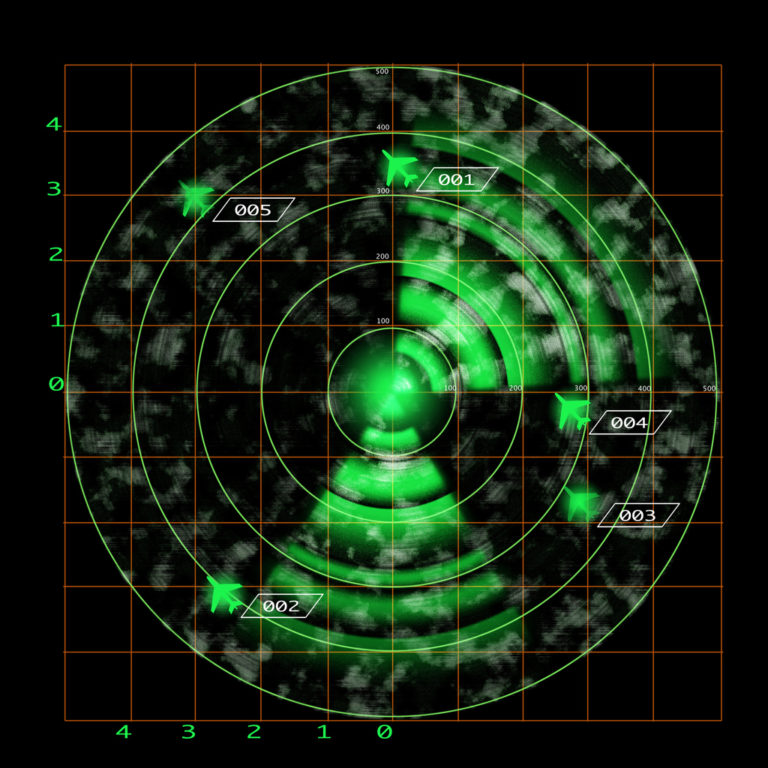
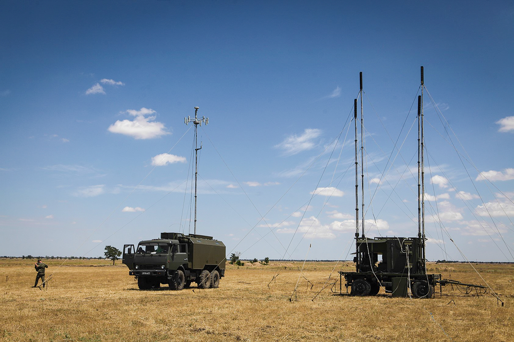
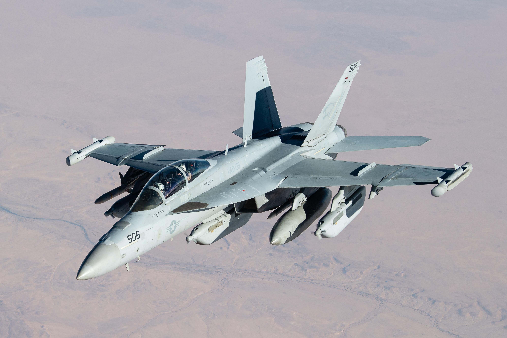
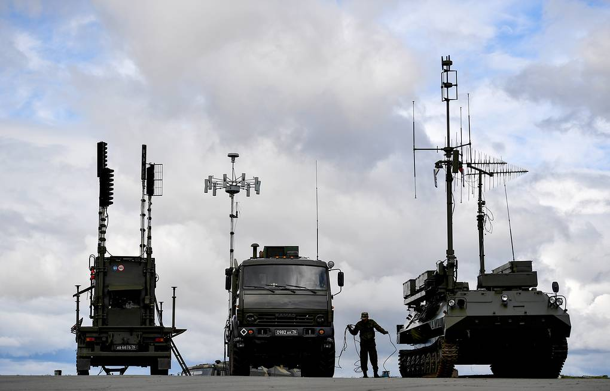
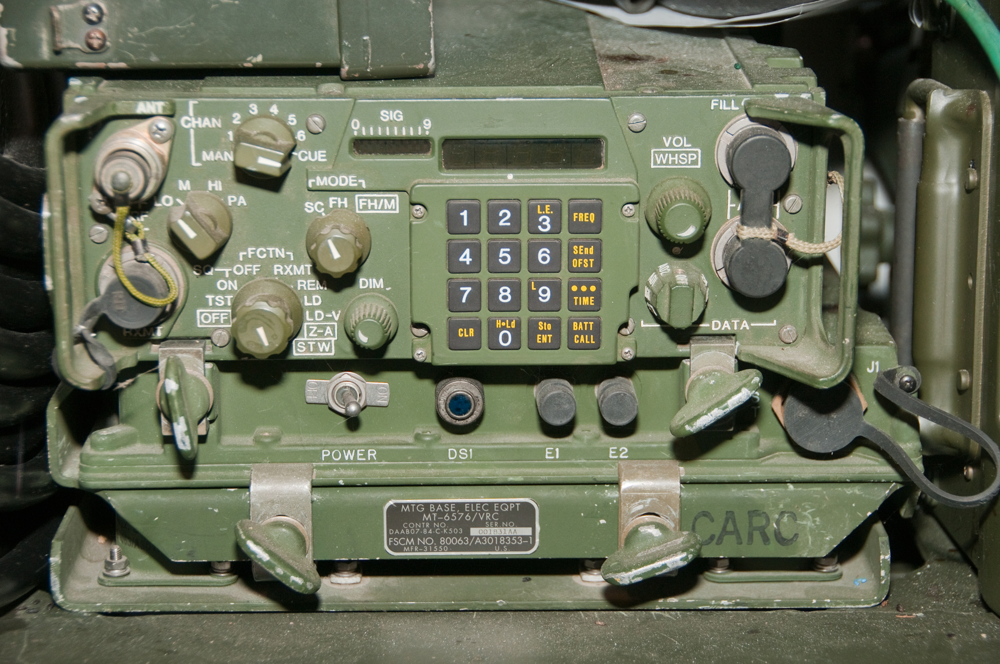
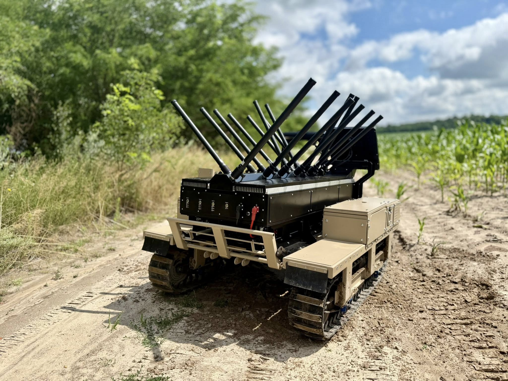

# Military Jamming Tactics

  

In modern warfare, controlling the electromagnetic spectrum (EMS) can be as decisive as any physical weapon. Military jamming is a key tactic in electronic warfare (EW), using radio frequency (RF) signals to disrupt enemy communications, radar, and navigation systems like GPS. As a security researcher, I've seen how jamming can shift the balance of power, from blinding enemy radar to grounding drones.

## Jamming Overview

Jamming is the act of deliberately interfering with an enemy's electronic systems by broadcasting RF signals that overpower or deceive their receivers. It's a non-lethal yet potent way to disrupt critical operations — think of it as shouting over a conversation to stop it from being heard, but with radio waves instead of sound. In today's tech-driven conflicts, where militaries rely on radios, radar, and GPS for coordination and precision, jamming is a game-changer. It can isolate troops, misdirect missiles, or hide forces from detection.

The concept isn't new. During World War II, as radios became widespread, early jamming efforts targeted enemy communications. Since then, jamming has evolved into a sophisticated art, leveraging advanced equipment to tackle modern systems. Today, it's a cornerstone of electronic warfare, sitting alongside electronic protection (defending against jamming) and electronic support (gathering signal intelligence).

## Types of Jamming

Jamming targets specific systems, and its methods vary accordingly. There are three major types: radio jamming, radar jamming, and GPS jamming. I'll be detailing how they work, the equipment involved, and their battlefield roles.

### Radio Jamming

**Mission Capability:** Radio jamming disrupts enemy communication networks — radios used by soldiers, pilots, or ships to relay orders and share intel. By blocking these links, you sow confusion and break coordination.

**Operational Mechanism:** The jammer identifies the enemy's radio frequency (e.g., VHF or UHF bands) and floods it with noise or false signals. Noise jamming uses high-powered static to drown out transmissions, while deception might mimic commands to mislead. Simple jammers might broadcast continuously, while advanced ones, like Russia's **R-330Zh Zhitel**, target specific frequencies dynamically.

  
  
R-330Zh Zhitel

**Fielded Asset Illustration:** The **R-330Zh Zhitel** can jam radio signals within a 20-30 km radius, targeting both ground and airborne communications. It's been spotted in Ukraine, disrupting tactical networks.

**Operational Outcome:** In a ground battle, imagine an enemy unit unable to call for reinforcements because their radios only pick up static. That's radio jamming at work.

### Radar Jamming

**Mission Capability:** Radar jamming blinds enemy detection systems, which use radio waves to track aircraft, ships, or vehicles. It's a shield for stealth and a sword to confuse.

**Operational Mechanism:** There are two main approaches:
- **Noise Jamming:** Overwhelms radar with a barrage of RF noise, obscuring real targets. Think of it as a fog machine for radar screens.
- **Deception Jamming:** Sends fake echoes (via Digital Radio Frequency Memory, or DRFM) to create ghost targets or mask real ones. Modern DRFM systems can replicate a target's signature precisely.

  
  
EA-18G Growler With AN/ALQ-99 Jamming Sytem

**Fielded Asset Illustration:** The U.S. **AN/ALQ-99**, flown on EA-18G Growler aircraft, jams radar across multiple frequencies. Its successor, the **Next Generation Jammer (NGJ)**, uses AESA technology for pinpoint accuracy against advanced air defenses.

**Operational Outcome:** During the Gulf War, AN/ALQ-99 jamming crippled Iraqi radar, letting coalition aircraft strike with near impunity.

### GPS Jamming

**Mission Capability:** GPS jamming targets the Global Positioning System, which guides everything from drones to missiles to troop movements. Disrupting it throws navigation into chaos.

**Operational Mechanism:** GPS signals, broadcast from satellites 20,000 km away, are weak (about -160 dBW). A jammer, sometimes as small as a handheld device, emits a stronger local signal on the GPS L1 frequency (1575.42 MHz) to block them. Barrage jamming can hit multiple GPS bands (L1, L2, L5), while spot jamming focuses on one.

  
  
EA-18G Growler With AN/ALQ-99 Jamming Sytem

**Fielded Asset Illustration:** Russia's **Pole-21** integrates with cell towers to jam GPS and GLONASS over a 150 km radius. Portable units like the **CJB-100** can disrupt GPS within 100 meters, ideal for localized denial.

**Operational Outcome:** In the Russia-Ukraine war, GPS jamming has downed thousands of Ukrainian drones monthly, forcing reliance on manual controls or alternative navigation.

## Tactical Field Applications

### Documented Combat Instances

- **Russia-Ukraine War (2022–Present):**
  - **Scenario:** Russian forces deploy the **Krasukha-4**, a mobile EW system, near the frontlines. It jams Ukrainian radar and GPS, blinding air defenses and disrupting drone strikes.
  - **Details:** The Krasukha-4's 300 km range targets S-band radar and satellite links. Ukraine reports losing 10,000 drones monthly, many to GPS jamming, forcing a shift to inertial navigation or visual piloting.
  - **Outcome:** Russian jamming delays Ukrainian counterattacks, though Ukraine adapts with frequency-hopping radios.

- **Gulf War (1991):**
  - **Scenario:** U.S. EA-6B Prowlers equipped with AN/ALQ-99 systems fly ahead of strike groups, jamming Iraqi radar.
  - **Details:** Noise jamming overwhelmed early-warning systems, while deception created false targets, confusing operators.
  - **Outcome:** Coalition air superiority was secured, with minimal losses to radar-guided threats.

## Defense Protocols

Jamming isn't unstoppable. Militaries deploy countermeasures to fight back, creating an ongoing EW arms race.

- **Frequency Hopping:** Radios and drones switch frequencies rapidly (e.g., 1,000 times per second) to dodge jammers. The U.S. **SINCGARS** radio uses this to stay connected.
- **Encryption:** Scrambles signals so even if jammed, the content remains secure. It doesn't stop jamming but limits intelligence leaks.
- **Spread Spectrum:** Spreads signals across a wide band (e.g., Direct Sequence Spread Spectrum), diluting jammer effectiveness. GPS's military P(Y) code uses this.
- **Anti-Jam GPS:** Systems like **M-Code** (a new GPS signal) boost resilience with higher power and directional antennas.
- **LPI Radar:** Low Probability of Intercept radar (e.g., on stealth aircraft) emits weak, hard-to-detect pulses, evading jammers.
- 

  
  
SINGCARS

In Ukraine, frequency hopping and inertial navigation have kept some drones aloft despite Russian jamming, though at reduced efficiency.

### LPI Radar Defense Overview

LPI radar is a special type of radar used mostly on stealth aircraft (like the F-35 or B-2) to detect enemies without being easily spotted. Normal radar sends out strong, obvious radio waves that bounce off objects and return, but LPI radar is sneaky — it sends out weak, tricky signals that are hard for enemies to notice or jam. It's like whispering instead of shouting, making it tough for jammers to find and block.

- **Hard to Detect:** Because LPI radar uses weak pulses and spreads them out, jammers like the **AN/ALQ-99** struggle to find the signal to block. It's like trying to shout over a whisper you can't even hear—jammers waste energy on the wrong frequencies or timings.

- **Confuses Jammers:** The random frequency hopping and timing throw off jammers. If a jammer tries to flood one channel with noise, the LPI radar has already switched to another. It's like playing hide-and-seek where the radar keeps changing hiding spots.

- **Resists Fake Signals:** Jammers might send fake echoes to trick regular radar, but LPI radar's smart computer can ignore these by checking the pattern of real echoes. This makes deception jamming (like with Digital Radio Frequency Memory) less effective.

- **Stealth Advantage:** Since LPI radar is on stealth aircraft with special shapes that reduce radar reflections, it's already hard to see. Adding LPI makes it doubly tough for enemies to detect or jam, giving the plane a big edge in combat.

Imagine an F-35 stealth fighter flying over a battlefield. It uses LPI radar to spot enemy planes without being noticed. An enemy tries to jam it with an AN/ALQ-99 from a Growler, blasting noise on common radar frequencies. But the F-35's LPI radar sends weak pulses, hops between channels, and changes timing randomly. The jammer's noise misses the target, and the F-35 detects the enemy plane while staying hidden, ready to strike.

## Emerging Operational Capabilities

Jamming's evolution is accelerating, driven by tech breakthroughs.

- **AI-Driven Jamming:** Machine learning could analyze enemy signals in real-time, adapting jamming patterns instantly. Imagine a jammer that predicts frequency hops faster than a human can react.
- **Autonomous Platforms:** Drones or robotic vehicles, like Ukraine's **Kvertus AD Berserk**, could carry jammers to the frontlines, self-adjusting to threats without risking operators.
- **Multi-Domain Networks:** Jammers might link across air, land, sea, and space, creating a seamless EW grid. The U.S. DARPA's **CONCERTO** program hints at this integration.

  
  
Kvertus_AD_Berserk

## Author

### Iftekhar Mahmud

- Email: iftekmahmud@protonmail.com
- Blog: [https://iftekmahmud.github.io/blog/](https://iftekmahmud.github.io/blog/)
- LinkedIn: [https://www.linkedin.com/in/iftekmahmud/](https://www.linkedin.com/in/iftekmahmud/)
