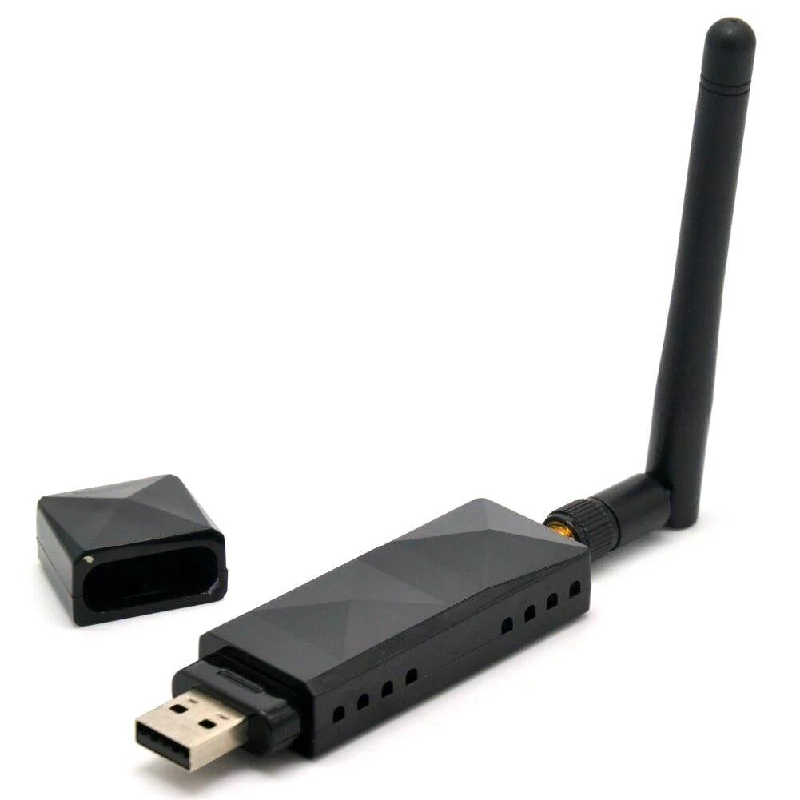
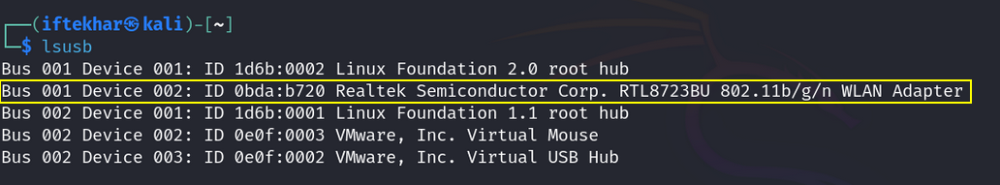
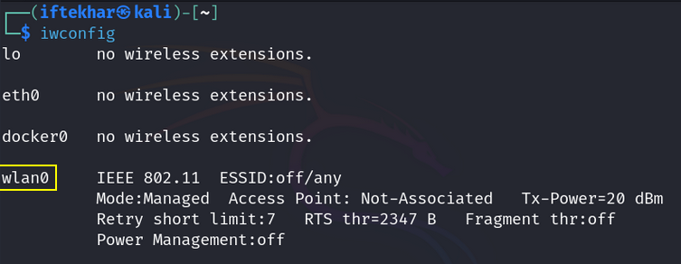
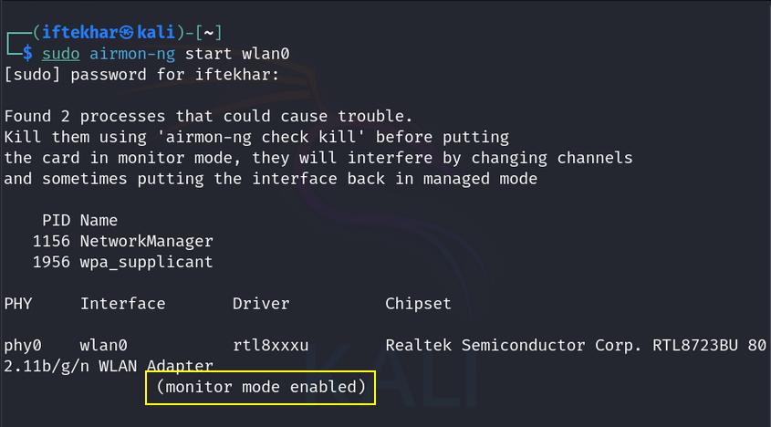
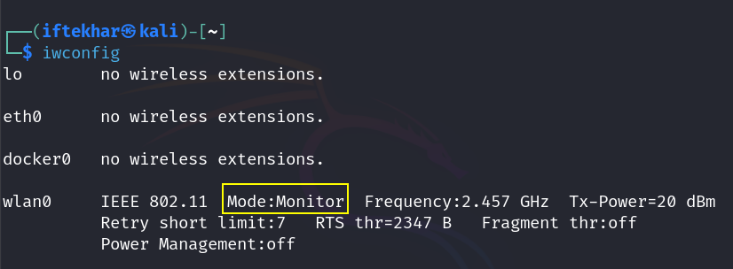
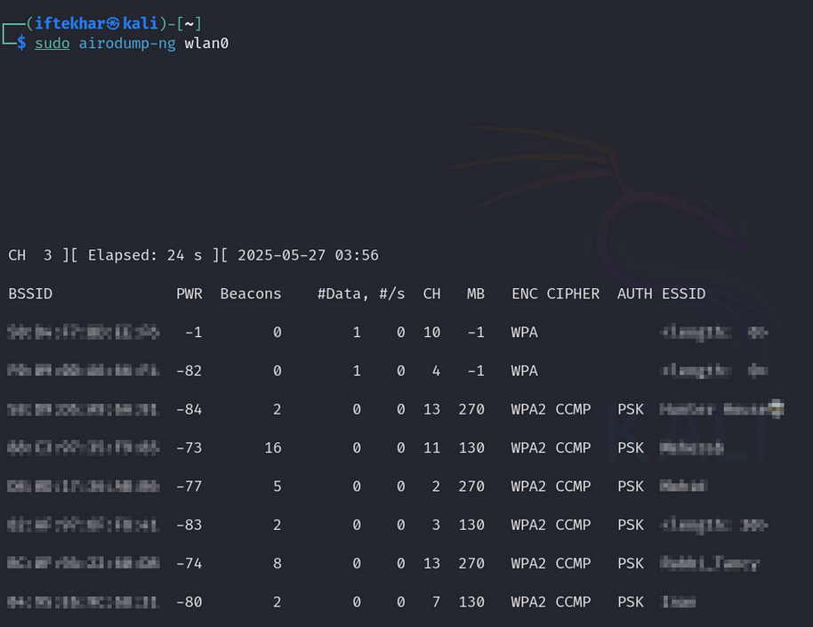
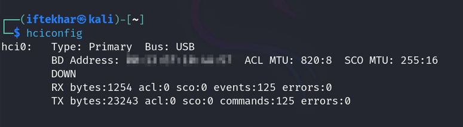

# Setting Up a USB Wi-Fi Adapter for Wireless Pentesting in Kali Linux on VMware

As a security researcher, I often guide beginners in wireless penetration testing, particularly those using Kali Linux in a virtualized environment like VMware. One of the first challenges is setting up a USB Wi-Fi adapter to enable features like monitor mode and packet injection, which are crucial for tools like `aircrack-ng` and `airodump-ng`. In this blog, I'll walk you through the process of connecting a compatible USB Wi-Fi adapter to a Kali Linux virtual machine running on VMware Workstation. This guide is designed for beginners, ensuring you can set up your adapter and start practicing wireless pentesting effectively. Let's dive in.

## Why a Compatible Wi-Fi Adapter Matters

For wireless pentesting, your Wi-Fi adapter must support **monitor mode** (to capture packets) and **packet injection** (to send custom packets, like deauthentication frames). Most built-in laptop Wi-Fi cards lack these capabilities, so a USB Wi-Fi adapter with a compatible chipset (e.g., Atheros AR9271, Ralink RT3070) is essential. Running Kali Linux in a VMware virtual machine adds complexity, as we need to pass the USB device from the host to the VM to enable these features. This guide applies to any USB Wi-Fi adapter that supports these modes, so let's break down the process.

<div style="text-align: center;">
  
  <p style="text-align: center;">Atheros AR9271</p>
</div>

## Connecting the Adapter

### 1. Preparing Your Environment

Before configuring VMware, ensure your setup is ready:

- **VMware Workstation:** Confirm you have VMware Workstation (or Player) installed on your host (Windows, macOS, or Linux). I'm using VMware Workstation for this guide.
- **Kali Linux VM:** Ensure your Kali Linux VM is powered off to avoid conflicts during configuration. If you haven't set up Kali, download it from kali.org and install it in VMware.
- **Insert the Adapter:** Plug your USB Wi-Fi adapter into your host machine. Verify it's detected:
  - **On Windows:** Open Device Manager and look for a device under "Network adapters" or "Other devices" (e.g., a chipset like Realtek or MediaTek).
  - **On Linux/macOS:** Run `lsusb` in a terminal to confirm (e.g., `Bus 001 Device 002: ID [VendorID:ProductID]`).

### 2. Configuring VMware USB Settings

VMware requires specific settings to pass USB devices to the VM, ensuring Kali can access the adapter's full capabilities.

### Configuring USB Preferences

1. Open VMware Workstation and navigate to **Edit > Preferences**.
2. In the Preferences window, select the **USB** tab.
3. Under "Connections," set the option to **"Ask me what to do"** when a new USB device is detected. This allows you to manually connect the adapter to the VM.
4. Click **OK** to save.

<div style="text-align: center;">
  
</div>

### Adding a USB Controller to the VM

1. Right-click your Kali Linux VM in the VMware library (left pane) and select **Settings**.
2. In the Virtual Machine Settings window, ensure a **USB Controller** is present in the hardware list.
  - If absent, click **Add**, select **USB Controller**, and click **Finish**.
3. Set the USB Controller to **USB 2.0** or **USB 3.0** (matching your host’s port). Most USB Wi-Fi adapters should work with either.
4. Check the box **"Show all USB input devices"** under the Connections section to make the adapter visible.
5. Click **OK** to save.

<div style="text-align: center;">
  
</div>

## 3. Connecting the Adapter to the VM

Now that VMware is configured, let's pass the adapter to Kali Linux.

1. **Power On the Kali VM:** Start your Kali Linux virtual machine and log in (default credentials are often `kali/kali` for a fresh install).

2. **Connect the Adapter:**
  - In VMware, go to **VM > Removable Devices**.
  - Look for the adapter in the list. It might appear as a chipset name (e.g., "Realtek 802.11n" or "MediaTek 802.11n WLAN").
  - Click the adapter name and select **Connect (Disconnect from Host)**.
  - Confirm the pop-up to disconnect the adapter from the host and connect it to the VM.

<div style="text-align: center;">
  
</div>

If the adapter isn't listed, ensure it's recognized by the host (re-plug if needed). You may also need to install VMware Tools in the VM to improve device detection:

```
sudo apt update && sudo apt install open-vm-tools
```
## 4. Verifying the Adapter in Kali Linux

Let's confirm the adapter is accessible in Kali and ready for pentesting.

**1. Check Detection:**

  - Open a terminal in Kali and run:

<div style="text-align: center;">
  
</div>

Look for an entry corresponding to your adapter (e.g., a chipset like Realtek or MediaTek). If it's plug-and-play, it should appear.

  - Run:

<div style="text-align: center;">
  
</div>

You should see a wireless interface (e.g., `wlan0`). If it's listed, the adapter is detected.

**2. Enable the Interface:**

If the interface isn't active, bring it up:

```
sudo ip link set wlan0 up
```
- Re-run `iwconfig` to confirm the interface is active.

## 5. Test for Wireless Pentesting

Let's ensure the adapter supports the features needed for wireless pentesting.

**1. Enable Monitor Mode:**

- Use `airmon-ng` to switch the adapter to monitor mode (essential for capturing packets):

<div style="text-align: center;">
  
</div>

- Verify the new interface (e.g., `wlan0`):
  
<div style="text-align: center;">
  
</div>

Look for "Mode: Monitor" to confirm. If monitor mode fails, your adapter may not support it—double-check its chipset compatibility with Kali Linux.

**2. Scan for Networks:**

- Use `airodump-ng` to scan for nearby Wi-Fi networks:

<div style="text-align: center;">
  
</div>

You should see a list of networks with their BSSIDs, ESSIDs, channels, and encryption types (e.g., WPA2). This confirms the adapter is ready for pentesting tasks like capturing handshakes.

## 6. Troubleshooting Tips

If you encounter issues, here are some common fixes:

- **Adapter Not Detected:** Ensure it's disconnected from the host (check Removable Devices). Reboot the VM or re-plug the adapter. If it persists, install drivers for the chipset.
- **Monitor Mode Fails:** Not all adapters support monitor mode in a VM environment. Test on a native Kali install (via live USB) to isolate the issue. Popular chipsets like Atheros AR9271 or Ralink RT3070 are known to work well.
- **VMware Tools:** If detection fails, ensure VMware Tools is installed (as shown earlier).

## Exploring Bluetooth Capabilities

Some USB Wi-Fi adapters also support Bluetooth, which can be used for Bluetooth pentesting. To check if your adapter has this feature, run:

<div style="text-align: center;">
  
</div>

If a device (e.g., `hci0`) is listed, you can use tools like `hcitool` or `bettercap` to scan for Bluetooth devices.

## What's Next?

With the adapter connected, you're ready to start wireless pentesting. Try capturing a WPA handshake using `airodump-ng` and `aireplay-ng`, then crack it with `aircrack-ng` using a wordlist like `/usr/share/wordlists/rockyou.txt`. If you run into issues or want to dive into more advanced wireless attacks, feel free to reach out.

**Note:** Always practice on networks you own or have explicit permission to test. Unauthorized pentesting is illegal and unethical. Set up a lab with a spare router to hone your skills safely.

Keep learning, and happy hacking!
