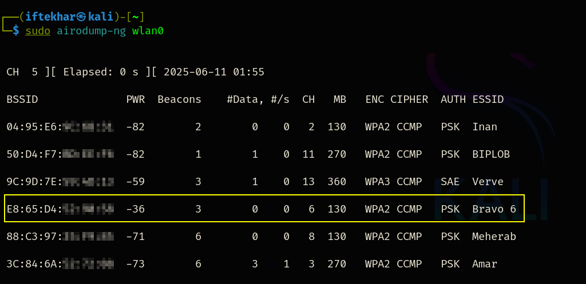

# Securing Wireless Networks from DoS Vulnerabilities

Wireless networks are all over the place, powering everything from home Wi-Fi to enterprise systems. However, their accessibility makes them prime targets for Denial-of-Service (DoS) attacks, which aim to disrupt network availability and performance. As a security researcher, I’ve seen how these attacks exploit vulnerabilities in wireless Access Points (APs) or client devices, causing crashes, unresponsiveness, or disconnection of legitimate users.

## What Are Wireless DoS Attacks?

A wireless DoS attack seeks to overwhelm or disrupt a wireless network, rendering it inaccessible to authorized users. Unlike wired networks, wireless networks are particularly vulnerable due to their open medium, where attackers can interfere with radio signals or exploit protocol weaknesses without physical access. Common types include:

- **Deauthentication Attacks:** Disconnect clients from an AP by sending spoofed deauthentication frames.
- **Beacon Flood Attacks:** Overwhelm clients with fake beacon frames, advertising nonexistent APs, causing confusion or resource exhaustion.
- **Jamming Attacks:** Emit radio signals to interfere with legitimate wireless communications, effectively blocking network access.

These attacks exploit the IEEE 802.11 protocol’s management frames, which are often unencrypted and unauthenticated, making them easy to spoof. Let’s dive into the most prevalent type, which is the deauthentication attack, to understand its mechanics and impact.

## Deauthentication Attacks

Deauthentication attacks are a go-to for attackers due to their simplicity and effectiveness. By sending forged deauthentication frames, an attacker tricks an AP or client into believing the connection is terminated, forcing disconnection. Below, I outline the steps to execute such an attack using tools like `aireplay-ng` (for educational purposes only, in controlled environments with explicit permission).

In my test, I targeted my own AP and used the same MAC address for both the target AP and my wireless adapter to simulate the attack on my "Bravo 6" network.

### 1. Setting Up the Environment

To perform a deauthentication attack, you need a wireless adapter capable of monitor mode. Monitor mode allows the adapter to capture all wireless traffic, including management frames, without associating with any network.

1. Enable Monitor Mode:

    - Use a compatible Wi-Fi adapter (e.g., one supporting the `ath9k` or `rt2800usb` chipset).

    - Run the following commands to enable monitor mode:

      

        
      

    This creates a virtual interface (e.g., `wlan0`) in monitor mode.

    - Verify monitor mode:

     

        
      

2. Identify the Target AP and Clients:

    Use `airodump-ng` to scan for nearby APs and their connected clients:

     

        
      

    This displays a list of APs, including their BSSID (MAC address), channel, and connected clients.

    In my test, I noted my AP’s BSSID (`E8:65:D4:xx:xx:xx`) for my "Bravo 6" network, which I used for both the target AP and my wireless adapter MAC address since I was testing on my own equipment.

### 2. Launching the Deauthentication Attack

With the target identified, you can launch the attack using `aireplay-ng`, a tool from the Aircrack-ng suite designed to inject frames into wireless networks.

 

    
  

- `aireplay-ng`: The tool for injecting frames.
- `-deauth 1000`: Sends 1000 deauthentication packets to the target AP, disconnecting clients.
- `a E8:65:D4:xx:xx:xx`: Specifies the target AP’s MAC address.
- `h E8:65:D4:xx:xx:xx`: Specifies the attacker’s wireless adapter MAC address (in my test, the same as the AP’s since I targeted my own adapter).
- `wlan0`: The interface in monitor mode.

**Execution:**

- Run the command to flood the AP with deauthentication frames. The AP interprets these as legitimate requests from clients to disconnect, causing clients to lose connectivity.

- In my test on the "Bravo 6" network, the attack was successful, and all devices connected to my Wi-Fi—laptops, phones, and IoT devices—lost their connection while the attack was running.

- Monitor the attack’s impact using `airodump-ng` to observe the client list diminishing as devices are forcibly disconnected.

Step 3: Observing the Impact
As the attack progresses, clients will struggle to maintain a connection with the AP. The client list in airodump-ng will show fewer connected devices, and users may experience dropped connections or inability to reconnect. This disruption can lead to significant productivity losses, communication breakdowns, or even financial and reputational damage in enterprise environments.
Note: Performing such attacks without permission is illegal and unethical. Always conduct tests in a lab environment or with explicit authorization.
Impact of Wireless DoS Attacks
The consequences of wireless DoS attacks extend beyond mere inconvenience:

Productivity Loss: Disrupted connectivity halts workflows, especially in environments reliant on real-time communication.
Communication Breakdowns: VoIP calls, video conferences, or IoT device operations may fail.
Financial Implications: Downtime in commercial settings can lead to lost revenue or operational costs.
Reputational Damage: Repeated disruptions erode trust in an organization’s network reliability.
Compromised Trust: Users may question the security of a network that fails to protect against such attacks.

Mitigating Wireless DoS Attacks
Defending against wireless DoS attacks requires a multi-layered approach. Below are practical strategies for network administrators and security practitioners:
1. Enable Management Frame Protection (MFP)

MFP (IEEE 802.11w) encrypts and authenticates management frames, preventing spoofed deauthentication attacks.
Configure APs and clients to support MFP:
On enterprise-grade APs (e.g., Cisco, Aruba), enable 802.11w in the wireless settings.
Ensure client devices support MFP, as older devices may not.

Limitation: MFP is not universally supported, and enabling it may exclude legacy devices.

2. Traffic Filtering and Rate Limiting

Deploy Wireless Intrusion Detection/Prevention Systems (WIDS/WIPS) to detect and block suspicious management frames.
Example tools: Aruba’s RFProtect, Cisco’s Adaptive Wireless IPS.
Rate-limit management frames to reduce the impact of flooding attacks.

3. Access Control

Use MAC address filtering to restrict connections to known devices, though this is less effective against spoofing.
Implement strong authentication (e.g., WPA3-Enterprise) to ensure only authorized users access the network.

4. Channel and Frequency Management

Mitigate jamming by switching to less congested channels or using 5 GHz bands, which are harder to jam due to shorter range.
Use Dynamic Frequency Selection (DFS) to automatically switch channels when interference is detected.

5. Network Segmentation

Segment critical devices into separate VLANs or SSIDs to limit the blast radius of an attack.
Prioritize bandwidth for essential services using Quality of Service (QoS) policies.

6. Monitoring and Alerts

Deploy real-time monitoring tools to detect anomalies, such as sudden client disconnections or excessive management frames.
Set up alerts to notify administrators of potential DoS activity.

7. Physical Security

Reduce the AP’s signal range to minimize exposure to external attackers.
Use directional antennas to focus coverage on intended areas.

Advanced Considerations
For advanced practitioners, consider the following:

Custom Detection Scripts: Write scripts to analyze wireless traffic (e.g., using tshark or scapy) for unusual patterns, such as a high volume of deauthentication frames from a single source.from scapy.all import *

def detect_deauth(pkt):
    if pkt.haslayer(Dot11Deauth):
        print(f"Deauth frame detected from {pkt.addr2} to {pkt.addr1}")

sniff(iface="wlan0mon", prn=detect_deauth, filter="wlan type mgt subtype deauth")

Machine Learning Models: Train models to detect DoS attacks based on traffic patterns, leveraging tools like TensorFlow or PyTorch.
Red Teaming: Simulate DoS attacks in controlled environments to test network resilience and validate mitigation strategies.
Regulatory Compliance: Ensure compliance with local laws (e.g., FCC regulations in the US) when testing or deploying countermeasures, as unauthorized jamming or frame injection is illegal.

Conclusion
Wireless DoS attacks, particularly deauthentication attacks, are a potent threat to network availability. By exploiting weaknesses in the 802.11 protocol, attackers can disrupt connectivity with minimal effort. Understanding the mechanics of these attacks—through tools like aireplay-ng—is crucial for security researchers and network administrators. However, the real challenge lies in mitigation. By implementing MFP, traffic filtering, access control, and proactive monitoring, organizations can significantly reduce their vulnerability.
As wireless networks continue to evolve, so do the tactics of attackers. Staying ahead requires a combination of robust security practices, continuous monitoring, and a deep understanding of the wireless ecosystem. Whether you’re a beginner setting up a lab to learn or an advanced practitioner defending enterprise networks, the principles outlined here provide a foundation for tackling wireless DoS threats.
Disclaimer: The techniques described are for educational purposes only. Unauthorized attacks on networks are illegal and unethical. Always obtain explicit permission before conducting security tests.
