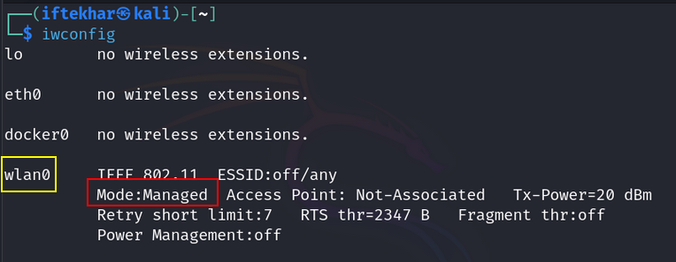

# Wireless Pentesting with Kali Linux

Wireless networks are a cornerstone of modern connectivity, but their widespread use makes them a prime target for attackers. As security researchers, we rely on wireless penetration testing tools to identify vulnerabilities in access points (APs), client devices, and network configurations. This guide provides an in-depth look at these tools and a detailed walkthrough for configuring Kali Linux to conduct effective wireless pentests. Whether you're a beginner or an advanced practitioner, this blog will equip you with the knowledge to assess wireless network security systematically.

## Understanding Wireless Penetration Testing

Wireless pentesting involves simulating real-world attacks to evaluate the security posture of wireless networks. The primary goal is to identify vulnerabilities such as weak encryption, misconfigured access points, or unauthorized devices. By using specialized software and hardware tools, we can capture network traffic, detect hidden networks, and test encryption protocols like WEP, WPA, and WPA2. Adopting standardized methodologies, such as the OWASP Wireless Security Testing Guide, ensures thorough and repeatable testing.

The process helps us:

1. **Discover Wi-Fi Networks:** You identify nearby wireless networks, including their names (ESSID) and unique identifiers (BSSID).

2. **Analyze Network Traffic:** You capture data packets transmitted over the Wi-Fi network to understand its behavior and configuration.

3. **Test Encryption Strength:** The ultimate goal in the example is to recover the **Wi-Fi password (passphrase)** for a specific network, typically one using WEP or WPA/WPA2 encryption. This tests whether the network's password is weak and vulnerable to attacks.

4. **Identify Vulnerabilities:** By attempting to crack the password or exploit weaknesses (like WPS vulnerabilities with Reaver), you're checking if the network can be compromised by an attacker. This helps determine if the network is secure or needs stronger protections.

In short, we're trying to **find the Wi-Fi password** of a target network to see if it's vulnerable to unauthorized access. This is done, with permission, to help secure the network.

The Wi-Fi password is a critical component of network security. If an attacker can crack it, they can:

- Gain unauthorized access to the network.
- Intercept sensitive data (e.g., login credentials or personal information).
- Launch further attacks, like man-in-the-middle attacks or malware distribution.

By attempting to crack the password, we're simulating what a malicious hacker might do, allowing us to identify and fix weaknesses before they can be exploited.

## Common Wireless Penetration Testing Tools

A variety of tools are available for wireless pentesting, each serving specific purposes in analyzing and exploiting network weaknesses. Below is an overview of the most widely used tools, their capabilities, and their roles in a pentester's toolkit:

1. **Aircrack-ng:** A powerful suite for auditing wireless networks, Aircrack-ng is primarily used to crack WEP and WPA/WPA2-PSK encryption keys. It captures and analyzes network packets to identify vulnerabilities, making it essential for testing encryption strength and recovering passwords.

2. **Wireshark:** A robust network protocol analyzer, Wireshark captures and dissects network traffic to provide detailed insights into transmitted and received packets. It's invaluable for identifying security threats, such as unencrypted data or suspicious traffic patterns.

3. **Kismet**: Kismet is a wireless network detector, sniffer, and intrusion detection system. It excels at discovering hidden networks, detecting rogue access points, and identifying unauthorized devices, offering a comprehensive view of the wireless environment.

4. **NetStumbler:** This tool is designed for Windows environments and is used to detect wireless networks and access points. While less feature-rich than others, it's effective for identifying basic network configurations and potential vulnerabilities.

5. **Reaver:** Reaver targets WPS-enabled wireless networks, exploiting vulnerabilities in the Wi-Fi Protected Setup (WPS) protocol to recover WPA/WPA2 passphrases. It's particularly useful for assessing the security of networks using WPS.

**Note:** Always stay updated with the latest tools and techniques. The wireless threat landscape evolves rapidly, and tools like Aircrack-ng and Kismet frequently receive updates to address new vulnerabilities and protocols.

## Configuring Kali Linux for Wireless Penetration Testing

Kali Linux is the go-to operating system for security researchers due to its extensive suite of pre-installed tools and flexibility for wireless pentesting. Properly configuring Kali Linux is critical to conducting effective tests. Below, I provide a step-by-step guide to prepare and configure Kali Linux for wireless attacks, ensuring compatibility with common wireless adapters and tools.

### Preparing Kali Linux

Before conducting wireless pentests, ensure Kali Linux is set up correctly. Follow these steps to prepare the environment:

### 1. Update and Upgrade Kali Linux

Keeping the system up to date ensures compatibility with the latest tools and patches. Open a terminal and run:

```
sudo apt-get update && sudo apt-get upgrade
```

This command updates the package lists and upgrades installed packages.

### 2. Install Wireless Drivers

Many wireless adapters require specific drivers to function correctly in Kali Linux. For Intel-based adapters, install the `firmware-iwlwifi` package:

```
sudo apt-get install firmware-iwlwifi
```

**Note:** The required drivers depend on your wireless adapter. For example, the TP-Link WN722N requires manual driver setup, while ALFA NETWORK cards like the AWUS036NH are highly recommended for their support of 802.11 b/g/n protocols and monitor mode.

### 3. Verify Wireless Interface Availability

Check if the wireless interface is recognized by running:



This command lists available wireless interfaces, typically named `wlan0` or similar.

### 4. Install Essential Tools

Install the core tools for wireless pentesting:


This ensures Aircrack-ng, Wireshark, Kismet, and Reaver are available for testing.

## Configuring Kali Linux for Wireless Attacks

With the system prepared, configure Kali Linux to perform wireless attacks. This involves setting the wireless interface to monitor mode, scanning for networks, and capturing packets. Follow these steps:

### 1. Deactivate the Wireless Interface

Disable the wireless interface to prepare it for configuration:


### 2. Terminate Interfering Processes

Check for and kill processes that might interfere with wireless operations:


### 3. Enable Monitor Mode

Set the wireless interface to monitor mode, which allows packet capturing without associating with a network:


**Note:** Ensure your wireless adapter supports monitor mode. ALFA NETWORK AWUS036NH or similar adapters are ideal.

### 4. Activate the Wireless Interface

Bring the interface back online:


### 5. Verify Monitor Mode

Confirm the interface is in monitor mode:


The output should indicate `Mode:Monitor` for wlan0.

### 6. Scan for Wireless Networks

Use Aircrack-ng's `airodump-ng` to discover available networks:


This displays a list of nearby networks, including their BSSID (Basic Service Set Identifier), ESSID (network name), and channel.

- Look at the `ESSID` column to find the name of the Wi-Fi network you want to test (e.g., `Bravo 6`). This is the human-readable name of the network.
- Note the corresponding BSSID (e.g., `E8:65:D4:xx:xx:xx`) and CH (channel, e.g., `6`) for that network. These are the values you'll use in the next step.

### Notes

- **Stay in Range:** Ensure your wireless adapter is close enough to the target AP for a strong signal (check the `PWR` column; lower negative numbers like `-30` indicate a stronger signal).
- **Capture a Handshake:** For password cracking (later with `aircrack-ng`), you need a WPA/WPA2 handshake. Keep `airodump-ng` running until you see `[ WPA handshake: <BSSID> ]` in the top-right corner of the output.
- **Stop the Scan:** Press `Ctrl+C` to stop airodump-ng when you've captured enough data (e.g., after getting a handshake).

### Common Issues and Fixes

- **No Networks Appear:** Ensure your wireless adapter is in monitor mode (`iwconfig` should show `Mode:Monitor`). If not, revisit the steps to set monitor mode (`sudo iwconfig wlan0 mode monitor`).
- **Wrong Interface Name:** If `wlan0` isn't your interface, use `iwconfig` to find the correct name (e.g., `wlan1`).
- **Channel Hopping:** If you don't specify a channel, `airodump-ng` hops between channels, which can miss data. Always lock to the target's channel with `-c`.

### 7. Capture Packets from a Target Network


Select a target network and capture its packets for analysis:

```
sudo airodump-ng --bssid <target_BSSID> -c <channel> -w output_file wlan0
```

Replace `<target_BSSID>` with the target's BSSID, `<channel>` with the network's channel, and `output_file` with your desired output file name. This command captures packets to a `.cap` file.


Here, `-w test_network` specifies the **base filename** for the output files. However, `airodump-ng` doesn't create a single file named `test_network.cap`. Instead, it appends a numerical suffix (e.g., `-01`) to the base filename, resulting in `test_network-01.cap`.

1. **Airodump-ng's File Naming Convention:**
- The `-w` option in `airodump-ng` defines a **prefix** for the output files, not the exact filename.
- Airodump-ng automatically appends **-01** to the first capture file (e.g., `test_network-01.cap`). If you start a new capture with the same prefix, it creates `test_network-02.cap`, and so on.
- This numbering ensures that multiple captures don't overwrite each other, allowing you to run several sessions without losing data.

2. **Multiple Output File Types:**
- Airodump-ng generates several files with the same prefix, each serving a different purpose:
  - `.cap`: The main packet capture file (e.g., `test_network-01.cap`), containing raw packets (including the handshake) for use with Aircrack-ng.
  - `.csv`: A text file with network and client details in CSV format.
  - `.kismet.csv`: A file for Kismet compatibility.
  - `.kismet.netxml`: An XML file with network data for Kismet.
- The `.cap` file is the one you use for password cracking with `aircrack-ng`.

3. **No test_network.cap File:**
- Airodump-ng never creates a file named exactly `test_network.cap` because it always adds the `-01` suffix (or `-02`, `-03`, etc., for subsequent captures). The prefix `test_network` is just the base name you provided.

### Notes for Beginners

- **Use the Correct Filename:** Always use the full filename (`test_network-01.cap`) when running `aircrack-ng`. If you mistakenly use `test_network.cap`, you'll get a "file not found" error.
- **Check for Additional Files:** If you run `ls` in the directory, you'll see `test_network-01.cap`, `test_network-01.csv`, etc. Only the `.cap` file is needed for password cracking.
- **Avoid Overwriting:** If you want to start a new capture, use a different prefix (e.g., `-w bravo6_new`) to avoid confusion with existing files.
- **Organize Captures:** Store capture files in a dedicated folder (e.g., `mkdir wifi_captures; mv test_network-01.* wifi_captures/`) to keep your workspace clean.

### 8. Crack the Wireless Password

Use Aircrack-ng to attempt cracking the network's password using a wordlist:

```
sudo aircrack-ng -w <wordlist> output_file.cap
```

Replace `<wordlist>` with the path to a wordlist file (e.g., `/usr/share/wordlists/rockyou.txt`). This step attempts to recover the WPA/WPA2 passphrase.


When you run this command, you're trying to:

1. **Recover the Wi-Fi Password:** The command attempts to find the correct WPA/WPA2 passphrase for the target network by testing passwords from the wordlist against the captured handshake in the **.cap** file.
2. **Assess Network Security:** If Aircrack-ng successfully cracks the password, it means the Wi-Fi network is vulnerable because the password is either weak (e.g., found in the wordlist) or the encryption is poorly configured. This helps you understand if the network can be easily compromised by an attacker.

### How Does It Work?

- **Handshake Capture:** The `output_file.cap` contains a "handshake", a set of packets exchanged when a device connects to the Wi-Fi network. This handshake includes encrypted data that Aircrack-ng can analyze.
- **Password Guessing:** Aircrack-ng uses the wordlist to test each possible password against the handshake. If a password matches, it decrypts the handshake successfully, revealing the Wi-Fi passphrase.
- **Output:** If successful, Aircrack-ng displays the correct password (e.g., `KEY FOUND: [password]`). If no match is found, it either exhausts the wordlist or indicates the handshake is invalid.

### Notes for Beginners

- **Use a Good Wordlist:** The success of this command depends on the wordlist. Common wordlists like `rockyou.txt` contain millions of passwords, but if the target password is unique, you may need a custom or larger wordlist.
- **Ensure a Valid Handshake:** The `output_file.cap` must contain a valid WPA/WPA2 handshake. If the capture is incomplete, the command won't work. Use airodump-ng properly to capture the handshake (as described in earlier steps).
- **Hardware Matters:** Ensure your Wi-Fi adapter supports packet injection and monitor mode (e.g., ALFA AWUS036NH) for reliable results.

### Next Steps

If the command successfully finds the password, you've identified a vulnerability. Report this to the network owner and recommend:

1. Using a stronger, unique password (e.g., at least 12 characters, mixing letters, numbers, and symbols).
2. Disabling WPS if enabled (Reaver exploits WPS vulnerabilities).
3. Upgrading to WPA3 for better encryption.

If the command fails, it's a good sign the network is more secure, but you might try a larger wordlist or other tools (e.g., Reaver for WPS attacks) to test further.

## Best Practices for Wireless Penetration Testing

- **Use Reliable Hardware:** ALFA NETWORK AWUS036NH adapters are recommended for their robust support of monitor mode and wireless protocols.
- **Follow Ethical Guidelines:** Always obtain explicit permission before testing a network. Unauthorized testing is illegal and unethical.
- **Stay Updated:** Regularly update tools and Kali Linux to leverage the latest features and patches.
- **Adopt Standardized Methodologies:** Refer to frameworks like the OWASP Wireless Security Testing Guide for structured testing.
- **Document Findings:** Record all vulnerabilities and recommendations in a detailed report to guide remediation efforts.

## Conclusion

Wireless penetration testing is a critical component of securing modern networks. Tools like Aircrack-ng, Wireshark, Kismet, NetStumbler, and Reaver provide powerful capabilities to identify and exploit vulnerabilities. By configuring Kali Linux correctly and following a systematic approach, security researchers can effectively assess wireless network security. For beginners, mastering these tools and configurations is a foundational step in penetration testing. Advanced practitioners should focus on staying updated with evolving threats and refining their methodologies. Always conduct testing ethically and responsibly to strengthen network defenses.

### Resources:

- OWASP Wireless Security Testing Guide: https://owasp.org/www-project-web-security-testing-guide/
- Kali Linux Documentation: https://www.kali.org/docs/
- Aircrack-ng Official Site: https://www.aircrack-ng.org/
