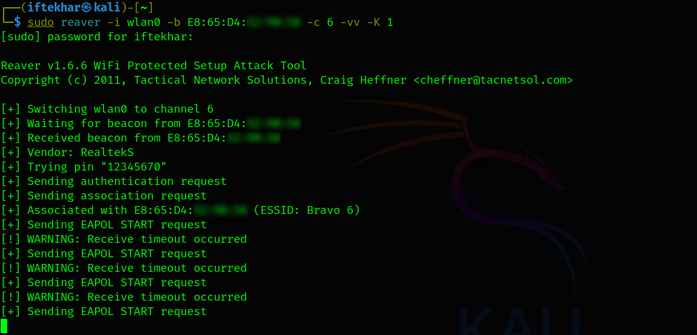

# Exploiting WPS with Reaver

As wireless networks remain a cornerstone of modern connectivity, their security is a critical concern for organizations and individuals alike. Advanced wireless attacks, particularly those targeting Wi-Fi Protected Setup (WPS) vulnerabilities using tools like Reaver, pose significant risks to network integrity. In this blog, we'll be providing a detailed and practical guide for security researchers, penetration testers, and network administrators, covering the technical execution of a Reaver-based attack, its implications, and robust defensive strategies. 

## Understanding WPS and Its Vulnerabilities

Wi-Fi Protected Setup (WPS) was introduced to simplify the process of connecting devices to wireless networks. By allowing users to enter an 8-digit PIN or press a physical button on the router, WPS bypasses the need to input complex WPA/WPA2 passphrases. However, this convenience comes at a cost: a design flaw in the WPS protocol makes it susceptible to brute-force attacks.

The WPS PIN is validated in two halves (four digits each), reducing the effective keyspace to approximately 11,000 possible combinations (10^4 for the first half, plus 10^3 for the second, accounting for a checksum digit). Tools like Reaver exploit this flaw by systematically guessing PINs until the correct one is found, at which point the router discloses the WPA/WPA2 passphrase. This vulnerability affects many routers, even those with strong passphrases, unless WPS is disabled or properly secured.

## WPS Exploitation with Reaver

Reaver is an open-source tool designed to automate WPS PIN brute-forcing. By targeting the WPS protocol, Reaver can recover the WPA/WPA2 passphrase in hours or days, depending on the router’s configuration and defenses. While highly effective against vulnerable devices, Reaver’s success is not guaranteed, as modern routers may implement rate-limiting or disable WPS entirely.

## Prerequisites

Before executing a Reaver attack, ensure you have the following:

- **A Linux-based system:** Kali Linux is recommended, as it comes pre-installed with Reaver and other wireless auditing tools.
- **A compatible wireless adapter:** The adapter must support monitor mode and packet injection. Popular choices include the Alfa AWUS036NHA (Atheros AR9271 chipset) or Panda PAU05.
- **Administrative privileges:** Root access is required to run Reaver and related tools.
- **Legal authorization:** Only perform attacks on networks you own or have explicit permission to test.

## Attacking with Reaver

### 1. Set Up Your Wireless Adapter

Ensure your wireless adapter is configured for monitor mode, which allows it to capture and inject packets.

<div style="text-align: center;">
  
</div>

<div style="text-align: center;">
  
</div>

This creates a monitor interface (e.g., `wlan0`). Confirm the interface is in monitor mode:

<div style="text-align: center;">
  
</div>

## 2. Identify the Target Router

Use `airodump-ng` to scan for nearby wireless networks and identify the target router’s BSSID (MAC address), channel, and WPS status.

<div style="text-align: center;">
  
</div>

Look for the target network in the output. Note the BSSID (e.g., `E8:65:D4:xx:xx:xx`), channel (e.g., `6`), and whether WPS is enabled (indicated in the `WPS` column). To focus on the target, run a targeted scan:

<div style="text-align: center;">
  
</div>

## 3. Verify WPS Vulnerability

Use `wash` to confirm that the target router has WPS enabled and is not locked (some routers lock WPS after repeated failed attempts).

<div style="text-align: center;">
  
</div>

In the output, check the `WPS Locked` column. If it says `No`, the router is vulnerable. If `Yes`, Reaver may still work, but success is less likely due to rate-limiting.

## 4. Launch the Reaver Attack

Execute Reaver to brute-force the WPS PIN. The following command targets the router’s BSSID and channel, with verbose output (`-vv`) and the Pixie-Dust attack (`-K 1`) for faster PIN recovery on supported routers:

<div style="text-align: center;">
  
</div>

`-i`: Specifies the monitor interface.
`-b`: Specifies the target BSSID.
`-c`: Specifies the channel.
`-vv`: Enables verbose output for debugging.
`-K 1`: Attempts the Pixie-Dust attack, which exploits weak WPS implementations to recover the PIN faster.

Reaver will begin guessing PINs, displaying progress and any errors. If successful, it will output the WPS PIN and the WPA/WPA2 passphrase.

The process stalled with repeated "Receive timeout occurred" warnings error. Several factors could contribute to this failure:

- **Signal or Adapter Issues:** The consistent timeouts suggest potential weaknesses in signal strength or adapter performance, possibly exacerbated by interference on channel 6.
- **Firmware Resistance:** The router’s RealtekS firmware, likely updated or configured with partial WPS protections, rejected the Pixie-Dust attack (-K 1) and standard handshake attempts.
- **Channel Mismatch or Congestion:** Although the channel was correctly set to 6, congestion or a misdetection of the active channel could have disrupted packet exchange.
- **Tool Limitations:** Reaver’s default settings and the Pixie-Dust approach may not align with this router’s WPS implementation, as evidenced by the lack of progress.

Even with adjustments, the attack did not succeed. However, in other cases, Reaver can execute successfully against vulnerable routers, especially those with older firmware or unpatched WPS implementations. Success depends on optimal signal conditions, a compatible adapter, and a router without advanced defenses.

## 5. Next Steps After a Successful Attack

### Connect to the Network

If the Reaver attack succeeds and you obtain the WPA/WPA2 passphrase, proceed with the following steps:

1. **Verify Access:**

    Connect to the network using the recovered passphrase to confirm access:

    ```
    nmcli device wifi connect "<wifi>" password "<recovered_passphrase>"
    ```

    You now have access to the wireless network, simulating a successful attack. Test connectivity to internal resources or the internet to assess the breach’s scope.

2. **Document Findings:** Record the BSSID, channel, PIN, passphrase, and attack duration for your report. Note any router defenses encountered (e.g., rate-limiting).

3. **Escalate Privileges** (if Authorized): If penetration testing, attempt to access the router’s admin panel or connected devices using default credentials or further exploits.

4. **Mitigation Testing:** Recommend and test defenses, such as disabling WPS or updating firmware, to prevent future attacks.

5. **Cleanup:**

    Disconnect from the network and disable monitor mode:

    ```
    sudo airmon-ng stop wlan0mon
    ```

    If the attack fails, as in this case, troubleshoot by checking signal strength with `airodump-ng`, testing adapter injection with `aireplay-ng --test <wireless-interface>`, or switching to alternative tools like `bully` with adjusted parameters (e.g., -bruteforce --retries=5). Persistent issues may indicate a need for better hardware or a different attack vector.

## Challenges and Limitations

- **Time-Consuming:** Brute-forcing the WPS PIN can take hours or days, depending on the router’s response time and PIN complexity.
- **Rate-Limiting:** Some routers lock WPS after multiple failed attempts, requiring you to wait or adjust Reaver’s timing parameters (e.g., `--delay` or `--lock-delay`).
- **False Positives:** Not all routers with WPS enabled are vulnerable. Firmware updates or custom configurations may mitigate the attack.
- **Interference:** Other wireless devices or networks can disrupt the attack, requiring a stable environment.

To improve success, experiment with Reaver’s advanced options, such as `--pin` to specify a starting PIN or `--no-nacks` to ignore negative acknowledgments.

## Defending Against Reaver Attacks

Network administrators must proactively secure their wireless networks to mitigate Reaver and similar attacks.

- **Disable WPS:** The most effective defense is to disable WPS in the router’s admin panel. Log in to the router (typically via `192.168.0.1` or `192.168.1.1`), navigate to the wireless settings, and turn off WPS. Note that some routers may not fully disable WPS despite the setting. Verify with `wash`.

- **Use a Strong Passphrase:** While Reaver bypasses the passphrase, a strong WPA2/WPA3 passphrase (at least 16 characters, mixing letters, numbers, and symbols) protects against secondary attacks if WPS is compromised.

- **Update Firmware:** Manufacturers often release firmware updates to patch WPS vulnerabilities or implement rate-limiting. Regularly check the router’s admin panel or manufacturer’s website for updates.

- **Monitor for Suspicious Activity:** Use intrusion detection systems (IDS) or network monitoring tools to detect repeated WPS authentication attempts, which may indicate a Reaver attack.

- **Segment Networks:** Isolate critical devices on a separate VLAN or guest network to limit the impact of a breach.

- **Replace Vulnerable Hardware:** If the router does not support disabling WPS or receiving firmware updates, consider upgrading to a modern, secure model.

## Conclusion

In this test, the attack’s failure highlights the challenges posed by modern router defenses and environmental factors, yet it also demonstrates that success is achievable with the right conditions and configurations. To deepen your knowledge, experiment with Reaver in a controlled lab environment, explore other wireless attack tools (e.g., `Aircrack-ng`, `Bully`), and stay updated on emerging vulnerabilities. Wireless security is a dynamic field. Staying ahead requires continuous learning and vigilance.
